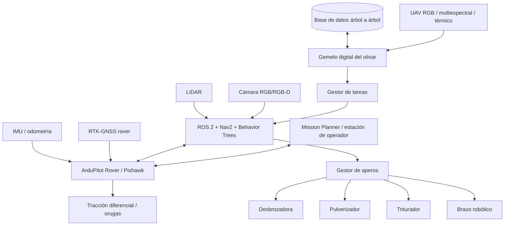
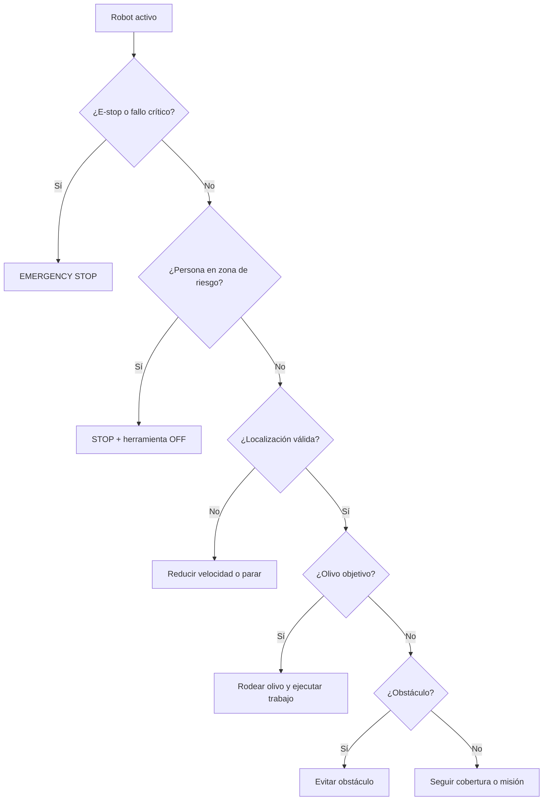
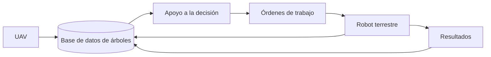
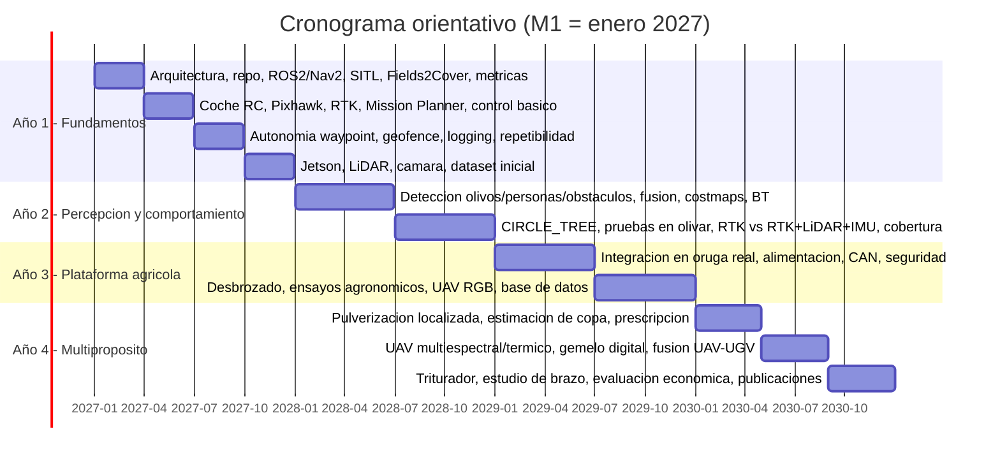
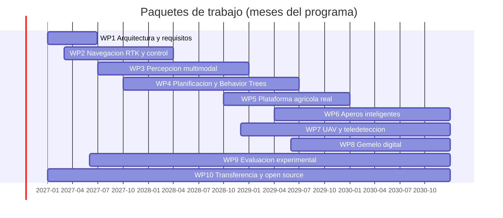

# Plataforma robótica autónoma, modular y de código abierto para la gestión de olivar ecológico: arquitectura, plan experimental, planificación temporal y presupuesto por fases

**Integración de RTK-GNSS, ArduPilot/ROS 2, percepción multimodal, aperos inteligentes y teledetección UAV para un gemelo digital a nivel de árbol**

**Autores:** [Nombre Apellido¹], [Nombre Apellido²] — *(completar)*
**Afiliaciones:** ¹ [Departamento, Universidad/Centro, Ciudad, País] · ² [...]
**Correspondencia:** [correo electrónico]
**Tipo de documento:** artículo de propuesta y protocolo de investigación (*registered-report style*). **No se presentan resultados experimentales.**
**Versión:** 1.1 — octubre de 2026 (deriva del documento de concepto v1.0)
**Ámbito inicial:** olivar tradicional/ecológico, finca piloto de ≈ 11 ha, Jaén (España)
**Licencias propuestas:** CC BY 4.0 (documentación científica); Apache-2.0 / BSD-3-Clause (software propio), sujeto a compatibilidad con las dependencias (ver §9.4)

---

## Resumen

Se propone el diseño, desarrollo y validación de una **plataforma robótica terrestre autónoma, modular y de código abierto** para automatizar de forma progresiva tareas recurrentes en olivar ecológico: control mecánico de cubierta vegetal (desbrozado), pulverización localizada, trituración de restos de poda y, a largo plazo, retirada asistida de varetas. La arquitectura combina posicionamiento RTK-GNSS, autopiloto ArduPilot Rover, ROS 2 con Navigation2 (Nav2) y *Behavior Trees*, percepción LiDAR + visión sobre NVIDIA Jetson, planificación de cobertura agrícola con Fields2Cover/OpenNav Coverage y supervisión con Mission Planner. Se añade una capa aérea (UAV RGB, multiespectral y, opcionalmente, térmica) para construir un **gemelo digital del olivar a escala de árbol individual** que genere órdenes de trabajo para el robot terrestre.

La estrategia es **incremental y de bajo riesgo**: simulación → prototipo RC 1/10 con RTK (≈ 1.000–1.600 €) → percepción (+1.400–1.900 €) → transferencia a una máquina de orugas real → aperos → UAV/gemelo digital. El programa se organiza en 48 meses, 10 paquetes de trabajo y 9 hitos con criterios cuantitativos de éxito, de modo que el presupuesto se solicita por tramos y cada tramo desbloquea resultados publicables. Se detallan seis hipótesis científicas contrastables, ocho líneas de publicación y dos tesis doctorales diferenciadas. El presupuesto de ejecución (sin personal) se estima en **≈ 70.000–193.000 € a 4 años (≈ 77.000–213.000 € con contingencia)**, y el núcleo mínimo para validar la arquitectura de navegación en un RC no supera **≈ 2.800–3.800 €**.

**Palabras clave:** robótica agrícola; olivar ecológico; ArduPilot; ROS 2; Navigation2; RTK-GNSS; LiDAR; visión artificial; UAV; gemelo digital; planificación de cobertura; Fields2Cover; robot de orugas; código abierto.

## Abstract

We propose the design, development and validation of an **open-source, modular, progressively autonomous ground robotic platform** for organic olive orchards. The architecture combines RTK-GNSS positioning, ArduPilot Rover, ROS 2 with Navigation2 and Behavior Trees, LiDAR–vision perception on an NVIDIA Jetson, agricultural coverage path planning (Fields2Cover/OpenNav Coverage) and Mission Planner supervision. A UAV layer (RGB, multispectral and optionally thermal) feeds a **tree-level digital twin** that issues work orders to the ground robot. Development is incremental: simulation → 1/10-scale RC prototype with RTK → LiDAR/vision perception → transfer to a tracked machine → implements (mowing, targeted spraying, mulching, long-term sucker-removal manipulation) → UAV–UGV fusion. The 48-month plan comprises 10 work packages, 9 milestones with quantitative success criteria, six testable hypotheses, eight publication lines and two PhD theses. We provide a phased, itemised budget (execution cost excluding personnel ≈ €70k–193k over four years; minimum viable RC core ≈ €2.8k–3.8k). This paper is a research protocol: no experimental results are reported.

**Keywords:** agricultural robotics; olive orchard; ArduPilot; ROS 2; Nav2; RTK-GNSS; LiDAR; UAV; digital twin; coverage path planning; tracked robot; open source.

---

## Índice

1. [Introducción y motivación](#1-introducción-y-motivación)
2. [Trabajos relacionados y proyectos de software libre](#2-trabajos-relacionados-y-proyectos-de-software-libre)
3. [Objetivos, hipótesis y contribuciones esperadas](#3-objetivos-hipótesis-y-contribuciones-esperadas)
4. [Arquitectura y métodos propuestos](#4-arquitectura-y-métodos-propuestos)
5. [Diseño experimental y métricas](#5-diseño-experimental-y-métricas)
6. [Planificación temporal](#6-planificación-temporal)
7. [Presupuesto detallado por fases](#7-presupuesto-detallado-por-fases)
8. [Estrategia de publicaciones, tesis y trabajos de estudiantes](#8-estrategia-de-publicaciones-tesis-y-trabajos-de-estudiantes)
9. [Gestión de datos, repositorio, ciencia abierta y licencias](#9-gestión-de-datos-repositorio-ciencia-abierta-y-licencias)
10. [Riesgos y mitigación](#10-riesgos-y-mitigación)
11. [Seguridad, normativa y ética](#11-seguridad-normativa-y-ética)
12. [Discusión y limitaciones](#12-discusión-y-limitaciones)
13. [Conclusiones](#13-conclusiones)
14. [Referencias](#14-referencias)
15. [Anexos](#15-anexos)

> **Convención.** Las cifras marcadas con **†** son estimaciones añadidas en esta versión (no figuraban en el documento de concepto v1.0) y **deben contrastarse con ofertas reales** antes de cada compra. Las referencias [1]–[28] proceden del documento de concepto; [29]–[51] se han añadido en esta versión.

---

# 1. Introducción y motivación

El olivar tradicional exige numerosas intervenciones repetitivas: control mecánico de hierba, tratamientos, gestión de restos de poda, retirada de varetas, inspección fitosanitaria y seguimiento del estado hídrico y vegetativo. Estas tareas implican (i) elevado coste de mano de obra, (ii) exposición del operario a calor, polvo, pendientes, maquinaria y fitosanitarios, (iii) desplazamientos repetitivos sobre el mismo terreno, (iv) dificultad para tratar de forma individualizada y (v) uso uniforme de recursos pese a la alta variabilidad intraparcelaria.

**Hipótesis de diseño.** La mayor parte de estas tareas comparte una infraestructura común: *localizarse con precisión → percibir árboles, personas y obstáculos → planificar → moverse de forma segura → decidir qué tarea corresponde → controlar un apero → registrar lo realizado*. Por ello, en lugar de construir una “desbrozadora autónoma”, se propone una **plataforma agrícola modular** cuya infraestructura se reutiliza para varios aperos.

**Qué aporta este trabajo.** (1) Una arquitectura abierta ArduPilot–ROS 2–Nav2–RTK adaptada al olivar; (2) un enfoque de **planificación semántica en el que el árbol no es solo un obstáculo, sino un objetivo de trabajo** (acción *work-around-tree*); (3) una ruta de desarrollo en fases con presupuesto escalonado, apta para financiación por tramos; (4) un marco para generar varias publicaciones y dos tesis; y (5) un gemelo digital árbol a árbol alimentado conjuntamente por UAV y UGV.

---

# 2. Trabajos relacionados y proyectos de software libre

## 2.1. Navegación autónoma en huertos y olivar

La obstrucción de GNSS por las copas, la repetitividad geométrica entre filas y los obstáculos no estructurados son las dificultades centrales de la robótica en cultivos arbóreos. La literatura reciente converge en la **fusión RTK-GNSS + IMU + odometría + LiDAR** con conmutación o acoplamiento fuerte según la calidad GNSS:

- Zhu et al. (2025) presentan un robot pulverizador de frutales basado en **ArduPilot + ROS + EKF** con evasión de obstáculos [1]: es la referencia arquitectónica más cercana a esta propuesta.
- Han et al. (2026) proponen localización LiDAR-IMU restringida por mapa y control segmentado para un robot de orugas de huerto, para mantener la localización con GNSS inestable [2].
- Li et al. (2024) integran RTK-GNSS/INS y odometría láser con una estrategia de conmutación a LiDAR ante pérdida de GNSS; reportan desviación lateral máxima de 0,35 m (media 0,1 m) en huerto real [29].
- Wang et al. (2024) combinan LIO-SAM, RTK-GNSS+IMU (filtro de Kalman), A* mejorado y DWA en un robot dosificador de huerto, con desviación lateral media de ≈ 4 cm [30].
- Su et al. (2024) usan LiDAR 2D, brújula y encoders con detección de troncos (DBSCAN) y EKF sobre una plataforma de orugas [31]; Sun et al. (2024) proponen un odómetro GNSS/LiDAR/IMU fuertemente acoplado con comprobación de salud de GNSS [32].
- Para localización por troncos y visión: SeeTree, un sistema **abierto** de detección de árboles y localización de huerto con filtro de partículas, con 99 % de convergencia en 800 ensayos [38]; detección de árboles con sensores 3D de bajo coste [43]; y detección de troncos con YOLOv8 para generar líneas de navegación [44].
- Específicos de olivar: guiado de un robot móvil por LiDAR en olivar con EKF y giros por odometría [33] (INTA, Argentina), y trabajos del grupo de Robótica, Automática y Visión por Computador de la Universidad de Jaén dentro de un Grupo Operativo EIP-AGRI sobre agricultura de precisión en olivar con UAS [51]. En Perugia, el proyecto AGROBOT integra GNSS, LiDAR, visión e inercial para viñedo y estimación de daños de mosca del olivo [50].

**Hueco identificado.** La mayoría de estos trabajos tratan el árbol como *obstáculo o referencia de fila*. Falta una formulación en la que el robot **ejecute trabajo alrededor del árbol** (desbrozado a 360°, tratamiento localizado, retirada de varetas) en olivar tradicional con copas bajas, integrando seguridad ante personas y registro por árbol.

## 2.2. Odometría LiDAR-inercial de código abierto

Para sostener la localización cuando RTK pasa de `FIXED` a `FLOAT` o se pierde bajo copa, existen implementaciones abiertas maduras: FAST-LIO2 [40], LIO-SAM [41] y KISS-ICP [42]. El proyecto las evaluará comparativamente en olivar (Artículo 2, §8).

## 2.3. Plataformas robóticas agrícolas abiertas o de referencia

| Proyecto | Descripción | Relevancia para este proyecto |
|---|---|---|
| **RoMu4o / UCM-AgBot-ROS2** [7] | Robot de orugas para huerto con GNSS, IMU, encoders, LiDAR, RGB-D, ROS 2 y brazo de 6 GDL | Referencia directa de hardware/software y de la fase de manipulación |
| **Thorvald II** [36] | Robot agrícola modular y reconfigurable (hardware y software), con paquetes ROS publicados | Referencia de modularidad y de interfaz de aperos |
| **Open Field Automation (OFA)** [48] | Iniciativa abierta de BFH-HAFL para construir robots agrícolas modulares con ROS 2/Nav2 | Ejemplo de stack ROS 2 abierto con enfoque de bajo coste |
| **AgriCruiser** [49] | Robot agrícola abierto de navegación *over-the-row* (tesis UCLA, 2025) | Diseño mecánico abierto y modularidad de comunicaciones |
| **Post et al. (2019)** [37] | Plataforma de monitorización con hardware COTS y software abierto (ROS) | Antecedente de robot asequible para agricultores |
| **AgOpenGPS** [8] | Guiado agrícola abierto: líneas AB, curvas, cabeceras, control de secciones | Referencia de guiado, interfaz de máquina y control de aperos |
| **OpenWeedLocator (OWL)** [39] | Detector de malas hierbas abierto y de bajo coste (Raspberry Pi) para control localizado | Referencia de pulverización localizada de bajo coste |
| **UAV–UGV de precisión** [35] | Sistema aire-tierra con intervención dirigida por mapas UAV | Referencia de cooperación UAV–UGV |
| **UAS+UGV en olivar** [34] | Inspección cooperativa UAS–UGV de trampas de insectos en olivar (simulación ROS/CoppeliaSim) | Antecedente en olivar de cooperación aire-tierra |

## 2.4. Planificación de cobertura y navegación

Fields2Cover [3, 25] ofrece generación de cabeceras, pasadas y trayectorias viables para parcelas no convexas y obstáculos; OpenNav Coverage [4] lo integra con Nav2; Fields2Benchmark [5] proporciona un banco de pruebas abierto. Nav2 [6, 26, 27] orquesta comportamientos mediante *Behavior Trees*. La integración nativa ArduPilot–ROS 2 mediante DDS está disponible desde ArduPilot 4.5 y reduce la dependencia de MAVROS en ciertos casos [45] (*verificar disponibilidad y opciones de compilación para la versión de Rover utilizada*).

## 2.5. Teledetección UAV en olivar

Las revisiones indican uso creciente de UAV RGB, multiespectral, térmicos e hiperespectrales para conteo de árboles, parámetros de copa, vigor, estrés hídrico, enfermedades, rendimiento y fenología [9–12, 28]. La Universidad de Jaén integró imágenes multiespectrales y modelos 3D para caracterizar individualmente olivos [13]; una contribución de 2026 propone un inventario multiescala en el que cada olivo es la unidad mínima de análisis [14]; y el CWSI térmico de UAV es sensible al estado hídrico del olivo [19].

## 2.6. Software libre a reutilizar

| Proyecto | Función | Licencia (indicativa) | Uso previsto |
|---|---|---|---|
| ArduPilot Rover / Mission Planner | Autopiloto terrestre / estación de tierra | GPLv3 | Control base y supervisión |
| MAVROS / interfaz DDS de ArduPilot [45] | Puente ROS 2–MAVLink/DDS | BSD/GPL según componente | Integración |
| ROS 2, Gazebo, rosbag2 | Middleware, simulación, registro | Apache-2.0 | Arquitectura y experimentos |
| Navigation2 [26] | Navegación, costmaps, BT | Apache-2.0 | Planner/controller/*collision monitor* |
| BehaviorTree.CPP | Behavior Trees | MIT | Lógica de comportamientos |
| Fields2Cover [25] / OpenNav Coverage [4] | Cobertura agrícola | BSD-3-Clause / Apache-2.0 | Planificación de pasadas |
| robot_localization | Fusión EKF/UKF | BSD-3-Clause | Fusión RTK+IMU+odometría |
| FAST-LIO2 [40] / LIO-SAM [41] / KISS-ICP [42] | Odometría LiDAR(-inercial) | GPL / BSD / MIT (*verificar*) | Localización bajo copa |
| OpenCV, PCL | Visión y nubes de puntos | Apache-2.0 / BSD | Procesamiento |
| YOLO y modelos compatibles | Detección de objetos | **Según versión/modelo (algunas, p. ej. Ultralytics, en AGPL-3.0)** | Percepción |
| OpenDroneMap/WebODM, QGIS | Fotogrametría y SIG | AGPL-3.0 / GPL | Ortomosaico, DSM/DTM, SIG |
| UCM-AgBot-ROS2 [7], AgOpenGPS [8], OWL [39], SeeTree [38] | Referencias | *Verificar en cada repositorio* | Referencia de arquitectura/diseño |

> Antes de publicar una distribución integrada debe realizarse una **revisión formal de compatibilidad de licencias** (§9.4).

---

# 3. Objetivos, hipótesis y contribuciones esperadas

## 3.1. Objetivo general

Desarrollar y validar una plataforma robótica abierta, modular y progresivamente autónoma capaz de ejecutar tareas de mantenimiento e inspección en olivar tradicional/ecológico mediante RTK-GNSS, navegación autónoma, percepción multimodal y gestión digital del cultivo.

## 3.2. Objetivos específicos

| Nº | Objetivo | Hito asociado |
|---|---|---|
| O1 | Prototipo RC 1/10 para validar la arquitectura de navegación | H1 |
| O2 | Navegación RTK repetible a escala centimétrica en cielo abierto | H1 |
| O3 | Arquitectura redundante que opere con seguridad ante degradación temporal de GNSS | H2–H3 |
| O4 | Integrar LiDAR, cámara RGB/RGB-D e IMU/odometría | H2 |
| O5 | Detectar y clasificar olivos, personas, piedras, troncos, ramas/restos y zonas transitables | H2–H3 |
| O6 | Comportamientos de alto nivel: misión, evitación, parada ante personas, aproximación a olivo, rodeo 360° y paso al siguiente árbol | H2–H3 |
| O7 | Rutas de cobertura agrícola eficientes | H4 |
| O8 | Transferir el software del RC a una plataforma de orugas real | H5 |
| O9 | Interfaz mecánica, eléctrica y lógica común para aperos | H5–H6 |
| O10 | Módulos de desbrozado, pulverización localizada, trituración y manipulación/corte de varetas | H6, H8 |
| O11 | Cartografía UAV RGB/multiespectral/térmica | H7 |
| O12 | Base de datos y gemelo digital a nivel de árbol | H7 |
| O13 | Evaluación científica de precisión, robustez, seguridad, energía, cobertura, calidad de trabajo y reducción de insumos | H9 |

## 3.3. Hipótesis científicas

- **H1.** RTK + LiDAR + IMU + odometría reduce significativamente el error de navegación y la tasa de abortos frente a RTK aislado bajo copa.
- **H2.** La percepción multimodal LiDAR + visión reduce falsos positivos/negativos de obstáculos frente a sensores individuales.
- **H3.** Un planificador semántico que trata los olivos como objetivos de trabajo mejora la cobertura bajo copa frente a la planificación agrícola convencional.
- **H4.** La planificación de cobertura optimizada reduce distancia, tiempo y energía frente a recorridos manuales simples.
- **H5.** La integración UAV–UGV permite órdenes de trabajo a nivel de árbol con mayor resolución espacial que la gestión homogénea por parcela.
- **H6.** La pulverización basada en geometría de copa y mapas de prescripción puede reducir el insumo total manteniendo la cobertura objetivo.

*(Para cada hipótesis se definirán, antes de recoger datos, la variable respuesta, el diseño de ensayo, el tamaño muestral y el criterio de decisión estadística; ver §5.)*

---
# 4. Arquitectura y métodos propuestos

## 4.1. Visión general



## 4.2. Reparto de responsabilidades por niveles

| Nivel | Subsistema | Responsabilidad |
|---:|---|---|
| 0 | Seguridad hardware | E-stop, contactores, corte independiente de herramienta |
| 1 | Pixhawk / ArduPilot | Control de movimiento, RTK, IMU, *failsafe*, geofence |
| 2 | ROS 2 / Nav2 | Planificación local, costmaps, comportamientos |
| 3 | Percepción | LiDAR, visión, segmentación, detección |
| 4 | Planificador agrícola | Fields2Cover / OpenNav Coverage |
| 5 | Gestor de trabajo | Árbol–tarea–apero–registro |
| 6 | Mission Planner | Configuración, supervisión, misión, telemetría |
| 7 | UAV / SIG | Cartografía y prescripción |

**Regla de diseño fundamental:** el ordenador de IA **no controla directamente motores de alta potencia ni elementos de corte**. Las órdenes de alto nivel pasan al controlador de movimiento, y el sistema de seguridad física debe poder detener la máquina aunque fallen Jetson, ROS o Pixhawk.

## 4.3. Localización

**RTK local.** Con una finca de ≈ 11 ha se propone una **estación base móvil con enlace radio local (RTCM)**, sin depender de Internet. Configuración de referencia: base y rover ZED-F9P, radio de largo alcance, antenas multibanda y Pixhawk. El kit ArduSimple simpleRTK2B Long Range incluye base, rover, radios y antenas, y el módulo ZED-F9P está especificado de −40 a +85 °C [15, 24].

**Puntos georreferenciados.** Se recomiendan 2–4 puntos permanentes (`BASE_A/B/C`) con coordenadas determinadas con precisión, sobre los que se estaciona la base. Mejora la repetibilidad temporal del mapa y permite volver meses después al mismo olivo.

**Heading GNSS.** En la plataforma final se estudiará una configuración de dos receptores con *moving baseline* para obtener orientación a velocidad cero y reducir la dependencia del magnetómetro cerca de generador, motores y estructura metálica.

**Fusión.** La plataforma final fusionará RTK-GNSS + IMU + encoders de oruga izquierda/derecha + LiDAR/SLAM + visión. La localización **no debe perderse** inmediatamente si RTK pasa de `FIXED` a `FLOAT`; se evaluarán conmutación y acoplamiento fuerte [29, 30, 32, 40–42].

## 4.4. Percepción

**LiDAR.** Aporta geometría y distancia, no semántica. El prototipo usará LiDAR 2D o 3D de coste moderado; el LiDAR 3D aporta ventajas para copa, ramas, pendientes y navegación bajo vegetación. El Livox Mid-360S ofrece 360° horizontal, 200.000 puntos/s, IP67 y 40 m de alcance típico (reflectividad 10 %), pero con rango térmico de −20…+55 °C [16].

**Visión.** Responde a «¿qué es el objeto?». Clases iniciales: `olive_tree`, `person`, `rock`, `fallen_branch`, `vehicle`, `animal`, `ground`, `weed`, `sucker`. Para prototipado: OAK-D S2 / S2 PoE (IP65 en la variante PoE) [17], con rango ambiental aproximado hasta +50 °C [18].

**Fusión LiDAR + visión.** Asocia semántica y geometría; por ejemplo:

```yaml
object_id: 417
class: olive_tree
confidence: 0.98
position_robot: {x: 3.82, y: -0.74}
trunk_radius: 0.23
canopy_radius: 1.94
```

La percepción debe distinguir **obstáculo a evitar** de **objeto sobre el que trabajar**: un olivo no se trata como una piedra.

## 4.5. Arquitectura software

```text
Ubuntu
└── ROS 2
    ├── Interfaz ArduPilot (MAVROS / DDS nativo)
    ├── Nav2: planner_server, controller_server, bt_navigator, costmap_2d, collision_monitor
    ├── OpenNav Coverage → Fields2Cover
    ├── perception: camera_driver, lidar_driver, detector, segmentation, object_fusion
    ├── localization: sensor_fusion
    ├── olive_manager        (gestor de trabajo árbol/tarea/apero/registro)
    ├── tool_manager         (interfaz de aperos por CAN)
    └── data_logger          (rosbag2 + metadatos reproducibles)
```

- **Mission Planner**: configuración de ArduPilot, diagnóstico, geofence, visualización GNSS, telemetría, misiones simples, pruebas e intervención del operador. No clasifica objetos ni ejecuta lógica agrícola compleja.
- **ArduPilot Rover**: *skid steering*/tracción diferencial, velocidad, rumbo, waypoints, RTK, geofence, *failsafes*, modos manual/AUTO/GUIDED/RTL y MAVLink.
- **Nav2**: costmaps, planificación global/local, seguimiento, recuperación, *collision monitoring* y Behavior Trees.
- **Fields2Cover/OpenNav Coverage**: parcela → cabeceras → pasadas → orden óptimo → giros → trayectoria; admitirá mapas de prescripción derivados de UAV.

## 4.6. Máquina de comportamientos (Behavior Tree)



| Prioridad | Evento |
|---:|---|
| 100 | E-stop físico |
| 95 | Persona en zona crítica |
| 90 | Fallo de control/localización |
| 85 | Colisión inminente |
| 70 | Obstáculo |
| 50 | Trabajo sobre olivo |
| 20 | Misión de cobertura |
| 10 | Retorno a base |

## 4.7. Comportamiento *work-around-tree* (circunvalación)

Sea $C=(C_x,C_y)$ el centro estimado del tronco y $R=(R_x,R_y)$ la posición del robot. El ángulo instantáneo alrededor del tronco es:

$$\theta = \operatorname{atan2}(R_y-C_y,\; R_x-C_x)$$

Acumulando el cambio angular se verifica la cobertura de ≈ 360°. La trayectoria nominal es:

$$x(\theta)=C_x+r\cos\theta,\qquad y(\theta)=C_y+r\sin\theta$$

donde $r$ depende de la geometría del robot y del apero. **La trayectoria no es rígida**: el planificador local la modifica ante piedras, ramas o irregularidades. Secuencia: `CIRCLE_TREE → LEAVE_TREE → REJOIN_COVERAGE_PATH → NEXT_TREE`.

## 4.8. Seguridad ante personas

Una persona **nunca** es un obstáculo rodeable. Ejemplo conceptual (los valores se fijarán con análisis de riesgos, velocidad, tiempo de reacción, inercia y normativa):

| Distancia | Comportamiento |
|---|---|
| > 10 m | Operación normal |
| 5–10 m | Velocidad reducida |
| < 5 m | Parada |
| Zona de herramienta | Herramienta OFF + parada |

La seguridad final combinará visión, LiDAR/radar, E-stop remoto y físico, relés/contactores independientes, supervisión de comunicaciones, *watchdog* y estado seguro ante fallo.

## 4.9. Plataforma modular de aperos

Interfaz común (*quick connect*) con potencia DC/AC, **bus CAN** y acoplamiento hidráulico/mecánico; el CAN es preferible al USB para comunicaciones de campo. Cada apero se identifica mediante un descriptor:

```yaml
tool_id: mower_v1
type: MOWER
width: 1.20
safe_radius: 3.0
power_limit_kw: 4.0
```

| Apero | Secuencia / método | Variables científicas |
|---|---|---|
| **Desbrozado** (primero) | `FOLLOW_ROW → TREE_DETECTED → APPROACH → TOOL_ON → CIRCLE_360 → TOOL_OFF/SAFE → REJOIN_PATH` | % superficie cubierta, hierba residual, distancia media al tronco, tiempo/árbol, energía, intervenciones humanas, daño al árbol (objetivo: cero), error lateral |
| **Pulverización localizada** | Depósito, bomba, regulador, sensores de presión/caudal, electroválvulas, boquillas segmentadas, controlador CAN; dosis según geometría de copa (siempre conforme a etiqueta y normativa) | L/árbol, L/ha, reducción frente a aplicación uniforme, cobertura, deriva, error de activación, repetibilidad |
| **Trituración de restos** | `DETECT_REMAINS → APPROACH → ALIGN → ACTIVATE_MULCHER → REDUCE_SPEED → VERIFY_PASS → CONTINUE` | Fracción de restos triturados, calidad de paso, consumo |
| **Retirada de varetas** (largo plazo, mayor riesgo) | Nivel A teleoperado → B asistencia (IA propone, humano confirma) → C autonomía supervisada → D autonomía validada | Detección 3D, estimación de pose del punto de nacimiento, éxito de corte, daños |

## 4.10. UAV, fotogrametría y gemelo digital

- **Fase A (RGB):** ortomosaico, DSM/DTM, nube de puntos, mapa de árboles, geometría de copa, caminos y modelos 3D (preferentemente con OpenDroneMap/WebODM y QGIS).
- **Fase B (multiespectral):** bandas Green, Red, Red Edge, NIR; $NDVI = \frac{NIR-Red}{NIR+Red}$; otros índices (p. ej. NDRE) según el problema agronómico y calibrados con medidas de campo.
- **Fase C (térmica, opcional):** variabilidad del estado hídrico y CWSI [11, 19].
- **Árbol como unidad de gestión:** cada olivo tiene un ID persistente.

```yaml
tree_id: OLV-0427
position: {lat: ..., lon: ...}
canopy: {diameter_m: 4.12, height_m: 3.42, volume_m3: 31.8}
remote_sensing: {ndvi: ..., ndre: ..., canopy_temperature: ...}
management: {last_mowing: ..., last_spray: ..., last_sucker_removal: ...}
observations: {health_flag: normal}
```



Ejemplos de órdenes: `JOB-001` desbrozar sector C · `JOB-002` inspeccionar OLV-0122 · `JOB-003` tratamiento localizado OLV-0181…0190 · `JOB-004` triturar restos sector F.

## 4.11. Gestión térmica, comunicaciones y alimentación

**Térmica (diseño a +60 °C ambiente, −15 °C mínimo).** Para la plataforma final se recomienda electrónica crítica con margen de −40…+85 °C; un componente especificado hasta +50/+55 °C vale para prototipo, pero no para una máquina expuesta horas al sol.

| Componente | Rango relevante |
|---|---|
| simpleRTK2B ZED-F9P | −40…+85 °C [15] |
| Pixhawk 6C Mini | −40…+85 °C [20] |
| Holybro H-RTK F9P (UART) | −40…+85 °C [24] |
| OAK-D S2 | ≈ −20…+50 °C ambiente [18] |
| Livox Mid-360S | −20…+55 °C [16] |

Medidas: armario de color claro, separación del motor térmico/generador, aislamiento radiativo, disipadores, ventilación filtrada o circuito cerrado, monitorización de temperatura, *thermal throttling*, apagado seguro por umbral y sensores industriales para producción.

**Comunicaciones.** RTCM por radio local (Internet no imprescindible). Starlink puede servir para vídeo, acceso remoto, sincronización y mantenimiento, pero **no** forma parte de la cadena crítica de localización o parada. Red interna: Ethernet/PoE para sensores de alta tasa, CAN para aperos, UART/CAN para autopiloto y Wi-Fi solo como canal no crítico.

**Alimentación.** Batería principal/generador → tracción, apero y DC/DC aislados (24 V sensores/Jetson; 12/5 V Pixhawk/RTK/seguridad). Requisitos: filtros EMI, masas bien diseñadas, protección contra transitorios, fusibles por rama, protección de inversión, DC/DC independientes y separación física de potencia y señal.

---

# 5. Diseño experimental y métricas

## 5.1. Niveles de validación (escalera de riesgo)

| Nivel | Entorno | Contenido |
|---:|---|---|
| 1 | Simulación (ArduPilot SITL, Gazebo, ROS 2, Nav2, OpenNav Coverage, mapas sintéticos de olivar) | Waypoint, obstáculos, pérdida GNSS simulada, persona simulada, olivo objetivo, vuelta 360°, recuperación |
| 2 | RC en circuito controlado, sin herramienta | RMSE de trayectoria, error transversal, disponibilidad RTK FIX, tiempo de recuperación, éxito de misión, distancia mínima, latencia sensorial |
| 3 | Olivar real sin herramienta | Calles, bajo copa, pendientes, suelo húmedo/seco, polvo, mañana/mediodía/tarde |
| 4 | Apero instalado pero desactivado | Geometría, distancia al tronco, estabilidad, giros, consumo |
| 5 | Trabajo supervisado | Baja velocidad bajo control de seguridad |
| 6 | Autonomía extendida | Solo tras criterios cuantitativos de las fases previas |

## 5.2. Métricas

| Dominio | Métricas |
|---|---|
| Navegación | RMSE de posición; error lateral, longitudinal y de rumbo; tasa de RTK FIX; % tiempo sin GNSS útil; *drift* en degradación; tasa de finalización |
| Percepción | Precision, recall, F1, mAP, IoU; error de distancia; tasa de falsos negativos de persona; robustez por iluminación |
| Cobertura | % suelo trabajado; solapamiento; superficie omitida; longitud total; tiempo; energía/ha |
| Árbol | Error del centro de tronco y de diámetro; distancia mínima; % de circunferencia procesada; tiempo/árbol |
| Agronomía | Altura de hierba antes/después; biomasa residual; volumen aplicado; deriva; reducción de insumos; consumo energético; coste/ha |

## 5.3. Principios de diseño estadístico (a concretar por hipótesis)

Réplicas por condición (mañana/mediodía/tarde; con/sin copa; FIX/FLOAT), aleatorización del orden de condiciones, bloques por zona de la finca, intervalos de confianza (*bootstrap*) y tamaños de efecto; ablaciones sistemáticas (RTK; RTK+IMU; RTK+IMU+odometría; +LiDAR; +visión). Los criterios de decisión se registran **antes** de los ensayos (*pre-registration* interna en el repositorio).

## 5.4. Hitos y criterios de éxito

| Hito | Criterio | Mes objetivo (orient.) |
|---|---|---:|
| H1 | RC recorre automáticamente una trayectoria RTK repetible | 9 |
| H2 | RC evita obstáculos y se detiene ante una persona | 18 |
| H3 | RC detecta un olivo y completa una vuelta de 360° | 24 |
| H4 | El sistema completa la cobertura de una parcela experimental | 24 |
| H5 | Software transferido a oruga real | 30 |
| H6 | Desbrozado autónomo supervisado | 36 |
| H7 | Inventario UAV/UGV árbol a árbol | 44 |
| H8 | Segundo apero autónomo (pulverización) | 40 |
| H9 | Publicación del stack y del dataset | 48 |

*(Los umbrales numéricos —p. ej. error lateral máximo, recall de personas— se fijarán tras la Fase 1 con datos reales.)*

---

# 6. Planificación temporal

Programa de **48 meses**, compatible con una o dos tesis doctorales y varios TFG/TFM. El calendario siguiente supone, **a efectos orientativos, M1 = enero de 2027**.

## 6.1. Cronograma por trimestres



## 6.2. Contenido por año y resultados esperados

| Año | Meses | Actividades | Resultado |
|---|---|---|---|
| **1 — Fundamentos** | 1–3 | Arquitectura, repositorio, ROS 2/Nav2, ArduPilot SITL, Fields2Cover, definición de métricas | Entorno de simulación reproducible |
| | 4–6 | Coche RC, Pixhawk, RTK, Mission Planner, control básico | RC controlable con RTK |
| | 7–9 | Autonomía por waypoints, geofence, logging, ensayos de repetibilidad | **H1** |
| | 10–12 | Jetson, LiDAR, cámara, dataset inicial | **RC RTK + navegación básica + primer artículo técnico/benchmark** |
| **2 — Percepción y comportamiento** | 13–18 | Detección de olivos/personas/obstáculos, fusión LiDAR-visión, costmaps, Behavior Trees | **H2** |
| | 19–24 | `CIRCLE_TREE`, pruebas en olivar, RTK vs RTK+LiDAR+IMU, planificación de cobertura | **H3, H4**: RC que recorre calles, evita obstáculos y rodea olivos |
| **3 — Plataforma agrícola** | 25–30 | Integración en oruga real, alimentación, CAN, seguridad, encoders | **H5** |
| | 31–36 | Desbrozado, ensayos agronómicos, UAV RGB, base de datos de árboles | **H6**: demostrador de desbrozado autónomo supervisado |
| **4 — Multipropósito** | 37–40 | Pulverización localizada, estimación de copa, mapas de prescripción | **H8** |
| | 41–44 | UAV multiespectral/térmico, gemelo digital, fusión UAV–UGV | **H7** |
| | 45–48 | Triturador, estudio preliminar de brazo/varetas, evaluación económica, publicaciones finales | **H9** |

## 6.3. Paquetes de trabajo (WP)

| WP | Nombre | Meses | Responsable propuesto |
|---|---|---|---|
| WP1 | Arquitectura y requisitos | 1–6 | Coordinación |
| WP2 | Navegación RTK y control | 3–15 | Tesis A |
| WP3 | Percepción multimodal | 7–24 | Tesis A / TFM |
| WP4 | Planificación y Behavior Trees | 10–30 | Tesis A |
| WP5 | Plataforma agrícola real | 22–36 | Tesis A + técnico |
| WP6 | Aperos inteligentes | 28–48 | Técnico + TFM |
| WP7 | UAV y teledetección | 24–48 | Tesis B |
| WP8 | Gemelo digital | 30–48 | Tesis B |
| WP9 | Evaluación experimental | 6–48 | Tesis A y B |
| WP10 | Transferencia, publicaciones y código abierto | 1–48 | Coordinación |



## 6.4. Puntos de decisión (*go/no-go*)

La inversión se libera por tramos y **solo si se cumple el hito anterior**:

| Puerta | Condición para avanzar | Inversión que desbloquea |
|---|---|---|
| G1 (M9) | H1 cumplido | Percepción (Fase 2) |
| G2 (M24) | H3/H4 cumplidos y primer artículo aceptado o en revisión | Plataforma de orugas (Fase 4) |
| G3 (M36) | H6 cumplido y análisis de riesgos externo favorable | Pulverización, UAV multiespectral/térmico, triturador |
| G4 (M44) | H7 cumplido | Brazo (solo estudio preliminar) |

---
# 7. Presupuesto detallado por fases

## 7.1. Criterios

- **Escalonado:** no se necesita un gran presupuesto inicial; cada tramo se libera al cumplir el hito previo (§6.4) y cada subproyecto (UAV, pulverizador, triturador, brazo) puede financiarse de forma independiente.
- **Rangos mínimo–máximo.** *Mín.* = montaje austero con material de gama media/baja y precios públicos más favorables; *Máx.* = material industrial/con margen térmico y precios altos. Los importes **son orientativos, no ofertas comerciales**; se consultaron precios públicos en octubre de 2026 cuando existía referencia pública [15–17, 20–24]; el resto son estimaciones de ingeniería que deben actualizarse antes de cada compra.
- **Marcador †:** partida añadida en esta versión que no figuraba en el documento de concepto v1.0 (estimación del autor, sin verificar).
- **IVA:** las fuentes públicas mezclan precios con y sin IVA; el tratamiento fiscal (elegibilidad del IVA) depende de la entidad y de la convocatoria.
- **No incluido en las partidas de hardware:** personal (§7.4), mecanizado especializado de gran tamaño, homologación completa de la máquina y su puesta en el mercado (§11).

## 7.2. Presupuesto por fase y elemento

**T. Infraestructura transversal (normalmente ya disponible en el grupo; imputar solo si no existe)**

| Elemento | Cant. | Mín. (€) | Máx. (€) | Observaciones |
|---|---:|---:|---:|---|
| Estación de trabajo de desarrollo/simulación (GPU ≥ 12 GB) † | 1 | 1.500 | 3.000 | Gazebo, entrenamiento de modelos, SITL |
| Portátil de campo † | 1 | 800 | 1.500 | Mission Planner, RViz, diagnóstico |
| Almacenamiento NAS/backup de datasets y rosbags † | 1 | 400 | 800 | Datos reproducibles (§9) |
| Tablet/pantalla de campo † | 1 | 300 | 600 | Supervisión de misiones |
| Instrumental de electrónica y herramientas † | 1 | 300 | 800 | Multímetro, soldador, crimpadoras, osciloscopio básico |
| Puntos geodésicos permanentes BASE_A/B/C (monolitos, placas, trípode) † | 3 | 450 | 1.200 | Repetibilidad del mapa (§4.3) |
| **Subtotal** | | **3.750** | **7.900** | |

**Fase 0 — Simulación SITL/ROS 2 (M1–3)**

| Elemento | Cant. | Mín. (€) | Máx. (€) | Observaciones |
|---|---:|---:|---:|---|
| Servicios cloud/GPU puntuales o pequeño material | 1 | 0 | 300 | Base: 0–300 € |
| **Subtotal** | | **0** | **300** | |

**Fase 1 — Prototipo RC 1/10 + Pixhawk + RTK (M4–9)**

| Elemento | Cant. | Mín. (€) | Máx. (€) | Observaciones |
|---|---:|---:|---:|---|
| Crawler RC 1/10 4×4 (si no se dispone) | 1 | 400 | 500 | Base |
| Pixhawk 6C Mini | 1 | 150 | 220 | −40…+85 °C [20] |
| ArduSimple simpleRTK2B LR base+rover | 1 | 592 | 592 | Precio consultado 2026 [15] |
| Alimentación/reguladores DC/DC separados | 1 | 60 | 60 |  |
| Cableado, JST-GH, conectores | 1 | 50 | 50 |  |
| Soporte GNSS / plano de tierra | 1 | 40 | 40 |  |
| E-stop / kill RC | 1 | 40 | 40 |  |
| Soportes / impresión 3D | 1 | 50 | 50 |  |
| **Subtotal** | | **1.382** | **1.552** | |

**Fase 2 — Percepción: Jetson + cámara + LiDAR 3D (M10–12)**

| Elemento | Cant. | Mín. (€) | Máx. (€) | Observaciones |
|---|---:|---:|---:|---|
| NVIDIA Jetson Orin Nano Super | 1 | 250 | 400 | [21] |
| NVMe 1 TB | 1 | 70 | 70 |  |
| Cámara OAK-D S2 / equivalente | 1 | 300 | 480 | [17] |
| LiDAR 3D Livox Mid-360S (alternativa 2D: 250–400 €) | 1 | 589 | 589 | [16] |
| Switch Ethernet/PoE | 1 | 60 | 120 |  |
| DC/DC dedicado Jetson | 1 | 50 | 80 |  |
| Caja/protección | 1 | 80 | 150 |  |
| Soporte antivibración | 1 | 50 | 50 |  |
| **Subtotal** | | **1.449** | **1.939** | |

**Reposición y ampliación del RC (M13–24) †**

| Elemento | Cant. | Mín. (€) | Máx. (€) | Observaciones |
|---|---:|---:|---:|---|
| Baterías, repuestos, segunda cámara/sensores de prueba | 1 | 500 | 1.500 |  |
| **Subtotal** | | **500** | **1.500** | |

**Fase 4 — Integración en plataforma de orugas real (M25–30), sin la máquina base**

| Elemento | Cant. | Mín. (€) | Máx. (€) | Observaciones |
|---|---:|---:|---:|---|
| Pixhawk industrial + redundancias | 1 | 300 | 800 |  |
| RTK base+rover definitivo | 1 | 600 | 1.200 |  |
| Segundo GNSS para heading (moving baseline) | 1 | 200 | 600 |  |
| Jetson de desarrollo/producción | 1 | 400 | 1.500 |  |
| LiDAR exterior | 1 | 600 | 5.000 | Industrial si se exige +60 °C |
| Cámaras exteriores | 1 | 500 | 2.000 |  |
| Encoders / sensores de velocidad | 1 | 300 | 800 |  |
| Radar / proximidad de seguridad | 1 | 300 | 1.500 |  |
| Contactores / E-stop / watchdog | 1 | 500 | 1.500 |  |
| DC/DC aislados y filtrado EMI | 1 | 500 | 1.500 |  |
| CAN + I/O industrial | 1 | 300 | 1.000 |  |
| Armario IP65/IP67 | 1 | 400 | 1.000 |  |
| Soportes mecanizados | 1 | 500 | 1.500 |  |
| Cableado industrial | 1 | 500 | 1.200 |  |
| Telemetría / red local | 1 | 200 | 800 |  |
| Instrumentación adicional | 1 | 300 | 1.000 |  |
| **Subtotal** | | **6.400** | **22.900** | |

**Máquina base de orugas con control remoto (M25) †**

| Elemento | Cant. | Mín. (€) | Máx. (€) | Observaciones |
|---|---:|---:|---:|---|
| Máquina comercial de orugas teleoperada (nueva, usada, cesión o alquiler) | 1 | 15.000 | 40.000 | Estimación de ingeniería NO verificada; pedir ofertas |
| **Subtotal** | | **15.000** | **40.000** | |

**Fase 5 — Módulo de desbrozado (M31–36)**

| Elemento | Cant. | Mín. (€) | Máx. (€) | Observaciones |
|---|---:|---:|---:|---|
| Interfaz electrónica del apero | 1 | 200 | 600 |  |
| Sensores rpm/corriente/estado | 1 | 150 | 400 |  |
| Actuadores auxiliares | 1 | 300 | 1.000 |  |
| Protecciones y seguridad | 1 | 300 | 1.000 |  |
| **Subtotal** | | **950** | **3.000** | |

**Fase 7 — UAV RGB (M31–36)**

| Elemento | Cant. | Mín. (€) | Máx. (€) | Observaciones |
|---|---:|---:|---:|---|
| UAV RGB | 1 | 1.000 | 2.500 | Puede ser un equipo ya disponible |
| Baterías adicionales | 1 | 300 | 600 |  |
| Puntos de control / targets | 1 | 100 | 300 |  |
| **Subtotal** | | **1.400** | **3.400** | |

**Fase 6 — Pulverización localizada (M37–40)**

| Elemento | Cant. | Mín. (€) | Máx. (€) | Observaciones |
|---|---:|---:|---:|---|
| Depósito | 1 | 150 | 400 |  |
| Bomba | 1 | 150 | 350 |  |
| Regulador | 1 | 80 | 200 |  |
| Sensor de caudal | 1 | 100 | 300 |  |
| Sensor de presión | 1 | 50 | 150 |  |
| Electroválvulas | 1 | 150 | 400 |  |
| Boquillas / portaboquillas | 1 | 100 | 300 |  |
| Controlador CAN | 1 | 100 | 300 |  |
| Tubería / filtros | 1 | 100 | 250 |  |
| Estructura | 1 | 300 | 700 |  |
| **Subtotal** | | **1.280** | **3.350** | |

**Fase 8 — UAV multiespectral (M41–44)**

| Elemento | Cant. | Mín. (€) | Máx. (€) | Observaciones |
|---|---:|---:|---:|---|
| DJI Mavic 3 Multispectral | 1 | 4.508 | 4.508 | Precio español 2026 [22] |
| Baterías / estación | 1 | 500 | 1.000 |  |
| Targets / calibración | 1 | 200 | 500 |  |
| **Subtotal** | | **5.208** | **6.008** | |

**Fase 8b — Térmica (M41–44) †**

| Elemento | Cant. | Mín. (€) | Máx. (€) | Observaciones |
|---|---:|---:|---:|---|
| Plataforma/sensor térmico UAV (CWSI) | 1 | 3.000 | 7.000 | Estimación NO verificada; opcional [11,19] |
| **Subtotal** | | **3.000** | **7.000** | |

**Fase 9 — Triturador (M45–48)**

| Elemento | Cant. | Mín. (€) | Máx. (€) | Observaciones |
|---|---:|---:|---:|---|
| Adaptación de triturador comercial compacto + integración | 1 | 1.500 | 5.000 | Base §23.3 |
| **Subtotal** | | **1.500** | **5.000** | |

**Fase 10 — Brazo robótico, estudio preliminar (M45–48)**

| Elemento | Cant. | Mín. (€) | Máx. (€) | Observaciones |
|---|---:|---:|---:|---|
| Brazo educativo/ligero de laboratorio | 1 | 2.000 | 6.000 | No adquirir antes de H6 |
| Herramienta de corte + sensórica | 1 | 1.000 | 4.000 |  |
| **Subtotal** | | **3.000** | **10.000** | |

> **Alternativa de LiDAR 2D para la Fase 2.** Sustituir el Livox por un LiDAR 2D de 250–400 € reduce el subtotal de la Fase 2 a 1.110–1.750 € (la versión 3D cuesta 1.449–1.939 €).

> **Corrección respecto al documento de concepto v1.0.** Al sumar las 16 partidas de la Fase 4, el subtotal es **6.400–22.900 €**, no 6.000–21.900 € (el documento base daba esas cifras; la diferencia procede de un error aritmético de 400 € en el mínimo y 1.000 € en el máximo). Se usan aquí las sumas recalculadas.

**Resumen por fase (hardware, sin máquina base ni personal)**

| Fase | Objetivo | Meses | Mín. (€) | Máx. (€) | Fuente de datos |
|---|---|---|---:|---:|---|
| 0 | Simulación SITL/ROS 2 | 1–3 | 0 | 300 | base |
| 1 | RC + Pixhawk + RTK | 4–9 | 1.382 | 1.552 | base [15,20] |
| 2 | Jetson + cámara + LiDAR 3D | 10–12 | 1.449 | 1.939 | base [16,17,21] |
| 4 | Integración en orugas (sin máquina) | 25–30 | 6.400 | 22.900 | base, **recalculado** |
| 5 | Módulo de desbrozado | 31–36 | 950 | 3.000 | base |
| 7 | UAV RGB | 31–36 | 1.400 | 3.400 | base |
| 6 | Pulverización localizada | 37–40 | 1.280 | 3.350 | base |
| 8 | UAV multiespectral | 41–44 | 5.208 | 6.008 | base [22] |
| 8b | Térmica (opcional) † | 41–44 | 3.000 | 7.000 | † |
| 9 | Triturador | 45–48 | 1.500 | 5.000 | base |
| 10 | Brazo, estudio preliminar | 45–48 | 3.000 | 10.000 | base |
| — | Máquina base de orugas † | 25 | 15.000 | 40.000 | † (estimación) |
| — | Infraestructura transversal † | 1 | 3.750 | 7.900 | † |
| — | Reposición RC † | 13–24 | 500 | 1.500 | † |

## 7.3. Flujo de caja por año (ejecución, sin personal)

| Concepto | Año 1 (M1–12) | Año 2 (M13–24) | Año 3 (M25–36) | Año 4 (M37–48) | **Total** |
|---|---:|---:|---:|---:|---:|
| Equipamiento y hardware (§7.2) | 6.581–11.691 | 500–1.500 | 23.750–69.300 | 13.988–31.358 | 44.819–113.849 |
| Operación de campo (combustible, transporte, mantenimiento, consumibles agronómicos) † | 1.000–2.500 | 1.000–2.500 | 1.000–2.500 | 1.000–2.500 | 4.000–10.000 |
| Fungibles y mecanizado específico † | — | 2.000–5.000 | 2.000–5.000 | 2.000–5.000 | 6.000–15.000 |
| Congresos y estancias cortas † | 1.500–2.500 | 3.000–5.000 | 3.000–5.000 | 3.000–5.000 | 10.500–17.500 |
| Gastos de publicación en acceso abierto (APC) † | 0–2.500 | 0–5.000 | 0–5.000 | 0–7.500 | 0–20.000 |
| Seguros (RC, equipos, UAV) † | 500–1.500 | 500–1.500 | 500–1.500 | 500–1.500 | 2.000–6.000 |
| Evaluación externa de seguridad/conformidad † | — | — | 3.000–10.000 | — | 3.000–10.000 |
| Formación/registro de piloto UAS † | — | — | 0–600 | — | 0–600 |
| Alojamiento de datos, CI y dominio † | 0–125 | 0–125 | 0–125 | 0–125 | 0–500 |
| **Subtotal ejecución (sin personal)** | **9.581–20.816** | **7.000–20.625** | **33.250–99.025** | **20.488–52.983** | **70.319–193.449** |
| Contingencia 10 % | 958–2.082 | 700–2.062 | 3.325–9.902 | 2.049–5.298 | 7.032–19.345 |
| **Total con contingencia (sin personal)** | **10.539–22.898** | **7.700–22.688** | **36.575–108.928** | **22.537–58.281** | **77.351–212.794** |

> En el escenario máximo, la integración en orugas más la máquina base suponen ≈ 33 % del presupuesto de ejecución (≈ 30 % en el mínimo): **es la decisión económica dominante** y conviene tomarla solo tras superar G2 (§6.4). Alternativas para reducirla: máquina usada, cesión/alquiler por una cooperativa o empresa colaboradora, o adaptar la desbrozadora del propio agricultor.

## 7.4. Personal (financiable por convocatorias competitivas)

| Perfil | Dedicación | Coste/retribución | Total | Observaciones |
|---|---|---|---:|---|
| Doctorando/a Tesis A (robótica terrestre) | M1–M48 (4 años) | Retribución mínima FPU 25.116 € brutos/año [47]; coste de entidad con cotizaciones ≈ 33.000 €/año † | ≈ 100.464 € brutos (≈ 132.000 € coste) | Ayuda FPU/FPI o equivalente; no se imputa a la ejecución |
| Doctorando/a Tesis B (UAV–UGV, gemelo digital) | M13–M48 (3 años) | Ídem | ≈ 75.348 € brutos (≈ 99.000 € coste) | Segunda ayuda/convocatoria; arranca cuando existan datos UAV |
| Ingeniero/a de apoyo (electrónica, integración mecánica) † | 0,5 ETC, M13–M48 | 12.000–18.000 €/año † | 36.000–54.000 € (3 años) | Opcional pero muy recomendable en Fases 4–6 |
| Dirección, coordinación, TFG/TFM | Docencia/investigación existente | — | — | Coste cero para el proyecto |

> Las cuantías de FPU/FPI cambian en cada convocatoria; *verificar* la vigente y el coste de cotizaciones de la entidad. Las ayudas FPU 2025 fijaban una retribución mínima de 25.116 € anuales (12 mensualidades y dos pagas extra) [47].

## 7.5. Escenarios de inversión

| Escenario | Alcance | Ejecución sin personal (€) | Con contingencia 10 % (€) |
|---|---|---:|---:|
| **E0 — Núcleo RC** | Fases 0–2 (RC + RTK + percepción 3D), sin infraestructura | 2.831–3.791 | 3.114–4.170 |
| **E1 — Años 1–2** | Hasta H3/H4: RC que rodea olivos y cubre una parcela | 16.581–41.441 | 18.239–45.585 |
| **E2 — Años 1–3** | Hasta H6: orugas real + desbrozado supervisado + UAV RGB | 49.831–140.466 | 54.814–154.513 |
| **E3 — Completo (4 años)** | Hasta H9, incluyendo pulverización, UAV multiespectral/térmico, triturador y estudio de brazo | 70.319–193.449 | 77.351–212.794 |
| **E4 — Austero** | E3 sin infraestructura (T), con máquina base cedida/alquilada, APC cubiertos por acuerdos de acceso abierto, sin térmica ni brazo | 45.569–108.549 | 50.126–119.404 |

## 7.6. Estrategia de financiación por tramos

| Tramo | Horizonte | Escenario | Posibles vías (*verificar convocatorias vigentes*) |
|---|---|---|---|
| Semilla | M1–12 | E0 + infraestructura mínima | Recursos propios del grupo, ayudas internas de la universidad, proyectos de innovación docente (TFG/TFM), mecenazgo o colaboración de cooperativas |
| Consolidación | M13–24 | E1 | Proyecto de generación de conocimiento del Plan Estatal (AEI), ayudas autonómicas de I+D+i, contrato predoctoral FPU/FPI [47] |
| Plataforma real | M25–36 | E2 | Proyecto colaborativo con empresa de maquinaria/cooperativa (cesión de máquina base), Grupos Operativos PEI-AGRI/EIP-AGRI (antecedente en Jaén [51]), retos de colaboración |
| Ampliación | M37–48 | E3 | Programas europeos (Horizon Europe, clúster agroalimentario), segunda ayuda predoctoral, transferencia a otros cultivos leñosos |

## 7.7. Sensibilidades y supuestos clave

1. **Temperatura de operación.** Exigir +60 °C ambiente empuja a LiDAR/cámaras industriales (el LiDAR exterior pasa de ≈ 600 a ≈ 5.000 €) y a un diseño térmico específico; es la principal fuente de incertidumbre del rango de la Fase 4.
2. **Máquina base.** La estimación de 15.000–40.000 € † **no está verificada**; depende de potencia, anchura de trabajo, nuevo/usado y de si se parte de una máquina de un colaborador.
3. **Publicación.** El coste de APC depende de la revista y de los acuerdos transformativos de la institución (0 € si están cubiertos).
4. **Seguridad y conformidad.** La evaluación externa (3.000–10.000 € †) es previa a trabajo supervisado con herramienta activa y a cualquier transferencia comercial (§11).
5. **Tipo de cambio y precios.** Algunos precios de referencia están en USD (Jetson 249 USD, OAK-D S2 329 USD, RedEdge-P 7.995 USD) [17, 21, 23]; deben recalcularse en euros con impuestos y transporte.
6. **Software.** No se presupuestan licencias: el stack es abierto (§2.6); el tiempo de ingeniería está en la partida de personal.

---
# 8. Estrategia de publicaciones, tesis y trabajos de estudiantes

## 8.1. Líneas de publicación

| Id | Tema | Hipótesis | Envío orient. (mes) | Tesis | Revistas/congresos candidatos* |
|---|---|---|---:|---|---|
| **A1** | Arquitectura abierta ArduPilot–ROS 2–Nav2–RTK para robot agrícola de bajo coste; *benchmark* GNSS standalone vs RTK vs RTK+IMU vs RTK+IMU+odometría | — (base de H1) | 12–15 | A | Smart Agricultural Technology, Agronomy, ICRA/IROS (workshop) |
| **A2** | Navegación bajo copa: fusión RTK/LiDAR/IMU/odometría en olivar tradicional; transiciones FIX/FLOAT; localización relativa a filas y troncos (comparando FAST-LIO2, LIO-SAM, KISS-ICP [40–42]) | H1 | 24–27 | A | Computers and Electronics in Agriculture, Journal of Field Robotics |
| **A3** | Percepción semántica multimodal RGB-D/LiDAR; **dataset abierto** de olivos, personas, piedras, ramas, hierba y suelo | H2 | 22–28 | A | Computers and Electronics in Agriculture, Biosystems Engineering, IEEE RA-L |
| **A4** | **Planificación de cobertura semántica con acciones *work-around-tree*** (extensión de Fields2Cover para cultivos arbóreos donde el árbol es objetivo de trabajo) | H3, H4 | 26–32 | A | IEEE RA-L, Journal of Field Robotics (contribución muy original) |
| **A5** | Desbrozado autónomo: cobertura, tiempo, consumo, error, seguridad y calidad agronómica | H3, H4 | 36–40 | A | Biosystems Engineering, Computers and Electronics in Agriculture |
| **A6** | Pulverización variable árbol a árbol: geometría de copa, percepción proximal, dosificación, reducción de producto | H6 | 42–46 | A/B | Precision Agriculture, Biosystems Engineering |
| **A7** | Fusión UAV–UGV: gemelo digital del olivar y generación automática de misiones | H5 | 44–48 | B | Remote Sensing, Precision Agriculture, Smart Agricultural Technology |
| **A8** | Varetas: detección 3D, estimación de pose, planificación de manipulación y corte semiautónomo (**opcional**, fuera de presupuesto base) | — | 48+ | A/B | IEEE RA-L, Journal of Field Robotics |
| **A9** *(propuesto)* | Inventario árbol a árbol RGB + multiespectral desde UAV (unidad mínima = olivo) [13, 14] | H5 | 32–38 | B | Remote Sensing, Smart Agricultural Technology |

\* Sugerencias de ámbito; confirmar alcance, calendario y coste de acceso abierto en cada revista. En el presupuesto (§7.3) se contemplan APC para 8 artículos (A1–A7 y A9), imputados de forma indicativa al año de aceptación.

**Publicaciones no convencionales.** Dataset con DOI (Zenodo), *software paper* del stack (p. ej. en una revista de software abierto), ponencias en ROSCon/congresos de agricultura de precisión y publicación de resultados negativos útiles (§9.3).

## 8.2. Tesis doctorales

Ambas comparten infraestructura, pero tienen preguntas científicas diferenciadas. Se plantean como **tesis por compendio de artículos** (verificar el reglamento del programa de doctorado: nº mínimo de artículos y su indexación).

| | **Tesis A — Robótica autónoma terrestre para olivar** | **Tesis B — Gemelo digital y cooperación UAV–UGV** |
|---|---|---|
| Título provisional | *Autonomous Multimodal Navigation and Task Planning for Modular Agricultural Robots in Traditional Olive Orchards* | *UAV–UGV Multisensor Data Fusion and Digital Twins for Tree-Level Precision Management in Olive Orchards* |
| Líneas | RTK, LiDAR, percepción, Nav2, Behavior Trees, navegación bajo copa, cobertura, seguridad, control de aperos | Fotogrametría, multiespectral, térmica, inventario árbol a árbol, detección de anomalías, planificación de trabajos, prescripción localizada, aprendizaje temporal |
| Paquetes de trabajo | WP2, WP3, WP4, WP5, WP9 | WP7, WP8, WP9 |
| Artículos núcleo | A1, A2, A3, A4, A5 (+ A6 compartido) | A9, A6 (compartido), A7 |
| Duración / inicio | 4 años, M1 | 3 años, M13 |
| Riesgo principal | Fallo de integración en orugas (G2) | Retraso en disponibilidad de UAV multiespectral |

## 8.3. TFG/TFM derivados

| Nº | Trabajo | WP |
|---:|---|---|
| 1 | Driver ROS 2 para apero CAN | WP6 |
| 2 | Detección de troncos mediante LiDAR | WP3 |
| 3 | Segmentación de olivos | WP3 |
| 4 | Detección de personas | WP3 |
| 5 | Simulador de olivar | WP1/WP9 |
| 6 | Integración SITL–Nav2 | WP1/WP2 |
| 7 | Planificador de circunvalación | WP4 |
| 8 | Optimización energética | WP5/WP9 |
| 9 | Dataset agrícola | WP3 |
| 10 | Panel web del gemelo digital | WP8 |
| 11 | Integración UAV | WP7 |
| 12 | Estimación de volumen de copa | WP7/WP6 |
| 13 | Detección de varetas | WP6 |
| 14 | Digitalización de puntos RTK | WP2 |
| 15 | Control del pulverizador | WP6 |
| 16 | Monitorización térmica de electrónica | WP5 |

---

# 9. Gestión de datos, repositorio, ciencia abierta y licencias

## 9.1. Organización del repositorio GitHub

```text
olive-robot/
├── README.md
├── LICENSE            # Apache-2.0 (software propio)
├── CITATION.cff
├── docs/              # architecture.md, hardware.md, safety.md, experiments.md
├── firmware/
├── ros2_ws/src/
│   ├── olive_bringup/      ├── olive_description/
│   ├── olive_navigation/   ├── olive_perception/
│   ├── olive_behavior/     ├── olive_localization/
│   ├── olive_tools/        └── olive_digital_twin/
├── simulation/        # worlds/, models/
├── datasets/          # (punteros a Zenodo; no datos pesados en Git)
├── configs/           # ardupilot/, nav2/, perception/
├── experiments/  notebooks/
├── hardware/          # cad/, electronics/, bom/
└── papers/            # este documento y borradores
```

## 9.2. Registro de experimentos

Cada experimento se registra con **rosbag2**, logs de ArduPilot, vídeo, LiDAR, posiciones RTK, datos UAV, configuración software, versión Git, meteorología, tipo de suelo y condiciones de iluminación, con metadatos reproducibles:

```yaml
experiment_id: EXP-2027-014
git_commit: ...
robot_config: rc_v2
field_zone: A
start_time: ...
rtk_base: BASE_A
weather: {temp_c: 34, wind_ms: 2.1}
mission: ...
```

## 9.3. Ciencia abierta

Código público; parámetros de experimentos; modelos CAD publicables; datasets anonimizados; scripts de evaluación; DOI mediante Zenodo; versiones etiquetadas por hito (`v0.1 simulation`, `v0.2 RC-RTK`, `v0.3 RC-perception`, `v0.4 orchard-RC`, `v1.0 tracked-platform`, `v1.1 autonomous-mowing`, `v1.2 precision-spraying`); BOM documentada; archivos de simulación; y publicación de resultados negativos útiles.

## 9.4. Licencias y compatibilidad

| Elemento | Licencia propuesta | Consideraciones |
|---|---|---|
| Software propio (ROS 2) | Apache-2.0 o BSD-3-Clause | Coherente con el ecosistema ROS 2/Nav2 |
| Parches a ArduPilot | GPLv3 | ArduPilot es GPLv3; mantener los cambios al firmware en repositorio separado bajo GPLv3 y comunicar con el resto del stack por MAVLink/DDS (procesos separados) |
| Modelos de detección | Elegir pesos/arquitecturas con licencia compatible | Algunas implementaciones populares (p. ej. Ultralytics) usan AGPL-3.0; valorar alternativas permisivas o licencia comercial |
| Fotogrametría (ODM/WebODM) | AGPL-3.0 | Uso como herramienta externa; no incorporar código en el stack permisivo |
| Datasets | CC BY 4.0 | Anonimizar personas (RGPD) |
| Hardware abierto (CAD/electrónica) | CERN-OHL (variante a decidir) | Documentar BOM y procedimientos de montaje |
| Documentación científica | CC BY 4.0 | — |

> Se realizará una **revisión formal de licencias** antes de la primera distribución integrada (hito H9) y se verificará la licencia de cada repositorio de referencia [7, 8, 38, 39].

---

# 10. Riesgos y mitigación

| Riesgo | Prob. | Impacto | Mitigación |
|---|---|---|---|
| Pérdida RTK bajo copa | Alta | Alta | LiDAR/IMU/odometría; conmutación y fusión evaluadas (H1) |
| Calor extremo | Alta | Alta | Diseño térmico, sensores con margen, apagado seguro por umbral |
| Polvo | Alta | Alta | IP65/IP67, filtrado |
| Vibraciones | Alta | Media | Montaje industrial, antivibración |
| Falsos negativos de persona | Baja pero crítica | Crítica | Sensores redundantes, E-stop físico independiente, análisis de riesgos |
| EMI de generador/motores | Media | Alta | Aislamiento, filtros, DC/DC aislados |
| Complejidad software | Alta | Media | Fases, simulación, CI y tests |
| Integración de aperos | Media | Alta | CAN e interfaz estándar |
| Brazo demasiado complejo | Alta | Media | Dejarlo para la fase final; estudio preliminar |
| Dependencia de Internet | Media | Alta | RTK local/offline |
| Coste de industrialización | Media | Alta | Validar primero en RC; puertas G1–G4 |
| Estacionalidad de ensayos agronómicos † | Alta | Media | Calendario de campañas; ensayos de cobertura en cualquier estación y de pulverización según fenología |
| Dependencia de una sola persona clave † | Media | Alta | Documentación, TFG/TFM, repositorio abierto, dos tesis con ámbitos solapados |
| Retraso en financiación † | Media | Media | Escenarios E0–E4 (§7.5); proyecto útil desde E0 |
| Incumplimiento normativo (máquinas, UAS, fitosanitarios) † | Media | Alta | Consulta temprana al servicio de prevención y asesoría; evaluación externa (§11) |
| Incompatibilidad de licencias † | Media | Media | Revisión formal; aislar componentes AGPL/GPL |

---

# 11. Seguridad, normativa y ética

> Esta sección es una **lista de comprobación**, no asesoramiento jurídico. Las referencias normativas deben verificarse con el servicio jurídico/de prevención de la institución, que determinará su aplicabilidad al prototipo de investigación y a una eventual comercialización.

## 11.1. Seguridad funcional y de máquinas

- **Reglamento (UE) 2023/1230 relativo a las máquinas**, aplicable desde el **20 de enero de 2027** y que sustituye a la Directiva 2006/42/CE [46]: relevante para máquinas puestas en el mercado o en servicio a partir de esa fecha, e introduce requisitos adicionales para sistemas con comportamiento autoevolutivo y ciberseguridad (consultar el texto).
- Normas armonizadas candidatas (verificar edición vigente): ISO 18497 (maquinaria agrícola altamente automatizada), ISO 13849-1 y ISO 25119 (partes de sistemas de control relacionadas con la seguridad).
- Diseño: E-stop físico y remoto, contactores independientes, *watchdog*, estado seguro ante fallo, supervisión de comunicaciones y zonas de exclusión (§4.8).

## 11.2. Protocolo de ensayos de campo

Operador entrenado con E-stop al alcance, perímetro señalizado, prohibición de herramienta activa con personas dentro de la zona de seguridad, ensayos escalonados (§5.1) y registro de incidentes. **Ningún ensayo con herramienta de corte activa antes de superar el análisis de riesgos externo (G3).**

## 11.3. UAV y fitosanitarios

- Operación de UAV conforme al marco europeo de UAS (Reglamento de Ejecución (UE) 2019/947) y a la normativa nacional aplicable; formación y registro del operador.
- Aplicación de productos fitosanitarios: normativa de uso sostenible y de inspección de equipos de aplicación; la dosis se diseña siempre conforme a etiqueta y criterios agronómicos. La pulverización desde UAV está especialmente restringida: **no** se contempla en este proyecto.

## 11.4. Protección de datos y ética

Los datasets con imágenes de personas (necesarios para validar detección y parada) se anonimizarán o se recogerán con consentimiento informado, conforme al RGPD (Reglamento (UE) 2016/679), y se someterán, si procede, al comité de ética de la institución. Los ensayos con voluntarios usarán maniquíes en las fases de mayor riesgo.

---

# 12. Discusión y limitaciones

1. **Documento de protocolo.** No hay resultados experimentales; las hipótesis y los umbrales deben concretarse tras la Fase 1.
2. **Generalización.** La finca piloto (≈ 11 ha, Jaén) condiciona suelo, pendiente, marco de plantación y cobertura móvil; la extrapolación a otras zonas o cultivos leñosos requiere ensayos adicionales.
3. **Dependencia de RTK local.** Aunque evita Internet, exige base propia y puntos geodésicos; la degradación bajo copa es precisamente lo que el proyecto pretende caracterizar.
4. **Seguridad de personas.** La detección basada en ML no puede ser la única barrera: la certificación final dependerá de protecciones físicas independientes del software.
5. **Costes.** Muchas estimaciones del presupuesto (marcadas †) y la máquina base no están verificadas con ofertas; el rango máx./mín. refleja precisamente esa incertidumbre.
6. **Estado del arte.** La revisión de §2 es selectiva y no sistemática; se recomienda una revisión sistemática (PRISMA) como producto adicional de la Tesis A.
7. **Licencias.** La compatibilidad entre dependencias GPL/AGPL y el software propio puede condicionar la distribución integrada.

---

# 13. Conclusiones

Se propone una **plataforma autónoma reutilizable para múltiples operaciones en olivar** y no una simple automatización de una desbrozadora. El enfoque en fases —simulación, RC con RTK, percepción, orugas, aperos y gemelo digital— permite comenzar con riesgo y presupuesto bajos (≈ 2.800–3.800 € para validar el núcleo de navegación y percepción) y escalar solo cuando se cumplen hitos cuantitativos. La existencia de software abierto maduro (ArduPilot, ROS 2, Nav2, Fields2Cover, OpenNav Coverage, odometría LiDAR-inercial) permite concentrar la investigación en lo realmente novedoso: **navegación bajo copa, planificación semántica alrededor del árbol, fusión UAV–UGV, aperos inteligentes y autonomía segura en olivar tradicional**. Por amplitud, modularidad y posibilidad de validación real, el proyecto puede sostener varias publicaciones, múltiples TFG/TFM y dos tesis doctorales, además de una plataforma transferible a otros cultivos leñosos.

---

# 14. Referencias

1. Zhu, X., Zhao, X., Liu, J., Feng, W., & Fan, X. (2025). **Autonomous Navigation and Obstacle Avoidance for Orchard Spraying Robots: A Sensor-Fusion Approach with ArduPilot, ROS, and EKF.** *Agronomy*, 15(6), 1373. https://doi.org/10.3390/agronomy15061373

2. Han, S., Cui, L., Xue, X., Ye, F., Le, F., Sun, T., & Chen, C. (2026). **Map-constrained LiDAR-IMU localization and segmented tracking control for tracked orchard robot navigation.** *Computers and Electronics in Agriculture*. https://doi.org/10.1016/j.compag.2026.112275

3. Mier, G., Valente, J., & de Bruin, S. (2023). **Fields2Cover: An Open-Source Coverage Path Planning Library for Unmanned Agricultural Vehicles.** *IEEE Robotics and Automation Letters*, 8(4), 2166–2172. https://doi.org/10.1109/LRA.2023.3248439

4. Open Navigation LLC. **OpenNav Coverage — Nav2 Compatible Complete Coverage Task Server.** GitHub. https://github.com/open-navigation/opennav_coverage

5. **Fields2Benchmark: An open-source benchmark for coverage path planning methods in agriculture.** (2025). *Smart Agricultural Technology*, 12, 101156. https://doi.org/10.1016/j.atech.2025.101156

6. Macenski, S., Martín, F., White, R., & Ginés Clavero, J. (2020). **The Marathon 2: A Navigation System.** *IEEE/RSJ International Conference on Intelligent Robots and Systems (IROS)*. https://arxiv.org/abs/2003.00368

7. Mortazavi, M., Cappelleri, D. J., & Ehsani, R. (2025). **RoMu4o: A Robotic Manipulation Unit for Orchard Operations Automating Proximal Hyperspectral Leaf Sensing.** Repository: https://github.com/mehradmrt/UCM-AgBot-ROS2

8. AgOpenGPS Project. **AgOpenGPS — Ag Precision Mapping, Section Control and Guidance Software.** https://github.com/AgOpenGPS-Official/AgOpenGPS

9. **Advancements in Remote Sensing Imagery Applications for Precision Management in Olive Growing: A Systematic Review.** (2024). *Remote Sensing*, 16(8), 1324. https://doi.org/10.3390/rs16081324

10. Zhang, C., Valente, J., Kooistra, L., Guo, L., & Wang, W. (2021). **Orchard management with small unmanned aerial vehicles: a survey of sensing and analysis approaches.** *Precision Agriculture*, 22, 2007–2052. https://doi.org/10.1007/s11119-021-09813-y

11. **Twenty Years of Remote Sensing Applications Targeting Landscape Analysis and Environmental Issues in Olive Growing: A Review.** (2022). *Remote Sensing*, 14(21), 5430. https://doi.org/10.3390/rs14215430

12. **Precision Oliviculture: Research Topics, Challenges, and Opportunities—A Review.** (2022). *Remote Sensing*, 14(7), 1668. https://doi.org/10.3390/rs14071668

13. Jurado, J. M., Ortega, L., Cubillas, J. J., & Feito, F. R. (2020). **Multispectral Mapping on 3D Models and Multi-Temporal Monitoring for Individual Characterization of Olive Trees.** *Remote Sensing*, 12(7), 1106. https://doi.org/10.3390/rs12071106

14. **A multi-scale inventory for sustainable olive farming using remote sensing and data fusion.** (2026). *Smart Agricultural Technology*, 14, 102230. https://doi.org/10.1016/j.atech.2026.102230

15. ArduSimple. **simpleRTK2B Long Range RTK Starter Kit / ZED-F9P.** Consultado en octubre de 2026. https://www.ardusimple.com/product/simplertk2b-starter-kit-lr-ip65/

16. Livox. **Mid-360S Specifications.** Consultado en octubre de 2026. https://www.livoxtech.com/mid-360s/specs

17. Luxonis. **OAK-D S2 / OAK-D S2 PoE.** Consultado en octubre de 2026. https://shop.luxonis.com/

18. Luxonis. **Environmental/operating-temperature discussion for OAK-D S2 PoE.** 2026. https://discuss.luxonis.com/d/6733-temperature-ratings-for-oak-d-s2-poe-camera/2

19. Egea, G. et al. (2017). **Assessing a crop water stress index derived from aerial thermal imaging and infrared thermometry in super-high density olive orchards.** *Agricultural Water Management*, 187, 210–221. https://doi.org/10.1016/j.agwat.2017.03.030

20. Holybro. **Pixhawk 6C Mini Technical Specification.** Consultado en 2026. https://docs.holybro.com/autopilot/pixhawk-6c-mini/technical-specification

21. NVIDIA. **Jetson Orin Nano Super Developer Kit.** Consultado en octubre de 2026. https://www.nvidia.com/en-eu/autonomous-machines/embedded-systems/jetson-orin/nano-super-developer-kit/

22. DJI / distribuidor español. **DJI Mavic 3 Multispectral.** Precio consultado en octubre de 2026. Especificación: RGB 20 MP + cuatro bandas multiespectrales.

23. AgEagle/MicaSense. **RedEdge-P Multispectral Camera Kit.** Consultado en octubre de 2026. https://micasense.com/es/drone-sensors/rededge-p/

24. Holybro. **H-RTK ZED-F9P Series Specification.** Consultado en 2026. https://docs.holybro.com/gps-and-rtk-system/zed-f9p-h-rtk-series/specification

25. Fields2Cover Project. **Fields2Cover documentation and source.** https://github.com/Fields2Cover/Fields2Cover

26. ROS Navigation. **Navigation2 — ROS 2 Navigation Framework.** https://github.com/ros-navigation/navigation2

27. Macenski, S., Moore, T., Lu, D. V., Merzlyakov, A., & Ferguson, M. (2023). **From the desks of ROS maintainers: A survey of modern & capable mobile robotics algorithms in the Robot Operating System 2.** *Robotics and Autonomous Systems*.

28. **Trends in Remote Sensing Technologies in Olive Cultivation.** (2023). *Smart Agricultural Technology*, 3, 100103. https://doi.org/10.1016/j.atech.2022.100103

*Referencias [1]–[28]: procedentes del documento de concepto v1.0 (formato conservado; verificar volúmenes, páginas y DOI antes del envío a revista).*

*Referencias añadidas en esta versión [29]–[51]:*

29. Li, Y., Feng, Q., Ji, C., Sun, J., & Sun, Y. (2024). **GNSS and LiDAR Integrated Navigation Method in Orchards with Intermittent GNSS Dropout.** *Applied Sciences*, 14(8), 3231. https://doi.org/10.3390/app14083231

30. Wang, W., Qin, J., Huang, D., Zhang, F., Liu, Z., Wang, Z., & Yang, F. (2024). **Integrated Navigation Method for Orchard-Dosing Robot Based on LiDAR/IMU/GNSS.** *Agronomy*, 14(11), 2541. https://doi.org/10.3390/agronomy14112541

31. Su, Z., Zou, W., Zhai, C., Tan, H., Yang, S., & Qin, X. (2024). **Design of an Autonomous Orchard Navigation System Based on Multi-Sensor Fusion.** *Agronomy*, 14(12), 2825. https://doi.org/10.3390/agronomy14122825

32. Sun, N., Qiu, Q., Li, T., Ru, M., Ji, C., Feng, Q., & Zhao, C. (2024). **GNSS/LiDAR/IMU Fusion Odometry Based on Tightly-Coupled Nonlinear Observer in Orchard.** *Remote Sensing*, 16(16), 2907. https://doi.org/10.3390/rs16162907

33. Penizzotto Bacha, F. V., Slawiñski, E., & Mut, V. A. (2015). **Laser Radar Based Autonomous Mobile Robot Guidance System for Olive Groves Navigation.** *IEEE Latin America Transactions*, 13(5), 1303–1312. https://ri.conicet.gov.ar/handle/11336/6646

34. Berger, G., et al. (2023). **Cooperative heterogeneous robots for autonomous insects trap monitoring system in a precision agriculture scenario.** *Agriculture*, 13(2), 239. https://www.mdpi.com/2077-0472/13/2/239

35. Pretto, A., Aravecchia, S., Burgard, W., Chebrolu, N., Dornhege, C., Falck, T., et al. **Building an Aerial-Ground Robotics System for Precision Farming.** arXiv:1911.03098. https://arxiv.org/pdf/1911.03098v1 *(verificar la versión publicada en revista)*

36. Grimstad, L., & From, P. J. (2017). **The Thorvald II Agricultural Robotic System.** *Robotics*, 6(4), 24. https://doi.org/10.3390/robotics6040024

37. Post, M. A., Bianco, A., & Yan, X. T. (2019). **Autonomous Navigation with Open Software Platform for Field Robots.** En *Informatics in Control, Automation and Robotics*, Lecture Notes in Electrical Engineering 495, pp. 425–450. Springer. https://doi.org/10.1007/978-3-030-11292-9_22

38. Brown, J., Grimm, C., & Davidson, J. R. (2025). **SeeTree — A modular, open-source system for tree detection and orchard localization.** arXiv:2504.10764. https://arxiv.org/pdf/2504.10764

39. Coleman, G., Salter, W., & Walsh, M. (2022). **OpenWeedLocator (OWL): an open-source, low-cost device for fallow weed detection.** *Scientific Reports*, 12, 170. https://doi.org/10.1038/s41598-021-03858-9

40. Xu, W., Cai, Y., He, D., Lin, J., & Zhang, F. (2022). **FAST-LIO2: Fast Direct LiDAR-inertial Odometry.** *IEEE Transactions on Robotics*. https://doi.org/10.1109/TRO.2022.3141876

41. Shan, T., Englot, B., Meyers, D., Wang, W., Ratti, C., & Rus, D. (2020). **LIO-SAM: Tightly-coupled Lidar Inertial Odometry via Smoothing and Mapping.** *IEEE/RSJ International Conference on Intelligent Robots and Systems (IROS)*. https://arxiv.org/abs/2007.00258 *(citada de memoria; verificar)*

42. Vizzo, I., Guadagnino, T., Mersch, B., Wiesmann, L., Behley, J., & Stachniss, C. (2023). **KISS-ICP: In Defense of Point-to-Point ICP — Simple, Accurate, and Robust Registration If Done the Right Way.** *IEEE Robotics and Automation Letters*, 8(2), 1029–1036. https://doi.org/10.1109/LRA.2023.3236571

43. Durand-Petiteville, A., Le Flecher, E., Cadenat, V., Sentenac, T., & Vougioukas, S. (2018). **Tree Detection With Low-Cost Three-Dimensional Sensors for Autonomous Navigation in Orchards.** *IEEE Robotics and Automation Letters*. https://hal-univ-tlse3.archives-ouvertes.fr/hal-01963173

44. Cao, Z., Gong, C., Meng, J., Liu, L., Rao, Y., & Hou, W. (2024). **Orchard Vision Navigation Line Extraction Based on YOLOv8-Trunk Detection.** *IEEE Access*, 12, 104126–104137. https://doi.org/10.1109/ACCESS.2024.3422422

45. ArduPilot Dev Team. **ROS 1 / ROS 2** (documentación de desarrollo; interfaz DDS nativa desde ArduPilot 4.5). https://ardupilot.org/dev/docs/ros.html

46. Parlamento Europeo y Consejo. **Reglamento (UE) 2023/1230, de 14 de junio de 2023, relativo a las máquinas.** DOUE L 165, 29.6.2023 (aplicable desde el 20 de enero de 2027). Resumen del INSST: https://www.insst.es/normativa/equipos-de-trabajo/equipos-de-trabajo-y-maquinas/maquinas

47. Ministerio de Ciencia, Innovación y Universidades. **Convocatoria de ayudas FPU 2025** (BOE, 10/01/2026). https://www.boe.es/boe/dias/2026/01/10/pdfs/BOE-B-2026-444.pdf — retribución mínima de 25.116 €/año según resumen consultado (https://www.csif.es). *Verificar en la convocatoria.*

48. Jenne, T., & Lukic, S. (2024). **Autonomous driving for the Open Field Automation platform.** Bachelor thesis, OST (iniciativa OFA de BFH-HAFL). https://orix.ost.ch/bitstreams/2811e7a4-3785-458b-a4c5-d32f8e13a02c/download

49. Truong, K. (2025). **AgriCruiser: An Open Source Agriculture Robot for Over-the-row Navigation.** Tesis, UCLA. https://escholarship.org/uc/item/7rf7c9mz

50. ISAR — Universidad de Perugia. **AGROBOT.** https://isar.unipg.it/?p=1009

51. EIP-AGRI Operational Group. **Precision agriculture in the olive grove using unmanned aerial systems** (incluye al grupo de Robótica, Automática y Visión por Computador de la Universidad de Jaén). https://eu-cap-network.ec.europa.eu/projects/precision-agriculture-olive-grove-using-unmanned-aerial-systems_fr

---

# 15. Anexos

## Anexo A. Enlaces principales del ecosistema

ArduPilot Rover <https://ardupilot.org/rover/> · Mission Planner <https://ardupilot.org/planner/> · ROS 2 <https://docs.ros.org/> · Navigation2 <https://navigation.ros.org/> · Fields2Cover <https://github.com/Fields2Cover/Fields2Cover> · OpenNav Coverage <https://github.com/open-navigation/opennav_coverage> · UCM-AgBot-ROS2 / RoMu4o <https://github.com/mehradmrt/UCM-AgBot-ROS2> · AgOpenGPS <https://github.com/AgOpenGPS-Official/AgOpenGPS> · OpenWeedLocator <https://github.com/geezacoleman/OpenWeedLocator> · KISS-ICP <https://github.com/PRBonn/kiss-icp> · ArduSimple <https://www.ardusimple.com/> · Holybro <https://holybro.com/> · NVIDIA Jetson <https://developer.nvidia.com/embedded/jetson> · Luxonis DepthAI <https://docs.luxonis.com/> · Livox <https://www.livoxtech.com/>

## Anexo B. Ejemplo de `CITATION.cff`

```yaml
cff-version: 1.2.0
message: "Si utiliza este software, cítelo como se indica."
title: "olive-robot: plataforma robótica abierta para olivar"
version: 0.1.0
date-released: 2027-01-01
authors:
  - family-names: "[Apellido]"
    given-names: "[Nombre]"
license: Apache-2.0
repository-code: "https://github.com/[usuario]/olive-robot"
```

## Anexo C. Control de cambios respecto al documento de concepto v1.0

| Cambio | Detalle |
|---|---|
| Formato | Reestructurado como artículo científico (resumen/abstract, introducción, trabajos relacionados, métodos, diseño experimental, planificación, presupuesto, discusión, conclusiones, referencias) |
| Presupuesto | Recalculado el subtotal de la Fase 4 (6.400–22.900 € en lugar de 6.000–21.900 €); añadidos infraestructura transversal †, máquina base †, térmica †, seguridad/seguros †, operación, difusión, personal y contingencia; flujo de caja por año y escenarios E0–E4 |
| Planificación | Añadidos cronograma Gantt, calendario orientativo (M1 = enero 2027), puertas *go/no-go* y mapeo hito → mes |
| Referencias | Añadidas [29]–[51]: navegación en huertos (GNSS/LiDAR/IMU), plataformas abiertas, odometría LiDAR-inercial, olivar y UAV–UGV, normativa y financiación |
| Publicaciones | Añadida la línea A9 (inventario UAV árbol a árbol) para equilibrar la Tesis B |
| Riesgos | Añadidos riesgos de estacionalidad, dependencia de personas clave, financiación, normativa y licencias |

## Anexo D. Lista de verificación antes de subir a GitHub o enviar a revista

- [ ] Completar autores, afiliaciones, correo y fecha de inicio real (M1).
- [ ] Contrastar con ofertas todas las partidas marcadas † y el precio de la máquina base.
- [ ] Verificar [2], [5], [14] y [27] (volumen, páginas, DOI) y [35], [41] (versión publicada / cita de memoria).
- [ ] Verificar la licencia de cada repositorio citado (UCM-AgBot-ROS2, AgOpenGPS, OWL, SeeTree, FAST-LIO2).
- [ ] Validar normativa citada en §11 con el servicio jurídico/de prevención.
- [ ] Confirmar convocatorias vigentes (FPU/FPI, Plan Estatal, autonómicas, Grupos Operativos, Horizon Europe).
- [ ] Revisar que los diagramas Mermaid y las ecuaciones se renderizan en GitHub.
