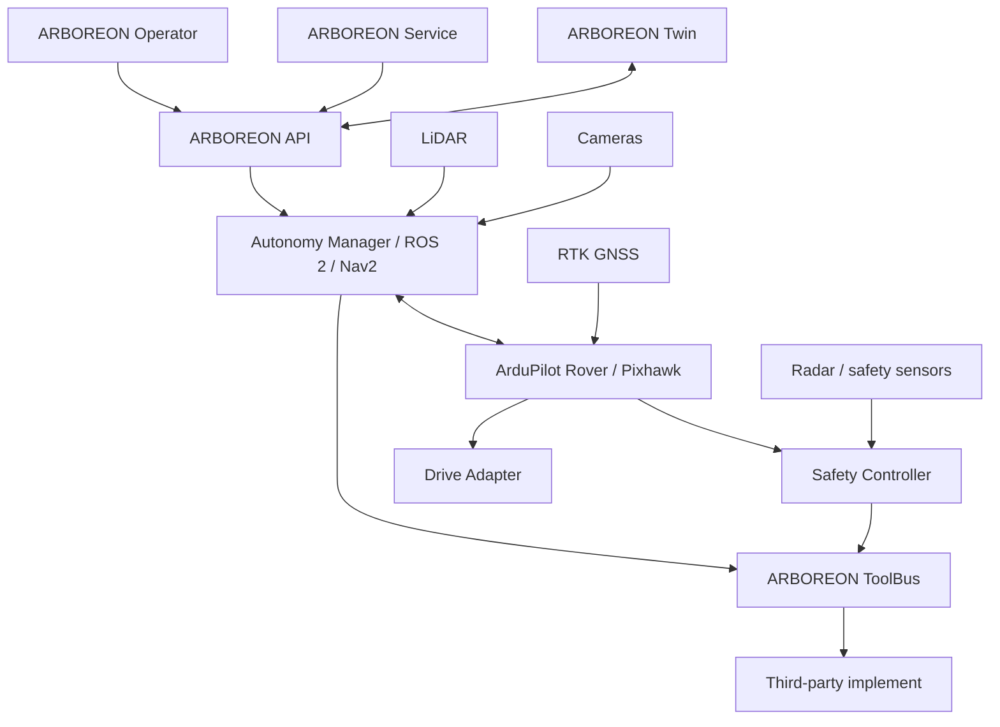
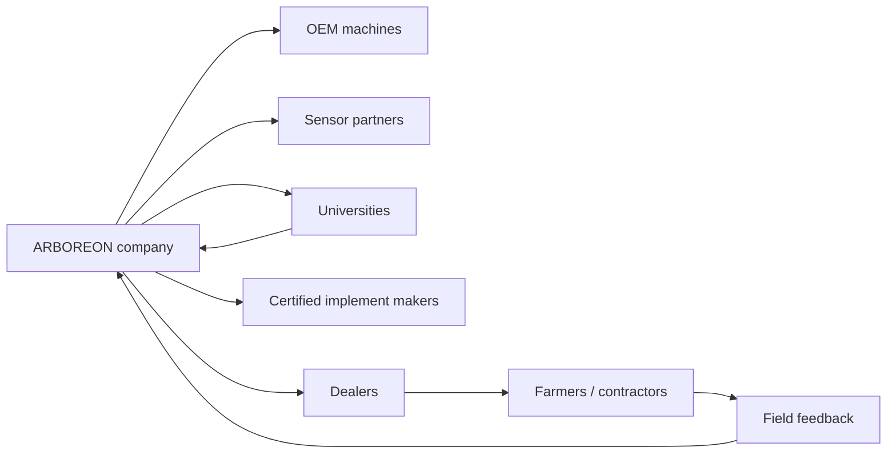

# ARBOREON
## Estrategia para convertir una plataforma robótica abierta para olivar en un producto comercial y un ecosistema industrial

**Documento estratégico de producto, industrialización, colaboración y transferencia**  
**Versión:** 1.0 — octubre de 2026  
**Documento de partida:** *Plataforma robótica autónoma, modular y de código abierto para la gestión de olivar ecológico: arquitectura, plan experimental, planificación temporal y presupuesto por fases* (v1.1).  
**Ámbito inicial:** olivar tradicional/ecológico de Andalucía, con extensión posterior a viñedo, almendro, cítricos, frutales y mantenimiento de vegetación.  
**Naturaleza del documento:** propuesta estratégica. Las empresas y grupos citados se identifican como **posibles colaboradores**; no implica contacto, acuerdo, respaldo ni compromiso por su parte.

---

# Resumen ejecutivo

El artículo científico de partida propone una plataforma robótica terrestre autónoma y modular basada en **RTK-GNSS + ArduPilot Rover + ROS 2/Nav2 + LiDAR + visión artificial + planificación de cobertura + UAV/gemelo digital**, concebida inicialmente para desbrozado, pulverización localizada, trituración de restos y, a largo plazo, retirada robotizada de varetas.

Este documento analiza cómo transformar esa plataforma experimental en un **producto comercial robusto, fácil de usar y extensible por terceros**, sin perder la filosofía de arquitectura abierta.

La propuesta se articula alrededor de una marca de trabajo:

# **ARBOREON**

> **ARBOREON — Open autonomy for perennial crops**

El nombre combina *arbor* (árbol) con una sonoridad tecnológica y épica. No limita el producto al olivar y permite crecer hacia otros cultivos leñosos. Se propone como **nombre de trabajo**: antes de utilizarlo comercialmente debe realizarse una búsqueda profesional de marcas, dominios y conflictos en EUIPO/OEPM y mercados objetivo.

La idea central no es vender “una desbrozadora autónoma”, sino construir un **ecosistema de autonomía agrícola interoperable** compuesto por:

- **ARBOREON Core** — unidad de autonomía certificable;
- **ARBOREON Sense** — percepción LiDAR/visión;
- **ARBOREON RTK** — base y rover de posicionamiento;
- **ARBOREON Drive Adapter** — adaptación a cada vehículo base;
- **ARBOREON ToolDock** — interfaz mecánica/eléctrica/datos para aperos;
- **ARBOREON ToolBus** — protocolo abierto para aperos;
- **ARBOREON Operator** — interfaz de usuario extremadamente simplificada;
- **ARBOREON Service** — herramienta avanzada para técnicos;
- **ARBOREON Twin** — mapa y gemelo digital árbol a árbol;
- **ARBOREON SDK** — especificaciones y APIs para fabricantes externos.

La plataforma debe ser **offline-first**: el robot tiene que poder navegar, detectar personas, evitar obstáculos y finalizar o abortar de forma segura sin cobertura móvil ni Starlink. Internet es una capa de sincronización, soporte y analítica, nunca un requisito de seguridad.

Desde el punto de vista comercial, la recomendación es evitar fabricar desde cero la máquina de orugas en la primera generación. Resulta mucho más eficiente negociar con fabricantes existentes de plataformas radiocontroladas —por ejemplo Blue Bird Industries/ISEKI, MDB, Energreen o McConnel— para disponer de una **base OEM o “autonomy-ready”**, mientras ARBOREON aporta la autonomía, la percepción, la interfaz abierta y los aperos inteligentes.

Una segunda decisión importante afecta a Mission Planner. Al ser software GPLv3, puede modificarse y redistribuirse comercialmente cumpliendo los términos de la licencia. Sin embargo, un *fork* profundo utilizado como interfaz de agricultor crearía una elevada deuda de mantenimiento. Se propone una estrategia de dos niveles:

1. **ARBOREON Operator**, aplicación nueva y simple destinada al agricultor;
2. **ARBOREON Service**, basada inicialmente en Mission Planner o compatible con él, destinada únicamente a instaladores, ingeniería y mantenimiento.

El objetivo final sería que un tercero pueda desarrollar, por ejemplo, un pulverizador, triturador o sensor y conectarlo a ARBOREON mediante una especificación pública, de la misma forma que un periférico se integra en una plataforma informática.

---

# 1. Del proyecto científico al producto

## 1.1. Activo tecnológico existente

El documento científico establece una arquitectura con los siguientes activos reutilizables:

- navegación RTK-GNSS;
- Pixhawk/ArduPilot Rover para control crítico;
- ROS 2/Nav2 para navegación inteligente;
- LiDAR + visión para percepción;
- *Behavior Trees* para decidir el comportamiento;
- Fields2Cover/OpenNav Coverage para cobertura;
- seguimiento individual de árboles;
- modularidad de aperos mediante CAN;
- fotogrametría y teledetección UAV;
- gemelo digital del olivar;
- desarrollo incremental desde RC 1/10 hasta plataforma real;
- diseño orientado a seguridad y funcionamiento sin Internet.

La transición comercial debe **conservar esta separación de responsabilidades**, porque es precisamente lo que facilita industrialización, validación y sustitución de componentes.

---

## 1.2. El producto real no es el robot

La propiedad intelectual y el valor diferencial deberían concentrarse en la **capa de autonomía y ecosistema**.

El vehículo es una plataforma física reemplazable.

```text
          ARBOREON AUTONOMY PLATFORM
                    │
         ┌──────────┼──────────┐
         │          │          │
       UGV A      UGV B      UGV C
     BlueBird      MDB      McConnel
         │          │          │
       Tool A     Tool B     Tool C
```

Este modelo tiene varias ventajas:

1. reduce inversión inicial en ingeniería mecánica;
2. permite lanzar antes;
3. evita depender de un único fabricante;
4. facilita entrar en diferentes rangos de potencia;
5. separa claramente el producto de autonomía del producto mecánico;
6. posibilita licenciar la tecnología a fabricantes existentes.

---

# 2. Nombre y arquitectura de marca

## 2.1. Nombre propuesto: ARBOREON

**ARBOREON** se propone como marca de trabajo porque:

- recuerda inmediatamente a árboles y cultivos leñosos;
- no está restringido al olivo;
- funciona razonablemente bien en español, inglés, portugués, italiano y francés;
- tiene una sonoridad tecnológica y de plataforma;
- admite familias de producto coherentes.

No debe considerarse legalmente disponible sin una búsqueda formal de marcas.

## 2.2. Familia de productos

| Nombre | Función |
|---|---|
| **ARBOREON Core** | Computación, autopiloto y gestión de autonomía |
| **ARBOREON Sense** | LiDAR, cámaras, radar y percepción |
| **ARBOREON RTK** | Posicionamiento centimétrico base/rover |
| **ARBOREON Drive** | Adaptación a vehículo/orugas |
| **ARBOREON ToolDock** | Enganche estándar para aperos |
| **ARBOREON ToolBus** | Protocolo abierto CAN para aperos |
| **ARBOREON Operator** | Aplicación del agricultor |
| **ARBOREON Service** | Configuración y diagnóstico técnico |
| **ARBOREON Twin** | Gemelo digital y gestión árbol a árbol |
| **ARBOREON SDK** | API, simulador y herramientas para terceros |
| **ARBOREON Certified** | Programa de certificación de aperos compatibles |

## 2.3. Posicionamiento

Una frase de posicionamiento sencilla sería:

> **Una plataforma abierta de autonomía para convertir maquinaria agrícola en robots multipropósito.**

No se vendería solo “autonomía”.

Se venderían:

- seguridad;
- ahorro de mano de obra;
- repetibilidad;
- trazabilidad;
- trabajo árbol a árbol;
- reutilización del mismo vehículo durante todo el año;
- independencia de cobertura móvil;
- apertura frente a ecosistemas propietarios.

---

# 3. Arquitectura comercial del producto



La regla fundamental debe ser:

> **La API de un tercero nunca puede saltarse la capa de seguridad.**

---

# 4. ARBOREON Core: la pieza que debe convertirse en producto

ARBOREON Core debería evolucionar hacia una caja IP65/IP67 instalada en la máquina.

## 4.1. Contenido

Una arquitectura posible:

```text
ARBOREON Core
├── Pixhawk / controlador tiempo real
├── Safety MCU independiente
├── ordenador NVIDIA Jetson
├── receptor RTK
├── CAN aislado
├── Ethernet industrial
├── alimentación DC/DC aislada
├── GNSS heading opcional
├── watchdog
├── secure element / TPM
├── almacenamiento NVMe
└── monitor térmico
```

## 4.2. Conectores externos

Evitar conectores hobby.

Interfaz industrial sugerida:

- alimentación sellada;
- M12 Ethernet;
- CAN-FD/CAN;
- entradas E-stop;
- salidas seguras;
- GNSS SMA/TNC;
- entradas encoder;
- conectores codificados por función.

## 4.3. Variantes

### Core Dev

Para universidades, integradores y fabricantes.

- accesos completos;
- SSH;
- ROS 2;
- parámetros;
- logs;
- SDK.

### Core Field

Para usuario final.

- configuración bloqueada;
- actualizaciones firmadas;
- interfaz simplificada;
- diagnóstico remoto;
- rollback.

### Core Safety

Futura variante para máquinas de mayor riesgo con elementos de seguridad certificados y arquitectura redundante.

---

# 5. No convertir Mission Planner en el producto de usuario

## 5.1. Qué permite la licencia

ArduPilot y Mission Planner se distribuyen bajo GPLv3. El propio proyecto ArduPilot explica expresamente que empresas pueden incorporar el software en productos comerciales, siempre respetando las obligaciones de la licencia, incluida la disponibilidad del código fuente correspondiente.

Fuentes:

- ArduPilot GPLv3: https://github.com/ArduPilot/ardupilot_wiki/blob/master/dev/source/docs/license-gplv3.rst
- Mission Planner: https://github.com/ArduPilot/MissionPlanner
- ArduPilot: https://github.com/ArduPilot/ardupilot

Por tanto, técnicamente y jurídicamente **es posible crear una versión modificada** de Mission Planner, siempre que se cumplan las condiciones GPLv3.

## 5.2. Problema de producto

Mission Planner es una excelente estación de ingeniería pero presenta al agricultor cientos de parámetros que no necesita.

Un operador de campo necesita saber:

```text
¿Dónde trabajar?
¿Qué trabajo realizar?
¿Está la máquina preparada?
¿Puedo iniciar?
¿Hay algún problema?
```

No necesita configurar:

```text
SERIALx_PROTOCOL
EK3_SRC1_POSXY
PSC_VEL...
MOT...
```

## 5.3. Estrategia recomendada

### ARBOREON Service

Inicialmente:

- Mission Planner upstream;
- plugins y perfiles propios;
- pantallas específicas;
- herramientas de calibración;
- diagnóstico completo.

Si se requiere un *fork*, mantenerlo **lo más delgado posible**.

### ARBOREON Operator

Aplicación independiente diseñada desde cero.

Pantalla inicial:

```text
┌─────────────────────────────────────────┐
│ ARBOREON                         READY  │
│                                         │
│ Finca: Los Olivos                       │
│ Apero: Desbrozadora                     │
│ RTK: FIX                                │
│ Seguridad: OK                           │
│ Batería: 82 %                           │
│ Combustible: 64 %                       │
│                                         │
│         [ INICIAR TRABAJO ]             │
│                                         │
│     [ Mapa ]      [ Diagnóstico ]       │
└─────────────────────────────────────────┘
```

Durante funcionamiento:

```text
12 / 846 olivos completados

████████░░░░░░░  14 %

Velocidad      0.7 m/s
RTK            FIX
Herramienta    ON
Estado         TRABAJANDO

        [ PAUSA ]

     [ PARADA SEGURA ]

  [ EMERGENCY STOP ]
```

## 5.4. Roles

### Agricultor

Solo funciones de trabajo.

### Supervisor

Misiones, mapas y planificación.

### Técnico autorizado

Calibración y diagnóstico.

### Desarrollador

ROS 2, MAVLink/DDS, logs y SDK.

La separación por roles reduce errores humanos.

---

# 6. Flujo de usuario del producto

## 6.1. Primera configuración

Un instalador:

1. monta ARBOREON Core;
2. calibra geometría del vehículo;
3. configura RTK;
4. mide posición de sensores;
5. configura parada;
6. registra aperos;
7. prueba control manual;
8. valida geofence;
9. realiza prueba sin herramienta;
10. entrega el sistema al agricultor.

## 6.2. Uso diario

El agricultor:

```text
Encender
↓
Autotest
↓
Seleccionar finca
↓
Seleccionar tarea
↓
Seleccionar apero
↓
Checklist automático
↓
Vista previa de misión
↓
START
```

## 6.3. Checklist automático

```yaml
rtk: FIX
localization_confidence: GOOD
lidar: OK
cameras: OK
safety_radar: OK
estop: OK
tool: mower_v2
tool_guard: CLOSED
geofence: LOADED
weather_limit: OK
```

Si una condición crítica falla:

```text
NO SE PUEDE INICIAR

Radar de seguridad no disponible.

[Ver diagnóstico]
```

No debe permitirse ignorar determinadas alarmas desde la interfaz normal.

---

# 7. Arquitectura abierta para terceros

El objetivo comercial más potente sería crear un ecosistema similar al de una plataforma informática:

```text
ARBOREON
     │
     ├── fabricantes de vehículos
     ├── fabricantes de aperos
     ├── fabricantes de sensores
     ├── universidades
     └── desarrolladores
```

## 7.1. ARBOREON ToolDock

Definir públicamente:

- geometría de anclaje;
- puntos de carga;
- centro de masas permitido;
- alimentación;
- conectores;
- CAN;
- paro seguro;
- identificador del apero.

Versiones posibles:

- **TD-S**: aperos pequeños;
- **TD-M**: gama media;
- **TD-H**: hidráulicos/potencia elevada.

## 7.2. ARBOREON ToolBus

Basado en CAN/CAN-FD.

Cada apero anuncia:

```yaml
vendor: ExampleTools
product: VariableSprayer
tool_class: SPRAYER
protocol_version: 1.1
working_width_m: 1.8
required_power_w: 2300
safe_stop_supported: true
capabilities:
  - variable_rate
  - section_control
  - flow_feedback
```

Mensajes mínimos:

```text
DISCOVER
GET_STATUS
GET_CAPABILITIES
ENABLE
DISABLE
SET_RATE
SET_HEIGHT
SET_RPM
SAFE_STOP
FAULT
HEARTBEAT
```

## 7.3. Tool Manifest

Cada apero incorpora un descriptor digital:

```json
{
  "vendor_id": 143,
  "product_id": 22,
  "name": "EcoSpray 180",
  "tool_class": "sprayer",
  "protocol": "arboreon-toolbus-1.0",
  "working_width": 1.8,
  "required_safety_profile": "SP3"
}
```

Al conectarlo:

```text
Apero detectado:
EcoSpray 180

Firmware compatible ✓
Seguridad compatible ✓
Perfil disponible ✓

[Activar]
```

## 7.4. SDK

El SDK público debería proporcionar:

```text
arboreon_sdk/
├── msgs/
├── tool_api/
├── simulator/
├── examples/
├── ros2/
├── can/
├── schemas/
└── certification_tests/
```

Un fabricante podría desarrollar un apero **sin modificar el núcleo del robot**.

---

# 8. Programa “ARBOREON Certified”

La apertura necesita control de calidad.

Un accesorio podría obtener:

> **ARBOREON Certified**

cuando supere:

1. compatibilidad eléctrica;
2. compatibilidad mecánica;
3. CAN conformance;
4. parada segura;
5. watchdog;
6. EMC;
7. pruebas de campo;
8. documentación;
9. identificación digital;
10. política de actualización.

Niveles:

| Certificación | Significado |
|---|---|
| Compatible | API/protocolo compatible |
| Certified | probado por el proyecto |
| Safety Certified | validación adicional para funciones críticas |

Esto permite mantener una plataforma abierta sin convertirla en un sistema impredecible.

---

# 9. Estrategia de vehículo base

## 9.1. No diseñar el chasis desde cero en Gen-1

La primera generación comercial debería utilizar una plataforma existente.

Criterios OEM:

- dos orugas controlables independientemente;
- interfaz electrónica documentable;
- freno/estado seguro;
- acceso al bus de potencia;
- generador/batería suficiente;
- disponibilidad de repuestos;
- documentación técnica;
- estabilidad;
- capacidad de operar lentamente;
- posibilidad de instalar sensores;
- colaboración del fabricante;
- marcado y documentación de conformidad.

---

# 10. Fabricantes de bases especialmente interesantes

## 10.1. Blue Bird Industries — prioridad alta

Blue Bird comercializa máquinas híbridas radiocontroladas muy próximas a la arquitectura buscada.

El **FM 24-70** dispone de:

- motor térmico Loncin de 452 cc;
- dos motores eléctricos brushless;
- 24 V;
- 1.200 W;
- orugas;
- 69 cm de corte;
- mando hasta 200 m;
- 285 kg.

Fuente oficial:

https://www.bluebirdind.com/en/products/remote-control-fm-24-70/

Es una candidata especialmente interesante para:

- prototipo industrial de coste contenido;
- acuerdo OEM;
- suministro de chasis sin electrónica de radio propia;
- acceso al protocolo/controladores de motores;
- variante “autonomy-ready”.

### Propuesta de colaboración

Solicitar:

1. reunión técnica;
2. documentación de control de tracción;
3. acceso al controlador;
4. posibilidad de entrada CAN/analógica;
5. disponibilidad de unidades sin receptor RC;
6. precios OEM;
7. acuerdo de codesarrollo.

---

## 10.2. ISEKI — prioridad alta

ISEKI France comercializa la **RCBH70-2**, una máquina híbrida con motor térmico para corte y motores eléctricos para las orugas, alcance de radio de hasta 200 m y 285 kg.

Fuente:

https://www.iseki.fr/produit/debroussailleuse-radio-commandee-rcbh70-fm24-70/

Su arquitectura es prácticamente ideal como vehículo de validación porque desacopla tracción eléctrica y potencia de corte.

Un acuerdo con ISEKI podría aportar:

- red comercial;
- servicio técnico;
- confianza del sector;
- acceso a clientes profesionales.

---

## 10.3. CAMON HM27 — candidata de bajo coste, pendiente de verificar OEM

En el mercado español aparece la CAMON HM27 con:

- arquitectura híbrida;
- orugas;
- control remoto;
- motor Loncin;
- peso ≈ 246 kg;
- anchura de corte ≈ 68 cm.

Sin embargo, para este documento **no se ha localizado una fuente oficial suficientemente clara del fabricante**. Antes de considerar una colaboración estratégica sería necesario identificar:

- fabricante/OEM real;
- país de fabricación;
- documentación CE;
- repuestos;
- esquemas eléctricos;
- controladores;
- capacidad de suministro sostenido.

Puede ser excelente para experimentación, pero el producto comercial no debería basarse en un OEM cuya cadena técnica no esté claramente documentada.

---

## 10.4. LIKE 500 — identificación pendiente

El modelo denominado “LIKE 500” en las conversaciones previas no ha podido identificarse inequívocamente mediante fuentes públicas durante la elaboración de este documento.

Por tanto:

> **No debe incorporarse todavía a la matriz comercial como proveedor verificado.**

La primera acción sería localizar fabricante, ficha técnica, homologación y canal OEM.

---

## 10.5. MDB / Green Climber — prioridad muy alta para plataforma multipropósito

MDB lleva décadas fabricando máquinas radiocontroladas de orugas y dispone de múltiples accesorios.

Fuentes:

https://mdbsrl.com/es/  
https://mdbsrl.com/en/become-a-reseller/

MDB declara una red internacional amplia y una gama de máquinas y accesorios.

Su interés para ARBOREON es especialmente alto porque ya comparte la filosofía:

> **un vehículo → muchos aperos**

Posibles acuerdos:

- API de control del portaherramientas;
- kit de autonomía;
- distribución conjunta;
- proyecto piloto para agricultura mediterránea;
- versión OEM “ARBOREON-ready”.

---

## 10.6. Energreen — prioridad alta

RoboEVO y RoboMAX son portaherramientas radiocontrolados con múltiples aperos.

Fuente:

https://en.energreen.it/green-maintenance-machines-energreen/robo-remote-controlled-tool-carriers/radio-controlled-tracked-mower/

Energreen puede ser un socio especialmente interesante para una versión profesional/forestal de mayor potencia.

---

## 10.7. McConnel ROBOCUT — prioridad alta como socio de gama profesional

McConnel dispone de una familia completa:

- S300/S300E;
- T400;
- T500;
- T600;
- T800.

Los T600/T800 incluso se anuncian como preparados para **GPS Autosteer**, y la gama dispone de muchos aperos.

Fuentes:

https://www.mcconnel.com/products/robocut/robocut-t400-t500  
https://www.mcconnel.com/products/robocut/robocut-t600-t800

Esta empresa sería muy interesante para una estrategia posterior de licenciamiento:

```text
McConnel machine
+
ARBOREON autonomous kit
```

---

# 11. Estrategia multi-OEM

Evitar:

```text
ARBOREON = modificación de una única máquina
```

Preferir:

```text
               ARBOREON
                   │
        ┌──────────┼───────────┐
        │          │           │
      BB/ISEKI     MDB      McConnel
        │          │           │
   Adapter BB   Adapter MDB  Adapter MC
```

Crear una HAL (*Hardware Abstraction Layer*):

```text
DriveAdapter
├── set_left_track()
├── set_right_track()
├── brake()
├── read_track_speed()
├── read_machine_faults()
├── tool_power_enable()
└── emergency_stop()
```

Cada fabricante implementa solamente su adaptador.

---

# 12. Socios tecnológicos para los componentes

## 12.1. ArduSimple — RTK/OEM

ArduSimple ofrece explícitamente:

- productos OEM/white-label;
- precios por volumen;
- servicios de configuración;
- montaje PCB;
- software personalizado;
- diseño de cajas.

Fuentes:

https://www.ardusimple.com/professional-sets/  
https://www.ardusimple.com/services/  
https://www.ardusimple.com/new-product-line-ardusimple-engineering-series/

Esto lo convierte en uno de los **primeros socios que contactaría**.

Objetivo:

> receptor RTK ARBOREON preconfigurado y fabricado en volumen.

---

## 12.2. Holybro

Holybro fabrica Pixhawk, GPS y electrónica para vehículos no tripulados y participa en ecosistemas Pixhawk/ArduPilot/PX4.

Fuentes:

https://holybro.com/pages/about-us  
https://docs.holybro.com/company/certification-iso-fcc-ce-rohs-etc

Ventajas:

- hardware estandarizado;
- documentación;
- certificaciones EMC disponibles para determinados productos;
- experiencia en fabricación.

Posible objetivo:

> una variante de controlador o kit Pixhawk/Jetson adaptado a ARBOREON.

---

## 12.3. NVIDIA

Socio tecnológico natural para:

- Jetson;
- IA en edge;
- TensorRT;
- soporte de ecosistema.

A medio plazo debe evaluarse si la plataforma comercial utiliza un módulo Jetson de vida útil larga en lugar del kit de desarrollo.

---

## 12.4. Luxonis

Interesante por:

- cámaras OAK;
- profundidad estéreo;
- aceleración de IA;
- SDK DepthAI;
- PoE.

Para el producto definitivo deberán seleccionarse variantes con protección y rango térmico compatibles con el diseño.

---

## 12.5. LiDAR: Livox, Hesai, Ouster/SICK

No debería ligarse el producto a una marca única.

La interfaz software debe permitir varios drivers.

```text
RangeSensor API
├── 2D lidar
├── Livox
├── Hesai
└── Ouster / industrial
```

Así puede existir:

- versión económica;
- versión profesional;
- versión industrial alta temperatura.

---

# 13. Empresas españolas especialmente interesantes

## 13.1. eProsima

Empresa española con gran experiencia en DDS y middleware, tecnología muy relacionada con ROS 2 y comunicaciones distribuidas.

Interés:

- arquitectura DDS;
- comunicaciones robustas;
- ciberseguridad;
- ROS 2 industrial.

## 13.2. Robotnik Automation

Fabricante/integrador español de robots móviles y ROS.

Interés:

- industrialización ROS;
- integración de robots móviles;
- seguridad y soporte comercial.

## 13.3. CITOLIVA

Centro tecnológico específicamente ligado al olivar y aceite de oliva.

Interés:

- validación agronómica;
- conexión con cooperativas;
- transferencia;
- demostradores;
- proyectos nacionales/europeos.

## 13.4. Cooperativas y grandes grupos olivareros

Ejemplos de socios piloto potenciales:

- Dcoop;
- Jaencoop;
- Interóleo;
- Picualia;
- cooperativas locales de Jaén;
- empresas de servicios agrícolas.

Su papel no tiene que ser tecnológico.

Son imprescindibles para:

- parcelas piloto;
- feedback de usuario;
- cálculo de ROI;
- requisitos reales;
- mantenimiento;
- aceptación de mercado.

---

# 14. Empresas de seguridad industrial

Para producto comercial deben incorporarse socios especialistas.

Candidatos:

- SICK;
- Pilz;
- ifm;
- Pepperl+Fuchs;
- Bosch Rexroth;
- Danfoss;
- Epec.

Posibles componentes:

- radar/LiDAR safety;
- relés de seguridad;
- controladores;
- encoders;
- inclinómetros;
- CAN;
- actuadores.

El principio debe ser:

> la detección semántica de una persona mediante IA **no sustituye** una función de seguridad certificada.

---

# 15. Laboratorios y certificación

Antes de producto final debería implicarse tempranamente a un laboratorio/notified body o consultora de conformidad.

Posibles organizaciones:

- Applus+ Laboratories;
- TÜV Rheinland;
- TÜV SÜD;
- SGS;
- Bureau Veritas;
- AENOR como entidad de normalización/certificación según el ámbito.

La colaboración debe comenzar **antes de congelar el hardware**, no después.

---

# 16. Regulación europea a incorporar desde el diseño

## 16.1. Reglamento de Máquinas (UE) 2023/1230

El Reglamento (UE) 2023/1230 será aplicable a partir del **20 de enero de 2027**.

Fuente oficial:

https://eur-lex.europa.eu/eli/reg/2023/1230/2026-07-27/spa

Por tanto, si ARBOREON llega al mercado durante la planificación propuesta, debe diseñarse desde el inicio pensando en este reglamento y no solo en la antigua Directiva de Máquinas.

## 16.2. Cyber Resilience Act

El Reglamento de Ciberresiliencia de la UE afecta a productos con elementos digitales.

La aplicación plena está prevista para el **11 de diciembre de 2027**, y las obligaciones de notificación de vulnerabilidades e incidentes graves se aplican ya desde el **11 de septiembre de 2026**.

Fuentes:

https://digital-strategy.ec.europa.eu/es/policies/cra-summary  
https://eur-lex.europa.eu/legal-content/ES/TXT/?uri=CELEX:32024R2847

Consecuencia directa:

ARBOREON debe disponer de:

- SBOM;
- política de actualizaciones;
- proceso de vulnerabilidades;
- firma de firmware;
- secure boot cuando sea viable;
- actualizaciones autenticadas;
- gestión de CVE;
- fecha de soporte;
- canal de reporte de seguridad.

## 16.3. Radio Equipment Directive

RTK radio, Wi-Fi, Bluetooth y otros equipos radioeléctricos pueden quedar dentro del marco de la Directiva 2014/53/UE.

Fuente:

https://eur-lex.europa.eu/legal-content/ES/TXT/?uri=CELEX:32014L0053

## 16.4. Normas técnicas a analizar

La matriz definitiva de conformidad debe elaborarse con especialistas. Entre las familias que previsiblemente habrá que analizar se encuentran:

- ISO 12100 — evaluación y reducción de riesgos;
- ISO 13849 — partes de sistemas de control relacionadas con seguridad;
- ISO 25119 — partes de sistemas de control relacionadas con seguridad en maquinaria agrícola;
- ISO 18497 — maquinaria agrícola altamente automatizada;
- requisitos EMC;
- RED para radio;
- normas específicas del apero;
- requisitos de pulverización cuando corresponda.

**Esta lista es orientativa y debe ser validada por un especialista de conformidad.**

---

# 17. Seguridad como producto, no como característica

Para comercialización, la seguridad debe ser un subsistema independiente.

```text
                   Safety MCU
              ┌────────┼─────────┐
              │        │         │
           E-STOP    radar     watchdog
              │        │         │
              └────────┼─────────┘
                       ▼
                  safety relay
                  /          \
             traction        tool
```

Ni ROS 2 ni Jetson deberían poder impedir una parada física.

## 17.1. Estados

```text
SAFE_OFF
MANUAL
READY
AUTONOMOUS
PAUSED
CONTROLLED_STOP
EMERGENCY_STOP
FAULT
```

## 17.2. Reanudación

Después de persona/E-stop:

> No reinicio automático.

Debe requerirse una condición definida y, en los casos de mayor riesgo, confirmación humana.

---

# 18. Arquitectura de software comercial

## 18.1. Open Source Core

Mantener abiertos:

- especificación ToolBus;
- mensajes ROS;
- interfaces de vehículo;
- simulación;
- ejemplos;
- protocolos;
- API de aperos;
- formatos de mapas;
- formato del gemelo digital.

## 18.2. Componentes GPL

Cuando se distribuya ArduPilot/Mission Planner modificado:

- cumplir GPLv3;
- publicar el código correspondiente;
- mantener avisos;
- documentar cambios.

## 18.3. Componentes de valor comercial

La estrategia de propiedad intelectual debe ser revisada jurídicamente, pero arquitectónicamente puede separarse en procesos y servicios bien definidos:

```text
Open protocols
     │
     ├── certified hardware
     ├── support
     ├── fleet management
     ├── agronomic analytics
     ├── certification service
     └── commercial integrations
```

El negocio no tiene que depender de ocultar código.

---

# 19. Modelo de negocio recomendado

## Línea 1 — Kit de autonomía

```text
ARBOREON Core
+ sensors
+ RTK
+ installation
```

Precio objetivo dependerá del vehículo y nivel de seguridad.

## Línea 2 — Máquina completa

```text
OEM UGV
+
ARBOREON
+
apero
```

Se vende a través de fabricante/distribuidor.

## Línea 3 — Licencia OEM / integración

Fabricante incorpora ARBOREON de fábrica.

## Línea 4 — Aperos Certified

Ingresos:

- pruebas;
- certificación;
- soporte;
- integración.

## Línea 5 — Twin/Fleet

Suscripción opcional para:

- histórico;
- analítica;
- flotas;
- UAV;
- prescripciones.

Debe existir un modo local sin suscripción para evitar bloquear al agricultor.

## Línea 6 — Soporte

- puesta en marcha;
- mantenimiento;
- formación;
- SLA;
- extensión de garantía.

---

# 20. Diseño “offline first”

En un olivar real:

```text
Internet = opcional
RTK local = esencial
seguridad = local
IA = local
mapa = local
misión = local
```

Starlink:

- soporte remoto;
- telemetría;
- actualizaciones;
- sincronización;
- vídeo.

Si Starlink desaparece:

```text
robot continúa de forma segura
o
ejecuta parada controlada
```

dependiendo de política.

---

# 21. Actualizaciones OTA

Producto comercial implica gestionar decenas o cientos de máquinas.

Arquitectura:

```text
Release
  ↓
CI
  ↓
tests simulation
  ↓
hardware-in-loop
  ↓
signed image
  ↓
staged rollout
  ↓
5 robots
  ↓
50 robots
  ↓
fleet
```

Nunca:

```text
git pull
```

en una máquina de producción.

Necesidades:

- A/B partition;
- rollback;
- firmware firmado;
- versionado de configuración;
- backup;
- registro de actualización.

---

# 22. Hardware abstraction layer

Cada vehículo implementa una interfaz común.

```cpp
class VehicleAdapter {
  setVelocity(v, omega);
  stop();
  emergencyStop();
  readWheelSpeeds();
  readBattery();
  readEngine();
  readFaults();
};
```

Esto hace posible que el software desarrollado para el RC pase a:

- BlueBird;
- ISEKI;
- MDB;
- Energreen;
- McConnel.

---

# 23. Simulator-first

Todo fabricante externo debe poder probar su componente sin tener una máquina.

```text
ARBOREON Simulator
├── orchard world
├── olive tree models
├── rock obstacles
├── people
├── slopes
├── GNSS dropout
├── dust/noise models
└── implement simulator
```

El SDK debe proporcionar:

```bash
docker compose up arboreon-sim
```

y un ejemplo completo.

Esto sería una ventaja estratégica enorme para crear comunidad.

---

# 24. Grupos de investigación prioritarios en España

## 24.1. Universidad de Jaén — GRAV

**Grupo de Robótica, Automática y Visión por Computador (TEP237)**.

Responsable actual indicado por UJA: **Javier Gámez García**.

Investigadores publicados por UJA incluyen, entre otros:

- Javier Gámez García;
- Pablo Cano Marchal;
- Jesús de la Casa Cárdenas;
- Elisabet Estévez Estévez;
- Juan Gómez Ortega;
- Diego Manuel Martínez Gila;
- Ildefonso Ruano Ruano;
- Alejandro Sánchez García;
- Silvia María Satorres Martínez.

Fuente:

https://investigacion.ujaen.es/grupos/12080/detalle?lang=en

### Por qué es el socio natural

- proximidad al olivar de Jaén;
- automática;
- robótica;
- visión;
- Instituto Universitario de Investigación en Olivar y Aceites de Oliva;
- capacidad de experimentación local.

**Javier Gámez García** aparece como catedrático de Ingeniería de Sistemas y Automática y miembro del instituto de olivar.

https://investigacion.ujaen.es/investigadores/192509/detalle

**Prioridad de contacto: MUY ALTA.**

---

# 25. Universidad de Córdoba — CEMTRO / AGR-126

Probablemente uno de los grupos más directamente alineados con la industrialización agronómica.

El Centro de Mecanización, Tecnología Rural y del Olivar trabaja específicamente en mecanización del olivar.

Fuentes:

https://www.uco.es/investiga/grupos/cemtro/  
https://www.uco.es/cemtro/index.php/investigacion/item/47-olivar

El grupo ha trabajado en:

- mecanización del olivar;
- desbrozado de cubiertas;
- tratamientos;
- maquinaria;
- seguridad;
- pendientes;
- agricultura de precisión.

Investigadores especialmente relevantes:

### Jesús A. Gil Ribes
Mecanización de olivar, agricultura de precisión, aplicaciones y riesgos.

### Gregorio L. Blanco Roldán
Mecanización, aplicaciones de agroquímicos, maquinaria forestal, prevención de riesgos.

### Juan Agüera Vega
Agricultura de precisión, aplicación variable, sensores e instrumentación.

### Sergio Castro García
Recolección mecanizada y agricultura de precisión.

### Francisco J. Castillo Ruiz
Responsable de una oferta específica de diseño y ensayo de maquinaria para olivar y frutales.

### Antonio Miranda Fuentes
Dosificación fitosanitaria, caracterización de vegetación y prototipos de aplicación en olivar.

Fuente de equipo:

https://www.uco.es/cemtro/index.php/equipo-trabajo

Además, UCO ha desarrollado recientemente el tractor autónomo **Sergius**, orientado a cultivos leñosos.

https://www.uco.es/ucci/es/proyecto-investigacion/item/4994-un-tractor-autonomo-recorre-el-olivar-asi-se-ha-optimizado-su-navegacion-entre-hileras-de-arboles

**Prioridad de contacto: MUY ALTA.**

---

# 26. UPV — Agricultural Robotics Laboratory

La Universitat Politècnica de València mantiene una línea explícita de:

> **Robótica Agrícola y Vehículos Inteligentes**

Investigador principal:

### Francisco Rovira-Más

Fuente:

https://www.upv.es/entidades/DIRA/infoweb/dira/info/871771normalc.html

La UPV indica experiencia en:

- automatización de maquinaria;
- robótica agrícola;
- visión;
- pulverización;
- sensores.

En junio de 2026, Rovira-Más fue reconocido como Fellow de iAABE y la UPV destaca su trabajo en visión artificial, IA y vehículos inteligentes aplicados a agricultura.

https://www.upv.es/entidades/etsiamn/2026/06/29/francisco-rovira-mas-elegido-fellow-de-la-international-academy-of-agricultural-and-biosystems-engineering/

Otros nombres relevantes de este entorno:

- Verónica Saiz-Rubio;
- Andrés Cuenca-Cuenca;
- Coral Ortiz Sánchez.

**Prioridad de contacto: MUY ALTA.**

---

# 27. IAS-CSIC / UCO — imaPing

Grupo de teledetección aplicada a agricultura de precisión.

Investigadora especialmente relevante:

### Francisca López-Granados

Sus líneas incluyen:

- UAV;
- multiespectral;
- hiperespectral;
- termografía;
- LiDAR;
- olivar;
- arquitectura 3D árbol a árbol;
- mapas de aplicación localizada.

Fuente:

https://www.ias.csic.es/departments/crop-protection/remote-sensing-applied-to-precision-agriculture-and-malherbology/?lang=en

Perfil:

https://www.ias.csic.es/investigacion/departamentos/proteccion-de-cultivos/teledeteccion-aplicada-a-agricultura-de-precision-y-malherbologia/francisca-lopez-granados/

El grupo participó además en el proyecto europeo **RHEA — Robot Fleet for Highly Effective Agriculture and Forestry Management**.

https://www.ias.csic.es/imaping/

**Prioridad: MUY ALTA para UAV, malas hierbas, prescripción y gemelo digital.**

---

# 28. UCO — AGR-124 / CereSys

## AGR-124 — Teledetección y agricultura de precisión

Investigadores publicados:

- Francisco Javier Mesas Carrascosa;
- Alfonso García-Ferrer Porras;
- Isabel Luisa Castillejo González.

Fuente:

https://www.uco.es/patricia/index.php/es/quienes-somos/nuestros-investigadores/grupo-de-investigacion-agr-124

## CereSys

Grupo multidisciplinar en:

- teledetección;
- GIS;
- robótica;
- agricultura de precisión;
- RGB/multiespectral/hiperespectral;
- LiDAR;
- IA;
- plataformas terrestres autónomas.

Fuente:

https://www.uco.es/ceresys/

**Prioridad: ALTA.**

---

# 29. UdL / Agrotecnio — GRAP

Grupo de Investigación en AgróTICa y Agricultura de Precisión.

Fuente:

https://www.grap.udl.cat/es/presentacio/

Particularmente fuerte en:

- tecnologías de aplicación fitosanitaria;
- agricultura de precisión;
- LiDAR de cultivos;
- dosis variable;
- maquinaria inteligente.

Investigadores de referencia asociados a sus trabajos:

- Joan Ramon Rosell;
- Ricardo Sanz;
- Alexandre Escolà;
- Jordi Llorens;
- Jaume Arnó;
- Santiago Planas.

Fuente de tesis:

https://www.grap.udl.cat/es/recerca/tesis-dirigides/

**Prioridad: ALTA para pulverización inteligente y caracterización LiDAR.**

---

# 30. NMBU / Saga Robotics — Thorvald

El sistema Thorvald es una referencia internacional de robot agrícola modular.

Investigador especialmente relevante:

### Pål Johan From

NMBU documenta su trabajo en robótica y sensores agrícolas y su relación con Saga Robotics/Thorvald.

https://www.nmbu.no/en/research/how-robots-find-best-food

**Valor de colaboración:**

- diseño modular;
- experiencias de comercialización;
- flotas;
- transición investigación→empresa.

---

# 31. UC Merced — orchard robotics

### Reza Ehsani

Profesor de UC Merced especializado en:

- automation and intelligent agricultural machines;
- precision agriculture;
- sensors;
- robotic systems for fruit and nut trees.

Fuente:

https://engineering.ucmerced.edu/content/reza-ehsani

Su entorno es especialmente interesante por el proyecto RoMu4o/UCM-AgBot utilizado como referencia en el artículo base.

**Prioridad: ALTA como colaboración internacional.**

---

# 32. University of Perugia — ISARLab / AGROBOT

El proyecto AGROBOT utiliza:

- GNSS;
- LiDAR;
- visión;
- sensores inerciales;
- navegación autónoma;
- evasión de obstáculos;
- mapas multiespectrales;
- monitorización de mosca del olivo.

Fuente:

https://isar.unipg.it/project/agrobot/

Es una colaboración europea particularmente alineada con ARBOREON.

---

# 33. Comité científico-técnico recomendado

Un comité ideal debería cubrir:

| Área | Perfil |
|---|---|
| Robótica móvil | UJA / UPV |
| Maquinaria del olivar | UCO CEMTRO |
| RTK/localización | universidad + ArduPilot |
| LiDAR/visión | UJA/UCO |
| Pulverización | UCO/GRAP |
| UAV | IAS-CSIC/UCO |
| Seguridad | laboratorio industrial |
| Usuario final | cooperativa/agricultor |
| Fabricación | OEM |
| Open source | ArduPilot/ROS ecosystem |

No es necesario que todos sean socios contractuales.

---

# 34. Investigadores internacionales de software especialmente relevantes

El ecosistema open source también es parte del consorcio informal.

## ArduPilot

El repositorio actual identifica mantenedores como:

- Andrew Tridgell;
- Randy Mackay — Rover/Copter;
- Grant Morphett — Rover;
- Rishabh Singh — Avoidance/Proximity;
- Michael du Breuil — GPS/scripting, entre otros subsistemas.

Fuente:

https://github.com/Ardupilot/ardupilot

Una relación activa con la comunidad es preferible a mantener parches privados.

## Nav2

La comunidad Nav2/Open Navigation resulta estratégica para:

- navegación;
- Behavior Trees;
- cobertura;
- seguridad local.

## Fields2Cover

Su equipo y comunidad son potenciales colaboradores para convertir `work-around-tree` en una extensión reutilizable.

---

# 35. Estrategia de alianzas

No contactar a 30 organizaciones con el mismo mensaje.

Crear cuatro niveles.

## Nivel A — socios fundadores

Objetivo: 4–6.

Propuesta:

- universidad coordinadora;
- UJA GRAV;
- UCO CEMTRO;
- fabricante de plataforma;
- ArduSimple;
- cooperativa/finca.

## Nivel B — socios tecnológicos

- NVIDIA;
- Luxonis;
- LiDAR;
- Holybro;
- eProsima;
- seguridad industrial.

## Nivel C — socios científicos

- UPV;
- IAS-CSIC;
- GRAP;
- NMBU;
- UC Merced;
- Perugia.

## Nivel D — ecosistema

- fabricantes de aperos;
- integradores;
- distribuidores;
- startups.

---

# 36. Qué pedir a un fabricante de robot base

No iniciar la conversación pidiendo “comprar una máquina”.

Presentar:

> Queremos convertir su plataforma en una máquina autónoma abierta y desarrollar conjuntamente una nueva categoría de producto.

Solicitar:

### Ingeniería

- diagrama eléctrico;
- controlador de motores;
- interfaz de velocidad;
- interfaz de giro;
- señales E-stop;
- feedback de velocidad;
- estado de motor;
- tensión/corriente;
- control de herramienta.

### Comercial

- precio OEM;
- MOQ;
- exclusividad o no;
- territorio;
- repuestos;
- garantía;
- formación;
- unidad de demostración.

### Legal

- responsabilidad por modificaciones;
- quién es fabricante final;
- estrategia CE;
- documentación técnica;
- propiedad de modificaciones.

---

# 37. Tres modelos de colaboración OEM

## Modelo A — Retrofit

ARBOREON compra máquinas estándar y añade un kit.

Ventaja:

- rápido.

Problema:

- integración menos limpia.

## Modelo B — Autonomy Ready

El fabricante suministra:

```text
chasis
+ tracción
+ motor
+ herramienta
+ interfaz documentada
```

ARBOREON instala autonomía.

**Es probablemente el mejor modelo para Gen-1.**

## Modelo C — Integración de fábrica

El fabricante produce:

> Powered by ARBOREON

Mayor escala, pero requiere madurez.

---

# 38. Producto mínimo comercial

No intentar vender desde el principio:

- desbrozado;
- pulverización;
- triturador;
- brazo;
- UAV;
- gemelo digital.

## Gen-0 — Research Kit

Universidades e integradores.

## Gen-1 — Autonomous Mower

Debe hacer solamente:

1. mapear finca;
2. navegar;
3. detectar obstáculos;
4. detectar persona y detenerse;
5. desbrozar;
6. rodear olivos;
7. registrar trabajo;
8. permitir control remoto.

## Gen-2

Añadir:

- pulverización;
- UAV;
- prescripciones.

## Gen-3

- ecosistema de terceros;
- flotas;
- manipulación.

---

# 39. ARBOREON Gen-1

Propuesta física:

```text
Base híbrida 250–500 kg
+
ARBOREON Core
+
RTK dual
+
LiDAR 3D
+
2–4 cámaras
+
radar/sensor safety
+
E-stop independiente
+
mando manual
```

Objetivo:

> 8 horas de operación agrícola supervisada sin intervención en navegación rutinaria.

---

# 40. Diseño para mantenimiento

El agricultor no debe convertirse en técnico ROS.

Componentes reemplazables:

```text
[Core]
[SenseBar]
[RTK]
[Safety]
[Drive Interface]
[Tool Interface]
```

Cada módulo:

- número de serie;
- firmware;
- autotest;
- QR;
- instrucciones.

Si falla cámara:

```text
Camera 2 fault

Replace module C2
```

No:

```text
ROS node oak_camera_driver exited code 255
```

---

# 41. Telemetría y “black box”

Registrar:

- órdenes;
- estado de seguridad;
- vídeo de eventos;
- objetos;
- RTK;
- velocidad;
- herramienta;
- E-stop;
- errores;
- software;
- configuración.

Ante incidente:

```text
t = -10 s ... +30 s
```

Debe existir un registro protegido.

Es fundamental para:

- soporte;
- mejora;
- responsabilidad;
- certificación.

---

# 42. Gemelo digital comercial

ARBOREON Twin no debería empezar como plataforma SaaS enorme.

Versión 1:

```text
Mapa
├── parcelas
├── olivos
├── obstáculos
└── trabajos
```

Por árbol:

```text
OLV-427
├── posición
├── última operación
├── tiempo
├── alertas
└── imágenes
```

Después:

- vigor;
- temperatura;
- NDVI;
- rendimiento;
- tratamientos.

---

# 43. UAV

La capa UAV puede ser agnóstica.

Entrada:

```text
GeoTIFF
orthomosaic
point cloud
tree shapefile
prescription map
```

No obligar a un DJI específico.

Soportar:

- DJI;
- Autel;
- equipos RTK;
- servicios externos.

Esto evita dependencia.

---

# 44. Modelo de marketplace futuro

Un fabricante publica:

```text
OliveSpray X2
ARBOREON Certified
€...
```

Otro:

```text
BranchMulcher 120
ARBOREON Certified
```

Otro:

```text
CanopySense
ARBOREON Compatible
```

El valor de ARBOREON crece con los terceros.

---

# 45. Gobierno open source

Propuesta:

```text
ARBOREON Foundation / Consortium
```

a largo plazo.

Inicialmente:

- repositorio público;
- RFCs;
- especificaciones;
- governance;
- CLA/DCO;
- roadmap público.

Separar:

### Open specification

Neutral.

### Commercial product

Mantenido por empresa.

Esto genera confianza para fabricantes que no quieren depender de una API privada que puede cambiar arbitrariamente.

---

# 46. Repositorios

```text
arboreon/
├── arboreon-spec
├── arboreon-sdk
├── arboreon-msgs
├── arboreon-sim
├── arboreon-nav
├── arboreon-tools
├── arboreon-vehicle-adapters
└── arboreon-docs
```

Repositorios comerciales separados cuando proceda.

---

# 47. Compatibilidad de versiones

Nunca:

```text
"funciona con la versión actual"
```

Definir:

```text
ARBOREON Platform API 1.0
ToolBus 1.0
Vehicle API 1.0
Map Schema 1.0
```

SemVer.

Un apero ToolBus 1.x debe funcionar con Core compatible.

---

# 48. Hardware reference design

Publicar suficiente información para permitir terceros:

```text
ARBOREON Reference Tool Controller
```

Componentes:

- MCU;
- CAN;
- entradas;
- salidas;
- E-stop loop;
- firmware abierto.

Un fabricante puede copiarlo o comprarlo.

---

# 49. Kit de desarrollador para aperos

Podría venderse por:

```text
300–800 €
```

incluyendo:

- ToolBus dev board;
- cable;
- terminador CAN;
- simulador;
- documentación;
- soporte inicial.

Esto reduce radicalmente la barrera de entrada.

---

# 50. Roadmap de producto

## Fase P0 — 0–6 meses

**Objetivo:** demostrar arquitectura de producto.

- nombre provisional;
- especificación interfaces;
- prototipo RC;
- RTK;
- ArduPilot;
- primer Operator UI;
- simulación;
- lista OEM.

Entregable:

> ARBOREON Developer Preview.

## P1 — 6–12 meses

- LiDAR;
- visión;
- persona;
- obstáculos;
- olivo;
- CIRCLE_TREE;
- hardware Core Alpha.

## P2 — 12–18 meses

- primera base híbrida comercial;
- Drive Adapter;
- Safety v1;
- prototipo de campo.

## P3 — 18–24 meses

- 1.000 h acumuladas de pruebas;
- revisión industrial;
- beta con agricultores.

## P4 — 24–30 meses

- Core Beta industrial;
- caja;
- conectores;
- EMC;
- pre-compliance;
- documentación.

## P5 — 30–36 meses

- piloto comercial limitado;
- 5–10 máquinas;
- servicio técnico.

## P6 — 36–48 meses

- versión 1.0;
- primer apero externo;
- programa Certified;
- expansión internacional.

---

# 51. TRL y gates

| Gate | Requisito |
|---|---|
| G0 | simulación reproducible |
| G1 | RC navegación |
| G2 | RC percepción |
| G3 | robot real sin herramienta |
| G4 | robot real desbrozando |
| G5 | seguridad pre-compliance |
| G6 | piloto 5 máquinas |
| G7 | producto comercial |

No pasar de gate por calendario.

Pasar por evidencia.

---

# 52. Presupuesto adicional de industrialización

El artículo científico estima desarrollo y hardware de investigación. El paso a producto requiere nuevas partidas.

## 52.1. Ingeniería de producto

| Partida | Estimación |
|---|---:|
| diseño electrónico Core v1 | 20.000–50.000 € |
| prototipos PCB | 5.000–15.000 € |
| diseño mecánico caja | 10.000–30.000 € |
| prototipos mecanizados | 5.000–15.000 € |
| cableado industrial | 5.000–15.000 € |
| HIL test bench | 10.000–30.000 € |
| UX Operator | 20.000–60.000 € |
| sistema OTA/backend inicial | 20.000–60.000 € |

## 52.2. Validación

| Partida | Estimación |
|---|---:|
| EMC pre-compliance | 5.000–15.000 € |
| ensayos ambientales | 10.000–30.000 € |
| vibración/impacto | 10.000–25.000 € |
| IP tests | 5.000–15.000 € |
| análisis de seguridad | 15.000–50.000 € |
| conformidad/certificación | 20.000–80.000+ € |

## 52.3. Piloto

10 unidades:

```text
10 × 15.000–40.000 €
```

dependiendo de si la base se compra o es cedida.

### Orden de magnitud

Para convertir la investigación en un producto comercial serio:

> **300.000–800.000 € adicionales** pueden ser un rango razonable de industrialización inicial antes de escala, además del programa científico y del personal.

Una máquina totalmente nueva diseñada desde cero elevaría considerablemente la cifra; por eso es estratégica la alianza OEM.

---

# 53. Equipo mínimo de producto

## Ciencia/algoritmos

- 1 robotics lead;
- 1 percepción/IA;
- 1 navegación/localización.

## Embedded

- 1 firmware/electrónica;
- 1 functional safety.

## Mecánica

- 1 integración/mecatrónica.

## Software producto

- 1 backend/OTA;
- 1 frontend/UX.

## Agronomía

- 1 especialista olivar.

## Field

- 1 técnico de pruebas.

## Comercial

- 1 business development/OEM.

No todos tienen que ser plantilla propia; varios pueden proceder de universidad y socios.

---

# 54. Empresas y organizaciones potenciales

| Organización | Área | Colaboración posible |
|---|---|---|
| Blue Bird Industries | máquina híbrida | OEM/Gen-1 |
| ISEKI | maquinaria/distribución | base y canal |
| MDB | portaherramientas | OEM multipropósito |
| Energreen | portaherramientas | gama profesional |
| McConnel | portaherramientas | OEM/licencia |
| CAMON/Herralugo | máquina/servicio | piloto bajo coste, confirmar OEM |
| ArduSimple | RTK | white-label/OEM |
| Holybro | autopiloto | hardware |
| NVIDIA | edge AI | Jetson/ecosistema |
| Luxonis | visión | cámaras |
| Livox/Hesai/Ouster | LiDAR | percepción |
| eProsima | DDS | comunicaciones |
| Robotnik | robótica ROS | integración |
| SICK | safety sensing | seguridad |
| Pilz | safety control | seguridad |
| ifm | sensores | industrialización |
| Bosch Rexroth | control/drive | movilidad/hidráulica |
| Danfoss | control móvil | maquinaria |
| DJI | UAV | teledetección |
| AgEagle/MicaSense | multiespectral | teledetección |
| CITOLIVA | olivar/transferencia | validación |
| Dcoop/Jaencoop/etc. | usuario final | pilotos |
| Applus+/TÜV/SGS | ensayos | conformidad |

---

# 55. Matriz de prioridades de contacto

## Primeras diez reuniones

### 1. UJA GRAV

Arquitectura robótica y entorno local.

### 2. UCO CEMTRO

Maquinaria de olivar y seguridad agronómica.

### 3. Fabricante base: BlueBird o ISEKI

Acceso a vehículo híbrido.

### 4. ArduSimple

RTK OEM.

### 5. Cooperativa/finca piloto

Requisitos y ROI.

### 6. Applus/TÜV u otro especialista

Conformidad temprana.

### 7. UPV ARL

Robótica agrícola.

### 8. IAS-CSIC imaPing

UAV/teledetección.

### 9. MDB/Energreen/McConnel

Roadmap OEM profesional.

### 10. eProsima/Robotnik

Industrialización software/ROS.

---

# 56. Cómo presentar el proyecto a un OEM

Pitch de 30 segundos:

> ARBOREON convierte su máquina radiocontrolada en una plataforma autónoma multipropósito. No queremos competir fabricando el chasis: queremos integrar RTK, visión, LiDAR y una arquitectura abierta para que su máquina pueda desbrozar, pulverizar, triturar e incorporar futuros aperos de terceros. Empezamos en olivar mediterráneo y desarrollamos el sistema junto a universidades y fincas reales.

Lo que el fabricante gana:

- nueva gama;
- mayor margen;
- diferenciación;
- datos;
- acceso a proyectos de I+D;
- compatibilidad con nuevos aperos.

---

# 57. Propuesta para universidades

No presentarlo simplemente como producto.

Presentarlo como:

> **Living Lab de autonomía agrícola abierta para cultivos leñosos.**

Ofrece:

- plataforma experimental;
- datasets;
- robot compartido;
- doctorados;
- publicaciones;
- prototipos transferibles.

---

# 58. Publicaciones y producto no son incompatibles

Separar:

## Publicable

- arquitectura;
- algoritmos;
- datasets;
- planificación;
- benchmarks.

## Know-how comercial

- DFM;
- diagnóstico;
- supply chain;
- calibración automática;
- seguridad;
- QA;
- procedimientos de producción.

El valor de una empresa robótica rara vez está solo en mantener oculto el algoritmo.

---

# 59. Posibles nuevas líneas científicas surgidas del producto

1. auto-calibración de sensores;
2. degradación segura;
3. detección de fallos;
4. adaptive safety envelopes;
5. plug-and-play implements;
6. semantic coverage;
7. cross-platform navigation;
8. OTA verification;
9. fleet learning;
10. digital twin interoperability.

---

# 60. Financiación de la transición

Posibles vías a estudiar en cada convocatoria:

- Plan Estatal de I+D+i;
- CDTI;
- NEOTEC si se crea startup elegible;
- proyectos de cooperación tecnológica;
- Junta de Andalucía;
- Grupos Operativos;
- Andalucía Agrotech EDIH;
- Horizon Europe;
- EIC Accelerator en fases posteriores;
- EIT Food;
- PRIMA;
- Interreg;
- proyectos universidad–empresa;
- doctorados industriales.

No debe construirse el plan dependiendo de una única convocatoria.

---

# 61. Crear empresa o licenciar

Tres alternativas.

## A. Spin-off/startup

Ventaja:

- máximo control.

Requiere:

- capital;
- soporte;
- fabricación;
- certificación.

## B. Licenciar a fabricante

Ventaja:

- escala rápida.

Riesgo:

- menos control.

## C. Modelo híbrido — recomendado

ARBOREON mantiene:

```text
autonomy
software
ToolBus
certification
digital twin
```

OEM mantiene:

```text
machine
manufacturing
dealers
service mechanics
```

Es probablemente la estructura más eficiente.

---

# 62. Arquitectura empresarial del ecosistema



---

# 63. ¿Qué debe ser verdaderamente open source?

Recomendación:

## Abrir completamente

- ToolBus spec;
- ROS msgs;
- simulator;
- vehicle adapter API;
- tool SDK;
- schemas;
- example controllers;
- reference hardware interfaces.

## Mantener el upstream abierto

- ArduPilot changes;
- Mission Planner-derived work según GPL.

## Decidir estratégicamente

- UI completa;
- fleet backend;
- agronomic analytics;
- production tooling.

La apertura de **interfaces** es más importante para el ecosistema que abrir cada microservicio interno.

---

# 64. Política anti-lock-in

Promesa comercial:

> Si ARBOREON desaparece mañana, la máquina sigue pudiendo utilizarse.

Para conseguirlo:

- control manual permanece;
- formatos públicos;
- mapas exportables;
- datos propiedad del agricultor;
- RTK estándar;
- interfaces documentadas;
- sin dependencia cloud para trabajar.

Esto puede convertirse en un argumento comercial diferencial.

---

# 65. Servicio técnico

Arquitectura:

```text
Dealer
  ↓
ARBOREON diagnostics
  ↓
support portal
```

El distribuidor debe poder sustituir módulos.

No debe necesitar saber ROS.

Código de fallo:

```text
SEN-LIDAR-02
```

Manual:

> Compruebe conector L1. Si persiste, sustituya Sense module.

---

# 66. Datos y privacidad

Principio:

> **Los datos de la finca pertenecen al agricultor.**

Opciones:

- almacenamiento local;
- sincronización voluntaria;
- exportación GeoJSON/CSV/GeoTIFF;
- eliminación;
- API.

Los datos anónimos para mejorar algoritmos deben requerir acuerdos claros.

---

# 67. Teleoperación

La plataforma debe conservar un canal manual independiente.

Tres modos:

```text
MANUAL
ASSISTED
AUTO
```

### MANUAL

Joystick directo.

### ASSISTED

Humano conduce, robot:

- limita velocidad;
- evita colisión;
- protege árbol;
- apaga herramienta.

### AUTO

Planificación completa.

El modo ASSISTED puede ser comercialmente muy útil antes de conseguir autonomía completa.

---

# 68. Estrategia de lanzamiento gradual

## Producto 0

**ARBOREON Assist**

Control remoto + RTK + safety + logging.

Puede vender valor antes de autonomía total.

## Producto 1

**ARBOREON AutoMow**

Navegación y desbrozado.

## Producto 2

**ARBOREON MultiTool**

Aperos.

## Producto 3

**ARBOREON Fleet**

Flotas/gemelo digital.

---

# 69. KPIs de producto

## Fiabilidad

- horas entre fallos;
- misiones completadas;
- reinicios;
- pérdida RTK.

## Seguridad

- near misses;
- false negative person;
- stopping distance;
- E-stop latency.

## UX

- tiempo desde encendido a trabajo;
- toques para iniciar;
- errores de usuario;
- formación necesaria.

## Economía

- €/ha;
- h/ha;
- L/ha;
- kWh/ha;
- payback.

## Ecosistema

- vehículos compatibles;
- aperos certificados;
- desarrolladores;
- OEM.

---

# 70. Objetivos comerciales de UX

Un usuario formado debe poder:

### Encender y empezar

< 5 minutos.

### Crear una tarea básica

< 2 minutos.

### Cambiar un apero

< 10 minutos.

### Diagnosticar fallo común

sin portátil.

### Formación inicial

idealmente < 1 día para operación ordinaria.

---

# 71. Criterio de robustez

Una demo no es un producto.

Antes de Gen-1:

- calor;
- frío;
- polvo;
- vibración;
- lluvia;
- ramas;
- golpes;
- GNSS degradado;
- sensor desconectado;
- batería baja;
- pérdida de radio;
- fallo Jetson;
- fallo proceso ROS;
- disco lleno;
- corrupción config.

Todos deben tener comportamiento definido.

---

# 72. Fallo del ordenador IA

```text
Jetson heartbeat lost
↓
Pixhawk controlled stop
↓
tool OFF
↓
operator notified
```

No:

```text
robot continúa con último comando
```

---

# 73. Fallo RTK

```text
FIX
↓
FLOAT
↓
local fusion confidence?
    ├── HIGH → reduce speed
    └── LOW  → controlled stop
```

La política dependerá del trabajo.

---

# 74. Falla una cámara

Si el subsistema safety independiente funciona:

```text
camera AI degraded
↓
no semantic work
↓
safe navigation only / stop
```

No intentar compensar silenciosamente.

---

# 75. Papel de Starlink

Una opción comercial:

> ARBOREON Connect

incluyendo Starlink u otro enlace.

Pero debe ser un accesorio.

Nunca:

```text
sin Internet = robot inútil
```

---

# 76. Posible colaboración con ArduPilot

ArduPilot invita a fabricantes que incorporan el software a mantener relación con el proyecto e incluso proporciona un contacto de partners en su documentación GPL.

Un objetivo estratégico sería:

- upstream de mejoras Rover;
- colaboración en proximity/avoidance;
- testing;
- presencia como producto comercial basado en ArduPilot.

Esto reduce el coste de mantener parches propios.

---

# 77. Mantenimiento de Mission Planner

Si se hace fork:

```text
ArduPilot/MissionPlanner upstream
          ↓
automated merge/rebase
          ↓
ARBOREON branch
          ↓
CI
          ↓
tests
```

No modificar cientos de pantallas.

Preferible:

- plugin;
- tema;
- launcher;
- perfiles;
- ocultación por roles.

El agricultor seguirá utilizando Operator.

---

# 78. Roadmap de colaboración con empresas

## Mes 0–3

- ArduSimple;
- BlueBird/ISEKI;
- UJA;
- UCO;
- finca/cooperativa.

## Mes 3–6

- Holybro;
- eProsima;
- sensor partners;
- safety partner.

## Mes 6–12

- MDB;
- Energreen;
- McConnel;
- certificación.

## Año 2

- fabricante de aperos;
- pulverización;
- distribuidores.

---

# 79. Primer consorcio que intentaría formar

### Coordinación

Universidad / spin-off ARBOREON.

### Robótica

UJA GRAV.

### Maquinaria

UCO CEMTRO.

### Plataforma OEM

BlueBird/ISEKI o MDB.

### RTK

ArduSimple.

### Percepción

socio cámara/LiDAR.

### Usuario

cooperativa de Jaén.

### UAV

IAS-CSIC/UCO.

### Seguridad

partner industrial.

Con nueve socios ya se cubre prácticamente toda la cadena.

---

# 80. Primer demostrador público

No elegir una demo espectacular y frágil.

Demostración:

1. robot inicia;
2. reconoce apero;
3. carga parcela;
4. RTK FIX;
5. navega entre líneas;
6. rodea 3 olivos;
7. esquiva una piedra;
8. persona entra;
9. robot detiene tracción y herramienta;
10. persona sale;
11. operador autoriza;
12. robot continúa;
13. finaliza;
14. genera informe.

Esto cuenta toda la historia del producto.

---

# 81. Segundo demostrador

Cambiar el apero.

```text
Desbrozadora OFF
↓
ToolDock
↓
Pulverizador ON
↓
detección automática
↓
perfil cargado
```

Sin cambiar el núcleo.

Éste sería probablemente el momento en que ARBOREON dejaría de parecer “un robot desbrozador” para convertirse visualmente en una **plataforma**.

---

# 82. Informe automático al terminar

```text
Trabajo completado

Parcela          10.8 ha
Duración         6 h 42 min
Distancia        19.2 km
Olivos           846
Completados      842
Pendientes       4
Obstáculos       17
Paradas persona  2
RTK FIX          94.2 %
Combustible      8.4 L
Energía          3.7 kWh

[Ver mapa]
[Exportar]
```

Es una característica comercial importante.

---

# 83. Ventaja frente a robots propietarios

ARBOREON podría competir sobre seis pilares:

```text
OPEN
MODULAR
OFFLINE
MULTI-OEM
MULTI-TOOL
TREE-LEVEL
```

No intentar competir solo por precisión RTK.

---

# 84. Principales riesgos comerciales

| Riesgo | Mitigación |
|---|---|
| depender de un OEM | multi-OEM |
| fork Mission Planner inmantenible | Operator independiente |
| regulación | partner desde el principio |
| coste de LiDAR | SKUs |
| farmer UX compleja | diseño por roles |
| safety IA insuficiente | safety layer |
| fabricante no abre control | elegir otro OEM |
| licencias open source | revisión jurídica |
| falta de repuestos | OEM europeo/red |
| precio demasiado alto | retrofit + servicio |
| demasiado scope | Gen-1 solo desbrozado |

---

# 85. Decisiones que deben tomarse pronto

1. Nombre provisional y búsqueda de marca.
2. Elegir primer OEM.
3. Elegir vehículo de desarrollo real.
4. Definir ToolDock.
5. Definir ToolBus 0.1.
6. Definir Safety Architecture.
7. Decidir Mission Planner Service vs fork.
8. Crear Operator MVP.
9. Crear simulator público.
10. Incorporar especialista de conformidad.

---

# 86. Acciones para los próximos 90 días

## Semanas 1–2

- repositorio `arboreon-spec`;
- arquitectura de interfaces;
- ficha de proyecto de 4 páginas;
- NDA estándar;
- presentación OEM.

## Semanas 3–4

Reuniones:

- UJA;
- UCO;
- ArduSimple;
- BlueBird/ISEKI;
- cooperativa.

## Mes 2

- seleccionar vehículo;
- comprar/obtener cesión;
- ToolBus draft;
- Operator mock-up;
- safety concept.

## Mes 3

- adaptar tracción;
- probar control ArduPilot;
- plan de certificación;
- preparar primera propuesta de financiación.

---

# 87. Entregables de transferencia

### D1

ARBOREON Product Requirements Document.

### D2

Vehicle Adapter Specification.

### D3

ToolDock Mechanical Standard.

### D4

ToolBus Protocol 1.0.

### D5

Safety Concept.

### D6

Operator UX.

### D7

OEM Integration Guide.

### D8

Developer SDK.

### D9

Certification Test Suite.

### D10

Commercial Gen-1.

---

# 88. Conclusión

El proyecto científico de partida contiene ya la mayor parte de las decisiones arquitectónicas correctas para convertirse en producto: separación entre control crítico y percepción, RTK local, ROS 2, navegación modular, planificación semántica, aperos CAN y gemelo digital.

La transición comercial exige un cambio de énfasis:

```text
INVESTIGACIÓN
¿Puede hacerlo?
       ↓
PRODUCTO
¿Lo hace siempre, de forma segura,
simple, mantenible y certificable?
```

La estrategia recomendada es **no convertirse inicialmente en fabricante de tractores o desbrozadoras**. ARBOREON debe convertirse en la capa de autonomía que hace inteligentes y compatibles a diferentes vehículos.

De este modo:

```text
ARBOREON Core
      +
vehículo de un OEM
      +
apero de otro fabricante
      +
sensor de un tercero
      +
software abierto
```

pueden funcionar como un único sistema.

La verdadera ventaja competitiva sería conseguir que un fabricante externo pueda afirmar:

> **“Nuestro apero funciona con ARBOREON.”**

Cuando eso ocurra, el proyecto habrá dejado de ser una única máquina y se habrá convertido en una **plataforma tecnológica y un estándar de facto para robótica agrícola abierta en cultivos leñosos**.

---

# 89. Fuentes principales consultadas

## Documento científico de partida

- *Plataforma robótica autónoma, modular y de código abierto para la gestión de olivar ecológico*, versión 1.1, octubre de 2026.

## Open source

- ArduPilot GPLv3: https://github.com/ArduPilot/ardupilot_wiki/blob/master/dev/source/docs/license-gplv3.rst
- Mission Planner: https://github.com/ArduPilot/MissionPlanner
- ArduPilot: https://github.com/Ardupilot/ardupilot
- Navigation2: https://navigation.ros.org/
- Fields2Cover: https://github.com/Fields2Cover/Fields2Cover
- OpenNav Coverage: https://github.com/open-navigation/opennav_coverage

## Vehículos/OEM

- Blue Bird FM 24-70: https://www.bluebirdind.com/en/products/remote-control-fm-24-70/
- ISEKI RCBH70-2: https://www.iseki.fr/produit/debroussailleuse-radio-commandee-rcbh70-fm24-70/
- MDB: https://mdbsrl.com/es/
- MDB reseller/partner: https://mdbsrl.com/en/become-a-reseller/
- Energreen Robo: https://en.energreen.it/green-maintenance-machines-energreen/robo-remote-controlled-tool-carriers/radio-controlled-tracked-mower/
- McConnel ROBOCUT T400/T500: https://www.mcconnel.com/products/robocut/robocut-t400-t500
- McConnel ROBOCUT T600/T800: https://www.mcconnel.com/products/robocut/robocut-t600-t800

## Componentes

- ArduSimple OEM: https://www.ardusimple.com/professional-sets/
- ArduSimple engineering: https://www.ardusimple.com/services/
- Holybro: https://holybro.com/pages/about-us
- Holybro certificates: https://docs.holybro.com/company/certification-iso-fcc-ce-rohs-etc

## Investigación

- UJA GRAV: https://investigacion.ujaen.es/grupos/12080/detalle?lang=en
- Javier Gámez García: https://investigacion.ujaen.es/investigadores/192509/detalle
- UCO CEMTRO: https://www.uco.es/investiga/grupos/cemtro/
- UCO olivar: https://www.uco.es/cemtro/index.php/investigacion/item/47-olivar
- UCO equipo CEMTRO: https://www.uco.es/cemtro/index.php/equipo-trabajo
- UCO Sergius: https://www.uco.es/ucci/es/proyecto-investigacion/item/4994-un-tractor-autonomo-recorre-el-olivar-asi-se-ha-optimizado-su-navegacion-entre-hileras-de-arboles
- UPV Robótica Agrícola: https://www.upv.es/entidades/DIRA/infoweb/dira/info/871771normalc.html
- IAS-CSIC imaPing: https://www.ias.csic.es/imaping/
- IAS-CSIC Francisca López-Granados: https://www.ias.csic.es/investigacion/departamentos/proteccion-de-cultivos/teledeteccion-aplicada-a-agricultura-de-precision-y-malherbologia/francisca-lopez-granados/
- UCO AGR-124: https://www.uco.es/patricia/index.php/es/quienes-somos/nuestros-investigadores/grupo-de-investigacion-agr-124
- UCO CereSys: https://www.uco.es/ceresys/
- UdL GRAP: https://www.grap.udl.cat/es/presentacio/
- NMBU agricultural robotics: https://www.nmbu.no/en/research/how-robots-find-best-food
- UC Merced Reza Ehsani: https://engineering.ucmerced.edu/content/reza-ehsani
- University of Perugia AGROBOT: https://isar.unipg.it/project/agrobot/

## Legislación

- Reglamento (UE) 2023/1230 relativo a las máquinas:
  https://eur-lex.europa.eu/eli/reg/2023/1230/2026-07-27/spa
- Cyber Resilience Act:
  https://eur-lex.europa.eu/legal-content/ES/TXT/?uri=CELEX:32024R2847
- Comisión Europea — CRA:
  https://digital-strategy.ec.europa.eu/es/policies/cra-summary
- Radio Equipment Directive:
  https://eur-lex.europa.eu/legal-content/ES/TXT/?uri=CELEX:32014L0053

---

# 90. Nota final sobre el nombre

**ARBOREON** se utiliza en este documento como nombre conceptual.

Antes de registrar o presentar públicamente el producto deberá realizarse:

- búsqueda OEPM;
- búsqueda EUIPO;
- búsqueda WIPO;
- disponibilidad de dominios;
- empresas homónimas;
- clases Niza relevantes;
- análisis jurídico.

Una búsqueda web preliminar no sustituye este proceso.
