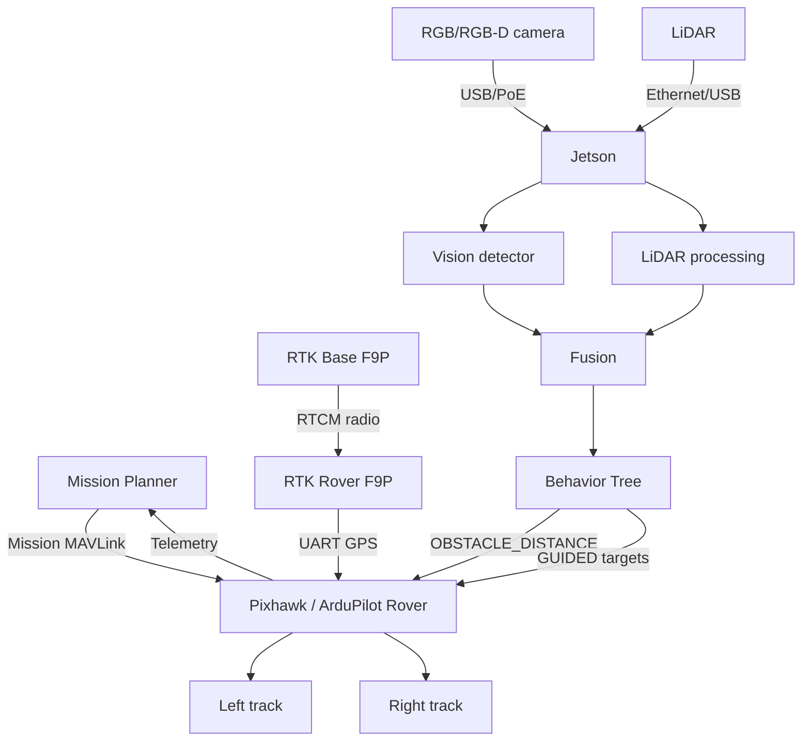
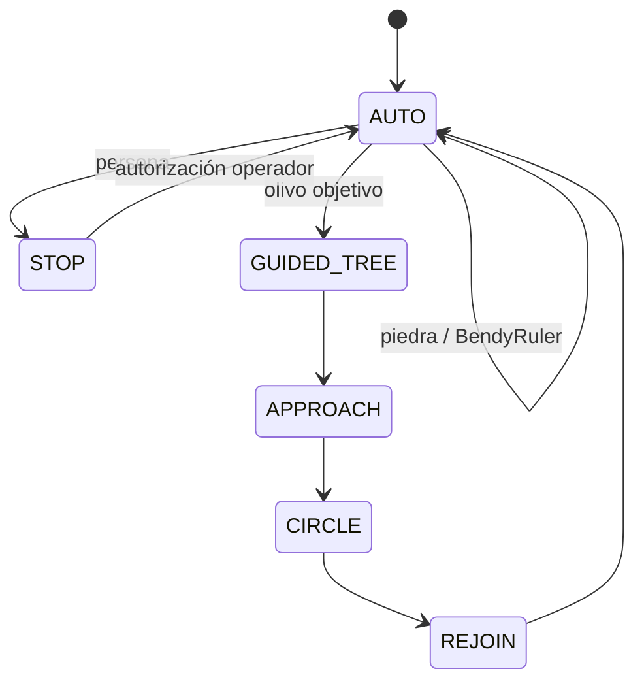

# Integración técnica de Mission Planner, ArduPilot Rover, RTK-GNSS, LiDAR y visión artificial para un robot agrícola autónomo

## Arquitectura hardware/software, parámetros de ArduPilot, comunicaciones, evitación de obstáculos y comportamientos semánticos temporales

**Versión:** 1.0 — octubre de 2026  
**Proyecto:** ARBOREON / plataforma robótica abierta para olivar  
**Tipo de documento:** especificación técnica y propuesta de arquitectura reproducible  
**Objetivo:** describir cómo integrar Mission Planner, Pixhawk/ArduPilot Rover, posicionamiento RTK, LiDAR, visión artificial y ROS 2 de forma que un robot pueda seguir una misión global, desviarse temporalmente para evitar obstáculos o realizar tareas alrededor de un árbol y regresar después a la misión original.

---

# Resumen

Este documento presenta una arquitectura técnica para integrar una estación de planificación Mission Planner, un autopiloto Pixhawk ejecutando ArduPilot Rover, posicionamiento RTK-GNSS, percepción LiDAR y visión artificial sobre un ordenador compañero NVIDIA Jetson.

La hipótesis de diseño fundamental consiste en **no conectar toda la inteligencia directamente a Mission Planner ni ejecutar visión artificial dentro del autopiloto**. Mission Planner se utiliza para definir y supervisar la misión global; Pixhawk/ArduPilot mantiene el control determinista del vehículo, la tracción, los modos de operación, *failsafes* y geofence; y un ordenador compañero ejecutando ROS 2 procesa LiDAR y cámara, realiza fusión semántica y decide acciones temporales.

La arquitectura permite dos clases de reacción:

1. **Evitación geométrica simple**, por ejemplo una piedra: el ordenador compañero entrega el mapa de proximidad a ArduPilot y éste puede utilizar BendyRuler mientras permanece en `AUTO`, desviándose temporalmente y retomando automáticamente el objetivo original.
2. **Comportamientos semánticos**, por ejemplo un olivo que debe rodearse: el ordenador compañero identifica el objeto, guarda el contexto de misión, solicita temporalmente `GUIDED`, ejecuta una trayectoria local —por ejemplo una circunferencia de 360° alrededor del árbol— y devuelve después el vehículo a `AUTO`.

Para el prototipo se recomienda **MAVLink2 por UART** entre Jetson y Pixhawk. Para una máquina industrial se recomienda un Pixhawk H7 con Ethernet —por ejemplo Pixhawk 6X— y la interfaz ROS 2 nativa de ArduPilot mediante DDS/Micro XRCE-DDS.

Se describen dos alternativas de conexión LiDAR: (i) LiDAR directo al Pixhawk, apropiado para evitación simple con sensores soportados; y (ii) LiDAR conectado al Jetson, recomendado para el proyecto porque permite fusionarlo con visión y posteriormente enviar información de proximidad a ArduPilot mediante MAVLink.

**Palabras clave:** ArduPilot Rover; Mission Planner; Pixhawk; ROS 2; Nav2; LiDAR; RTK; ZED-F9P; MAVLink; DDS; BendyRuler; visión artificial; agricultura; olivar; robot de orugas.

---

# 1. Principio de diseño

No se propone:

```text
LiDAR ──┐
Cámara ─┼──► Mission Planner ──► Motores
RTK ────┘
```

Mission Planner no está diseñado para ejecutar percepción semántica en tiempo real ni para ser el controlador principal de un robot agrícola.

La arquitectura propuesta es:

```text
MISSION PLANNER
     │
     │ misión global / configuración / supervisión
     ▼
PIXHAWK — ARDUPILOT ROVER
     ▲
     │ MAVLink2 o DDS
     ▼
JETSON — ROS 2
 ├── LiDAR
 ├── Cámara
 ├── percepción
 ├── fusión sensorial
 ├── Nav2
 └── Behavior Tree
```

Las responsabilidades se separan:

| Subsistema | Responsabilidad |
|---|---|
| Mission Planner | Planificación global, parámetros, supervisión y logs |
| Pixhawk/ArduPilot | Control determinista, modos, tracción, RTK, failsafes |
| Jetson/ROS 2 | LiDAR, visión, IA, planificación local, decisiones semánticas |
| Safety controller | E-stop y funciones de seguridad independientes |
| RTK | Posicionamiento global |
| LiDAR | Geometría del entorno |
| Cámara | Semántica/identificación |

---

# 2. Arquitectura hardware recomendada para el prototipo

## 2.1. Componentes principales

- Pixhawk 6C Mini o equivalente H7.
- NVIDIA Jetson Orin Nano.
- ArduSimple simpleRTK2B / ZED-F9P.
- Estación base RTK ZED-F9P.
- Radio RTCM base–rover.
- LiDAR 2D o 3D.
- Cámara OAK-D / OAK-D PoE / RealSense o equivalente.
- Receptor RC manual.
- ESC/controladores de motor.
- E-stop.
- DC/DC separados.
- Mission Planner en portátil.

---

# 3. Esquema físico del prototipo

```text
                         ESTACIÓN BASE RTK
                   ┌─────────────────────────┐
                   │ ZED-F9P BASE            │
                   │ antena GNSS             │
                   │ radio RTCM              │
                   └───────────┬─────────────┘
                               │ radio
                               │ RTCM
                               ▼
┌─────────────────────────────────────────────────────────────┐
│                        ROBOT                                │
│                                                             │
│ Antena RTK                                                  │
│     │                                                       │
│     ▼                                                       │
│ ZED-F9P ROVER                                               │
│     │ UART                                                  │
│     ▼                                                       │
│ GPS1 ┌──────────────────────┐                               │
│ ────►│      PIXHAWK         │                               │
│      │   ArduPilot Rover    │                               │
│      │                      │                               │
│      │ OUT1 ───── ESC L ───► motor/oruga izquierda         │
│      │ OUT3 ───── ESC R ───► motor/oruga derecha           │
│      │                      │                               │
│      │ TELEM1 ◄──── radio/USB Mission Planner              │
│      │ TELEM2 ◄────────────► Jetson MAVLink2               │
│      └──────────────────────┘                               │
│                                 ▲                           │
│                                 │                           │
│                         ┌───────┴────────┐                  │
│                         │    JETSON      │                  │
│                         │ ROS 2 / Nav2   │                  │
│                         └───┬────────┬───┘                  │
│                             │        │                      │
│                         Ethernet/   USB3/PoE                │
│                             │        │                      │
│                           LiDAR    Cámara                   │
│                                                             │
│ Receptor RC ───────────────► Pixhawk RCIN                   │
│ E-stop ─────────► contactor de potencia / safety circuit    │
└─────────────────────────────────────────────────────────────┘
```

---

# 4. ¿Dónde debe conectarse cada sensor?

## 4.1. RTK

El rover ZED-F9P se conecta **directamente al Pixhawk**, normalmente al puerto `GPS1`.

En Pixhawk 6C/6C Mini el mapeo documentado es:

| Puerto físico | Puerto lógico ArduPilot |
|---|---|
| USB | SERIAL0 |
| TELEM1 | SERIAL1 |
| TELEM2 | SERIAL2 |
| GPS1 | SERIAL3 |
| GPS2 | SERIAL4 |
| USER | SERIAL6 |

Por tanto:

```text
ArduSimple F9P
TX ─────► RX GPS1
RX ◄───── TX GPS1
5V
GND
```

ArduSimple utiliza un JST-GH compatible con el estándar Pixhawk.

Configuración típica:

```text
SERIAL3_PROTOCOL = 5   # GPS
```

ArduPilot indica que los parámetros GPS por defecto funcionan normalmente con receptores F9P conectados a un puerto configurado con protocolo GPS.

**La corrección RTCM no tiene que atravesar Mission Planner.**

La arquitectura recomendada es:

```text
ZED-F9P base
    │
radio RTCM
    │
ZED-F9P rover
    │
posición RTK
    │
Pixhawk
```

Esto permite trabajar sin Internet.

---

# 5. Comunicación Pixhawk–Jetson

## 5.1. Prototipo: MAVLink2 por TELEM2

Se recomienda:

```text
Pixhawk TELEM2
       │ UART
       ▼
Jetson UART / USB-UART
```

En Pixhawk 6C Mini:

```text
TELEM2 = SERIAL2
```

Configurar:

```text
SERIAL2_PROTOCOL = 2     # MAVLink2
```

y seleccionar una velocidad elevada compatible con ambos extremos, por ejemplo 921600 baud si el cableado y convertidor lo permiten. Para pruebas iniciales 460800 baud también puede ser suficiente.

Debe evitarse alimentar el Jetson desde el puerto TELEM del Pixhawk. Jetson debe disponer de su **propia alimentación DC/DC**.

---

# 6. Mission Planner simultáneamente

Mission Planner puede permanecer conectado por:

### Opción A — USB

```text
Mission Planner
      │ USB
      ▼
Pixhawk
```

### Opción B — radio de telemetría en TELEM1

```text
Mission Planner
      │ radio
      ▼
TELEM1 / SERIAL1
```

Por ejemplo:

```text
SERIAL1_PROTOCOL = 2
```

para MAVLink2 si el radio utilizado lo soporta.

Mientras Jetson utiliza TELEM2.

Esto separa:

```text
TELEM1 → operador
TELEM2 → companion computer
```

y simplifica el diagnóstico.

---

# 7. ¿Debe conectarse el LiDAR al Pixhawk?

Existen **dos arquitecturas válidas**.

---

# 8. Alternativa A — LiDAR directo al Pixhawk

ArduPilot soporta varios LiDAR 360° como sensores de proximidad.

Por ejemplo, determinados RPLIDAR pueden conectarse directamente a un UART del autopiloto.

Ejemplo documentado por ArduPilot:

```text
RPLIDAR
   │ UART
   ▼
TELEM1
```

con:

```text
SERIAL1_PROTOCOL = 11       # Lidar360
PRX1_TYPE        = 5        # RPLidar
PRX1_ORIENT      = 0
```

La velocidad depende del modelo; la documentación de ArduPilot cita, por ejemplo:

- C1: 460800;
- A2: 115200;
- S1/A2M12: 256000.

En Rover puede ser necesario:

```text
SCHED_LOOP_RATE = 400
```

para sensores con alta tasa de datos.

Si TELEM1/2 usa flow control y el sensor no:

```text
BRD_SER1_RTSCTS = 0
```

o

```text
BRD_SER2_RTSCTS = 0
```

según el puerto.

## Ventaja

ArduPilot recibe directamente el entorno y puede ejecutar evitación sin Jetson.

## Desventaja

El Pixhawk sabe:

> existe un obstáculo.

Pero no sabe:

> es una piedra, un olivo o una persona.

Para ARBOREON esta arquitectura resulta limitada.

---

# 9. Alternativa B — LiDAR al Jetson — recomendada

```text
LiDAR
   │ Ethernet/USB
   ▼
Jetson
   │
ROS 2
   │
procesamiento
   │
   ├──► Nav2
   │
   └──► MAVLink OBSTACLE_DISTANCE
                │
                ▼
             Pixhawk
```

Esta es la arquitectura recomendada.

El Jetson dispone de la nube de puntos completa y puede fusionarla con la cámara.

Ejemplo:

```text
LiDAR:
objeto a 2.8 m

Cámara:
bounding box = olive_tree

Fusión:
objeto #33 = OLIVO
x = 2.71
y = 0.44
confidence = 0.97
```

---

# 10. Enviar obstáculos desde Jetson a ArduPilot

ArduPilot puede recibir sensores de proximidad mediante MAVLink.

Una configuración MAVLink típica es:

```text
PRX1_TYPE = 2      # MAVLink
```

El Jetson puede enviar:

```text
DISTANCE_SENSOR
```

o:

```text
OBSTACLE_DISTANCE
```

y ArduPilot soporta también:

```text
OBSTACLE_DISTANCE_3D
```

para información tridimensional.

Esto es particularmente útil porque se puede utilizar:

```text
LiDAR
+
depth camera
+
segmentación
```

antes de generar la información de proximidad.

Mission Planner permite verificar la recepción:

```text
Ctrl + F
→ Proximity
```

o:

```text
Ctrl + F
→ MAVLink Inspector
```

donde se puede comprobar `OBSTACLE_DISTANCE`.

---

# 11. Cámara de visión

La cámara **no debe conectarse al Pixhawk** para ejecutar visión artificial.

Conectar:

```text
OAK-D
   │ USB3 / PoE
   ▼
Jetson
```

o:

```text
RealSense
   │ USB3
   ▼
Jetson
```

Procesamiento:

```text
/camera/image
      │
      ▼
YOLO / segmentación
      │
      ▼
/detections
```

La cámara puede además proporcionar profundidad si es estéreo.

---

# 12. Fusión visión + LiDAR

Arquitectura ROS 2:

```text
/lidar/points
      │
      ├─────────┐
      │         │
/camera/image   │
      │         │
      ▼         ▼
 detector    clustering
      │         │
      └────┬────┘
           ▼
     object_fusion
           │
           ▼
       /objects
```

Objeto final:

```yaml
id: 82
class: olive_tree
confidence: 0.96
position:
  x: 4.21
  y: -0.62
size:
  width: 0.48
```

---

# 13. Movimiento de la máquina de orugas

Para un vehículo *skid steering* ArduPilot utiliza dos salidas independientes.

Configuración documentada:

```text
SERVO1_FUNCTION = 73     # Throttle Left
SERVO3_FUNCTION = 74     # Throttle Right
```

Conexión:

```text
PIXHAWK OUT1
     │
     ▼
controlador motor izquierdo

PIXHAWK OUT3
     │
     ▼
controlador motor derecho
```

Para el RC 1/10 pueden ser ESC RC normales.

Para una máquina híbrida real no debe asumirse que los grandes controladores de tracción aceptan PWM de servo directamente. Será necesario un **Drive Adapter**:

```text
Pixhawk
   │
PWM / CAN
   ▼
Drive Adapter
   │
CAN / analog / digital
   ▼
inversores motores
```

---

# 14. Evitación simple en ArduPilot

ArduPilot proporciona dos niveles relevantes.

## 14.1. Simple avoidance

Para proximidad:

```text
AVOID_ENABLE = 7
```

habilita fuentes de barrera incluyendo sensores de proximidad.

`AVOID_MARGIN` define el margen deseado.

Rover tiende a detenerse ante un obstáculo en este modo básico.

---

# 15. BendyRuler

Para desviarse alrededor de un obstáculo mientras se dirige hacia un waypoint:

```text
OA_TYPE = 1
```

activa BendyRuler.

Parámetros relevantes:

```text
OA_BR_LOOKAHEAD
OA_MARGIN_MAX
```

ArduPilot indica:

- `OA_BR_LOOKAHEAD`: distancia de búsqueda de ruta libre;
- `OA_MARGIN_MAX`: margen respecto a obstáculos.

BendyRuler funciona en Rover en:

```text
AUTO
GUIDED
RTL
```

Esto permite algo extremadamente importante:

```text
AUTO
 ↓
piedra detectada
 ↓
BendyRuler desvía trayectoria
 ↓
obstáculo superado
 ↓
continúa hacia el waypoint original
```

sin cambiar de modo.

---

# 16. Dijkstra + BendyRuler

También puede utilizarse:

```text
OA_TYPE = 3
```

para combinar:

```text
Dijkstra → planificación global alrededor de fences
BendyRuler → obstáculos de proximidad
```

Cuando desaparece el obstáculo cercano, ArduPilot continúa con la planificación global.

Para la primera versión ARBOREON no resulta imprescindible.

BendyRuler solo es suficiente para probar evasión local.

---

# 17. ¿Qué ocurre cuando aparece una piedra?

Estado inicial:

```text
MODE = AUTO
```

Mission Planner ha cargado:

```text
WP17 → WP18
```

LiDAR detecta objeto.

Visión clasifica:

```text
ROCK
```

El Jetson genera proximidad MAVLink.

ArduPilot ejecuta BendyRuler:

```text
               █
            PIEDRA

WP17 ──────────┼──────── WP18

robot ───────╮
             ╰──────────►
```

No es necesario cambiar a GUIDED.

---

# 18. ¿Qué ocurre cuando aparece una persona?

Aquí no debe ejecutarse BendyRuler para rodearla.

Behavior Tree:

```text
PERSON
  │
  ▼
STOP
```

y debe ordenarse:

```text
herramienta OFF
tracción STOP
```

La capa de producción debe disponer además de un circuito de seguridad independiente.

---

# 19. ¿Qué ocurre cuando aparece un olivo?

El olivo no es solo un obstáculo.

Es un **objetivo de trabajo**.

Por tanto:

```text
AUTO
 ↓
OLIVE_TREE
 ↓
guardar contexto misión
 ↓
GUIDED
 ↓
APPROACH_TREE
 ↓
CIRCLE_TREE
 ↓
LEAVE_TREE
 ↓
AUTO
```

---

# 20. Control temporal desde el companion computer

ArduPilot Rover admite en `GUIDED` comandos MAVLink como:

```text
SET_POSITION_TARGET_LOCAL_NED
```

y:

```text
SET_POSITION_TARGET_GLOBAL_INT
```

Estos mensajes pueden controlar:

- posición;
- velocidad;
- heading;
- turn rate.

Por tanto el Jetson puede mandar puntos alrededor del árbol.

---

# 21. Generación del círculo

Sea:

```text
C = centro árbol
R = radio de trabajo
```

Se generan puntos:

\[
x_i=C_x+R\cos(\theta_i)
\]

\[
y_i=C_y+R\sin(\theta_i)
\]

con:

\[
\theta_i = i\Delta\theta
\]

Por ejemplo:

```text
Δθ = 15°
N = 24 puntos
```

Trayectoria:

```text
           P6
      P7        P5

   P8              P4

 P9        O         P3

   P10             P2

      P11       P1
           P12
```

En la práctica Nav2 puede proporcionar una trayectoria más suave que una lista rígida de waypoints.

---

# 22. Comprobar que se ha completado 360°

Con posición del robot `(R_x,R_y)` y centro del árbol `(C_x,C_y)`:

\[
\theta = atan2(R_y-C_y,R_x-C_x)
\]

Se acumulan los incrementos angulares.

Cuando:

\[
|\Delta \theta_{acumulado}| \geq 2\pi
\]

se considera completada la vuelta.

También deben cumplirse:

- distancia al árbol dentro de tolerancia;
- ausencia de interrupciones críticas;
- cobertura mínima de arco.

---

# 23. Regreso a la misión

Antes de salir de AUTO el Jetson almacena:

```text
mission_item
mission_state
rejoin_target
```

Después de `CIRCLE_TREE`:

### Versión simple

```text
modo AUTO
```

y continuar hacia el siguiente elemento de misión.

### Versión avanzada

Calcular el punto de reincorporación a la ruta.

```text
segmento original:
WP17 ──────────── WP18

                robot
                  │
                  ▼
             rejoin point
```

El robot navega en GUIDED hasta dicho punto y después cambia a AUTO.

---

# 24. Arquitectura ROS 2

```text
arboreon_ws/
└── src/
    ├── arboreon_bringup
    ├── arboreon_ardupilot
    ├── arboreon_lidar
    ├── arboreon_vision
    ├── arboreon_fusion
    ├── arboreon_behavior
    ├── arboreon_navigation
    ├── arboreon_tree
    ├── arboreon_safety
    └── arboreon_tools
```

---

# 25. Tópicos propuestos

```text
/camera/image
/camera/depth

/lidar/points
/scan

/detections
/objects

/tree_target

/robot_pose
/rtk_status

/safety/person_detected
/safety/stop

/arboreon/state

/mission/current_item

/tool/status
```

---

# 26. Behavior Tree

Ejemplo conceptual:

```xml
<ReactiveFallback>

  <Sequence>
    <EmergencyCondition/>
    <EmergencyStop/>
  </Sequence>

  <Sequence>
    <PersonDetected/>
    <StopAndDisableTool/>
  </Sequence>

  <Sequence>
    <TargetOliveTree/>
    <StoreMissionContext/>
    <SwitchGuided/>
    <ApproachTree/>
    <EnableTool/>
    <CircleTree/>
    <DisableTool/>
    <RejoinMission/>
    <SwitchAuto/>
  </Sequence>

  <Sequence>
    <ObstacleDetected/>
    <PublishObstacleToArduPilot/>
  </Sequence>

  <FollowMission/>

</ReactiveFallback>
```

---

# 27. Nav2

Navigation2 aporta:

- global costmap;
- local costmap;
- controller;
- planner;
- behavior tree;
- collision monitor;
- recuperación.

Por ejemplo:

```text
LiDAR
  ↓
local costmap
  ↓
Nav2
  ↓
local trajectory
```

El proyecto ARBOREON puede utilizar Nav2 para las acciones especiales mientras ArduPilot sigue controlando físicamente el rover.

---

# 28. Fields2Cover / OpenNav Coverage

Para responder a:

> ¿cómo recorrer toda la finca?

se recomienda Fields2Cover.

Fields2Cover proporciona:

- generación de cabeceras;
- swaths;
- ruta;
- curvas;
- cobertura.

OpenNav Coverage integra Fields2Cover directamente con Nav2.

El proyecto soporta además **filas predefinidas**, especialmente relevante para:

- olivares;
- frutales;
- viñedos.

OpenNav Coverage publica un `nav_msgs/Path` que puede utilizar Nav2.

---

# 29. Proyecto open source especialmente relacionado: RoMu4o

Repositorio:

https://github.com/mehradmrt/UCM-AgBot-ROS2

RoMu4o integra:

- robot crawler;
- GNSS;
- IMU;
- LiDAR 2D;
- cámara RealSense;
- encoders;
- ROS 2;
- navegación;
- brazo robótico.

Su secuencia de ejecución incluye explícitamente:

```bash
ros2 launch robot_bringup sensors.launch.py \
  imu:=true \
  gnss:=true \
  lidar2d:=true \
  realsense:=true \
  encoders:=true
```

seguido de:

```bash
ros2 launch robot_bringup localization.launch.py
ros2 launch robot_bringup navigation.launch.py
```

Es probablemente el ejemplo open-source más próximo físicamente a la arquitectura agrícola propuesta.

---

# 30. Proyecto oficial ArduPilot ROS 2

Repositorio:

https://github.com/ArduPilot/ardupilot_ros

ArduPilot mantiene actualmente un repositorio específico de integración ROS 2.

Incluye:

- Gazebo;
- ROS 2;
- Cartographer;
- GUI ROS 2;
- ejemplos de integración.

Es una referencia fundamental para la capa:

```text
ROS 2 ↔ ArduPilot
```

---

# 31. DDS nativo de ArduPilot

ArduPilot proporciona una interfaz ROS 2 basada en DDS.

Para utilizarla:

```text
DDS_ENABLE = 1
```

y:

```text
DDS_DOMAIN_ID
```

debe corresponder con:

```bash
ROS_DOMAIN_ID
```

En compilaciones actuales el soporte DDS puede requerir firmware personalizado habilitando:

```text
MicroXRCE DDS support for ROS 2
```

---

# 32. Pixhawk 6C Mini frente a Pixhawk 6X

## 6C Mini

Adecuado para:

- prototipo;
- RC;
- MAVLink UART;
- RTK;
- control rover.

## 6X

Más adecuado para la futura máquina industrial porque dispone de:

- H7;
- Ethernet integrado;
- múltiples UART;
- CAN;
- redundancia de sensores;
- temperatura especificada −40…+85 °C.

Holybro y ArduPilot documentan Ethernet en Pixhawk 6X.

---

# 33. Arquitectura industrial propuesta

```text
                Ethernet Switch Industrial
                    │       │       │
                    │       │       │
               Pixhawk6X  Jetson   LiDAR
                    │       │
                    │       ├──── Camera PoE
                    │       │
                    │       └──── ROS2/Nav2
                    │
                  DDS
                    │
                    ▼
                ArduPilot

CAN1 ───────── Drive Adapter
CAN2 ───────── ToolBus

Safety CAN / hardwired ─ Safety Controller
```

---

# 34. ROS 2 sobre Ethernet

ArduPilot soporta comunicaciones ROS 2/DDS por Ethernet en autopilotos H7 compatibles.

Ejemplo de parámetros documentados:

```text
DDS_ENABLE = 1

NET_ENABLE = 1
NET_DHCP   = 0

DDS_IP0 = ...
DDS_IP1 = ...
DDS_IP2 = ...
DDS_IP3 = ...

DDS_UDP_PORT = 2019
```

La configuración concreta depende de la red.

Ventajas frente a UART:

- mayor ancho de banda;
- mejor inmunidad al ruido;
- diagnóstico con Wireshark;
- una sola red IP;
- mejor integración con ordenadores de misión.

---

# 35. ¿Debe pasar Mission Planner a través del Jetson?

No es necesario.

Arquitectura recomendada:

```text
Mission Planner ── telemetry ── Pixhawk

Jetson ─────────── MAVLink/DDS ─ Pixhawk
```

Mission Planner y Jetson son dos clientes distintos.

Para desarrollo también puede utilizarse:

```text
mavlink-router
```

en el Jetson para repartir MAVLink entre:

- ROS;
- Mission Planner;
- logger;
- herramientas.

Pero una conexión independiente del operador es más robusta.

---

# 36. Mission Planner como herramienta de diagnóstico

Mission Planner sigue siendo muy útil.

Permite observar:

- GPS;
- RTK;
- EKF;
- modo;
- waypoints;
- parámetros;
- batería;
- servo outputs;
- proximidad;
- mensajes MAVLink.

Para visualizar proximidad:

```text
Ctrl+F
→ Proximity
```

Para mensajes:

```text
Ctrl+F
→ MAVLink Inspector
```

---

# 37. Parámetros mínimos de referencia

**Estos valores son una base de laboratorio, no un archivo `.param` definitivo. Deben revisarse para la versión concreta de Rover, sensor y hardware.**

## 37.1. RTK GPS1

```text
SERIAL3_PROTOCOL = 5
```

## 37.2. Jetson por TELEM2

```text
SERIAL2_PROTOCOL = 2
```

## 37.3. Skid steering

```text
SERVO1_FUNCTION = 73
SERVO3_FUNCTION = 74
```

## 37.4. Obstáculos enviados desde Jetson

```text
PRX1_TYPE = 2
AVOID_ENABLE = 7
```

## 37.5. BendyRuler

```text
OA_TYPE = 1
```

Ajustar experimentalmente:

```text
OA_BR_LOOKAHEAD
OA_MARGIN_MAX
AVOID_MARGIN
```

---

# 38. Configuración alternativa con RPLIDAR directo

Ejemplo:

```text
SERIAL1_PROTOCOL = 11
PRX1_TYPE = 5
PRX1_ORIENT = 0
```

más baud rate específico.

Si usa TELEM1:

```text
BRD_SER1_RTSCTS = 0
```

cuando corresponda.

---

# 39. Arquitectura híbrida recomendada de seguridad

Incluso si el LiDAR principal está conectado al Jetson, puede existir otro sensor directo al Pixhawk.

```text
               LiDAR principal
                     │
                     ▼
                   Jetson
                     │
                   ROS2
                     │
                  MAVLink
                     ▼
                  Pixhawk

LiDAR/Rangefinder safety ─────► Pixhawk
```

Así:

- Jetson entiende semántica;
- Pixhawk dispone de proximidad independiente.

En un producto comercial se añadiría además radar/controlador safety certificado.

---

# 40. Flujo completo de datos



---

# 41. Flujo de estados



---

# 42. Ejemplo de secuencia “piedra”

```text
1. Mission Planner carga misión.
2. Rover ejecuta AUTO.
3. LiDAR → Jetson.
4. Vision → clase ROCK.
5. Jetson publica obstáculo MAVLink.
6. Pixhawk almacena proximidad.
7. BendyRuler modifica trayectoria.
8. Robot rodea piedra.
9. Obstáculo deja de bloquear.
10. ArduPilot continúa hacia waypoint.
```

Mission Planner no tiene que hacer nada.

---

# 43. Ejemplo “olivo”

```text
1. AUTO hacia WP42.
2. LiDAR detecta tronco.
3. Visión identifica olive_tree.
4. tree_manager confirma que es objetivo.
5. Se guarda mission index.
6. Jetson solicita GUIDED.
7. Nav2 calcula approach.
8. Robot llega al radio de trabajo.
9. CircleTree genera trayectoria.
10. Robot completa 360°.
11. herramienta OFF.
12. Rejoin.
13. Jetson solicita AUTO.
14. Rover continúa misión.
```

---

# 44. Ejemplo “persona”

```text
1. Camera → person confidence 0.94.
2. LiDAR confirma presencia/posición.
3. Behavior Tree prioriza PERSON_STOP.
4. herramienta OFF.
5. tracción STOP.
6. aviso Mission Planner.
7. E-stop lógico.
8. no reiniciar automáticamente.
```

Para el sistema comercial una función de seguridad independiente debe respaldar este comportamiento.

---

# 45. `STATUSTEXT` hacia Mission Planner

El Jetson puede publicar mensajes para el operador, por ejemplo:

```text
Tree OLV-0234 detected
CircleTree started
CircleTree 50%
Tree OLV-0234 completed
Resuming mission
```

Mission Planner los muestra como mensajes del vehículo.

Esto proporciona transparencia sin convertir Mission Planner en el cerebro.

---

# 46. Simulación antes del vehículo

Se recomienda validar todo en:

```text
ArduPilot SITL
+
Gazebo
+
ROS 2
+
Nav2
```

ArduPilot proporciona documentación para SITL + ROS 2.

Ejemplos:

```bash
ros2 node list
ros2 node info /ap
ros2 topic echo /ap/geopose/filtered
```

y `DDS_ENABLE=1`.

---

# 47. Escenario de simulación de olivar

Crear en Gazebo:

```text
worlds/
└── olive_orchard.sdf
```

con:

- filas;
- árboles;
- piedras;
- persona;
- pendientes;
- zonas sin GNSS.

La lógica debe probarse primero allí.

---

# 48. Roadmap de implementación técnica

## Fase T1 — Pixhawk + Mission Planner

- ArduPilot Rover.
- RC manual.
- skid steering.
- AUTO.
- RTL.
- geofence.

## Fase T2 — RTK

- ZED-F9P.
- base local.
- RTK FIX.
- repetir trayectorias.

## Fase T3 — LiDAR directo/Jetson

Primero:

```text
LiDAR → Jetson → OBSTACLE_DISTANCE → ArduPilot
```

Probar BendyRuler.

## Fase T4 — cámara

Solo tres clases:

```text
PERSON
ROCK
OLIVE_TREE
```

## Fase T5 — CircleTree

- AUTO;
- GUIDED;
- círculo;
- AUTO.

## Fase T6 — Nav2

Sustituir círculo rígido por planner local.

## Fase T7 — OpenNav Coverage

Cobertura completa de finca.

---

# 49. Orden recomendado de complejidad

No comenzar con:

```text
YOLO + SLAM + Nav2 + RTK + ToolBus + Mission Planner
```

simultáneamente.

Desarrollar:

```text
AUTO
↓
RTK
↓
LiDAR
↓
BendyRuler
↓
visión
↓
CircleTree
↓
Nav2
↓
cobertura
```

Esto permite aislar errores.

---

# 50. Qué parte debe programarse específicamente para ARBOREON

No es necesario reimplementar:

- autopiloto;
- EKF;
- Mission Planner;
- planificador Nav2;
- cobertura base.

Debe desarrollarse:

```text
arboreon_semantic_fusion
arboreon_tree_manager
arboreon_behavior
arboreon_circle_tree
arboreon_mission_bridge
arboreon_tool_manager
arboreon_safety_supervisor
```

---

# 51. Proyecto de repositorio propuesto

```text
arboreon-autonomy/
├── README.md
├── docs/
│   ├── wiring.md
│   ├── ardupilot_parameters.md
│   ├── ros_architecture.md
│   └── experiments.md
├── config/
│   ├── rover/
│   └── nav2/
├── ros2_ws/
│   └── src/
│       ├── arboreon_bringup/
│       ├── arboreon_perception/
│       ├── arboreon_fusion/
│       ├── arboreon_behavior/
│       ├── arboreon_tree/
│       └── arboreon_bridge/
├── simulation/
│   ├── worlds/
│   └── models/
└── tests/
```

---

# 52. Proyectos open-source de referencia

## ArduPilot

https://github.com/ArduPilot/ardupilot

Autopiloto principal.

## Mission Planner

https://github.com/ArduPilot/MissionPlanner

Estación de tierra.

## ArduPilot ROS

https://github.com/ArduPilot/ardupilot_ros

Integración ROS 2 oficial.

## ArduPilot Gazebo

https://github.com/ArduPilot/ardupilot_gazebo

## Navigation2

https://github.com/ros-navigation/navigation2

## OpenNav Coverage

https://github.com/open-navigation/opennav_coverage

## Fields2Cover

https://github.com/Fields2Cover/Fields2Cover

## RoMu4o

https://github.com/mehradmrt/UCM-AgBot-ROS2

## BehaviorTree.CPP

https://github.com/BehaviorTree/BehaviorTree.CPP

## MAVROS

https://github.com/mavlink/mavros

---

# 53. Documentación de ejemplo

## Pixhawk 6C / UART mapping

https://ardupilot.org/rover/docs/common-holybro-pixhawk6C.html

## ArduSimple F9P

https://ardupilot.org/copter/docs/common-gps-ardusimple.html

## BendyRuler

https://ardupilot.org/rover/docs/common-oa-bendyruler.html

## Dijkstra + BendyRuler

https://ardupilot.org/rover/docs/common-oa-dijkstrabendyruler.html

## Guided Rover

https://ardupilot.org/rover/docs/guided-mode.html

## MAVLink Guided commands

https://ardupilot.org/dev/docs/mavlink-rover-commands.html

## Proximity sensors

https://ardupilot.org/rover/docs/common-proximity-landingpage.html

## RPLIDAR

https://ardupilot.org/copter/docs/common-rplidar-a2.html

## ROS 2 interfaces

https://ardupilot.org/dev/docs/ros2-interfaces.html

## ROS 2 Ethernet

https://ardupilot.org/dev/docs/ros2-over-ethernet.html

---

# 54. Vídeos útiles

## ArduPilot Rover — object avoidance

La propia documentación histórica de ArduPilot referencia este vídeo de demostración de evitación:

https://www.youtube.com/watch?v=ho9mlVwhgHA

## Navegación / ROS 2 / Nav2

Además:

- ArduPilot: https://www.youtube.com/@ArduPilot
- Open Robotics: https://www.youtube.com/@OpenRoboticsOrg
- Nav2/Open Navigation: consultar https://navigation.ros.org/
- Fields2Cover: demos enlazadas desde https://github.com/Fields2Cover/Fields2Cover
- OpenNav Coverage: ejemplos y demo en https://github.com/open-navigation/opennav_coverage

---

# 55. Arquitectura recomendada final

## Prototipo RC

```text
Mission Planner
     │
  MAVLink
     │
 Pixhawk 6C Mini
 ├── GPS1 ← ZED-F9P
 ├── TELEM1 ← operador
 ├── TELEM2 ↔ Jetson
 ├── OUT1 → ESC left
 └── OUT3 → ESC right

Jetson
 ├── USB/Ethernet ← LiDAR
 ├── USB/PoE ← Camera
 ├── ROS2
 ├── Nav2
 ├── vision
 ├── fusion
 └── behavior
```

## Máquina final

```text
                    Ethernet
        ┌─────────────┼──────────────┐
        │             │              │
    Pixhawk6X       Jetson         LiDAR
        │             │
        │             └────────── Cameras
        │
       DDS

CAN1 ─ Drive Adapter
CAN2 ─ ToolBus

RTK ─ GPS1/GPS2
Safety ─ independent controller
```

---

# 56. Respuesta directa a las preguntas técnicas

## ¿Hay que tocar parámetros de ArduPilot?

**Sí.**

Como mínimo:

- puerto GPS;
- puerto MAVLink/DDS;
- salidas skid steering;
- tipo de proximidad;
- avoidance;
- BendyRuler;
- parámetros cinemáticos del Rover.

Pero no es necesario modificar el código fuente de ArduPilot para la primera versión.

## ¿Hay que conectar el LiDAR al Pixhawk?

**No necesariamente.**

Para ARBOREON se recomienda:

```text
LiDAR → Jetson
```

y después:

```text
Jetson → MAVLink obstacle messages → Pixhawk
```

Un LiDAR adicional puede conectarse directamente al Pixhawk como redundancia.

## ¿Dónde va la cámara?

```text
Cámara → Jetson
```

No Pixhawk.

## ¿Dónde va el RTK?

```text
ZED-F9P rover → GPS1 Pixhawk
```

La base envía RTCM al rover.

## ¿Cómo se desvía temporalmente?

### Piedra

```text
AUTO + BendyRuler
```

sin abandonar la misión.

### Olivo

```text
AUTO
→ GUIDED
→ CircleTree
→ AUTO
```

### Persona

```text
STOP
```

y no evitar automáticamente.

---

# 57. Conclusión

La implementación puede realizarse sin modificar profundamente Mission Planner ni ArduPilot.

La clave consiste en mantener tres niveles:

```text
Mission Planner
     ↓
misión global

ArduPilot
     ↓
control seguro/determinista

ROS2 / Jetson
     ↓
inteligencia semántica
```

La primera prueba técnicamente útil debería demostrar solamente:

```text
WP1 → WP2
   ↓
PIEDRA
   ↓
BendyRuler
   ↓
WP2
   ↓
OLIVO
   ↓
GUIDED + CircleTree
   ↓
AUTO
   ↓
PERSONA
   ↓
STOP
```

Si este flujo funciona de forma repetible en el RC 1/10, la arquitectura fundamental del producto estará validada.

El stack open-source recomendado es:

```text
ArduPilot Rover
+
Mission Planner
+
ROS 2
+
Navigation2
+
OpenNav Coverage
+
Fields2Cover
```

con RoMu4o/UCM-AgBot-ROS2 como referencia práctica de integración agrícola.

---

# 58. Referencias

1. ArduPilot Project. **Pixhawk 6C / 6C Mini Flight Controller — UART Mapping.**  
   https://ardupilot.org/rover/docs/common-holybro-pixhawk6C.html

2. ArduPilot Project. **ArduSimple GNSS / ZED-F9P Integration.**  
   https://ardupilot.org/copter/docs/common-gps-ardusimple.html

3. ArduPilot Project. **RPLidar Integration.**  
   https://ardupilot.org/copter/docs/common-rplidar-a2.html

4. ArduPilot Project. **Simple Object Avoidance.**  
   https://ardupilot.org/rover/docs/common-simple-object-avoidance.html

5. ArduPilot Project. **Object Avoidance with BendyRuler.**  
   https://ardupilot.org/rover/docs/common-oa-bendyruler.html

6. ArduPilot Project. **Dijkstra + BendyRuler.**  
   https://ardupilot.org/rover/docs/common-oa-dijkstrabendyruler.html

7. ArduPilot Project. **Rover Guided Mode MAVLink Commands.**  
   https://ardupilot.org/dev/docs/mavlink-rover-commands.html

8. ArduPilot Project. **ROS 2 Interfaces.**  
   https://ardupilot.org/dev/docs/ros2-interfaces.html

9. ArduPilot Project. **ROS 2 over Ethernet.**  
   https://ardupilot.org/dev/docs/ros2-over-ethernet.html

10. ArduPilot Project. **ROS 2 with SITL.**  
    https://ardupilot.org/dev/docs/ros2-sitl.html

11. ArduPilot Project. **Motor and Servo Configuration — Skid Steering.**  
    https://ardupilot.org/rover/docs/rover-motor-and-servo-configuration.html

12. ArduPilot Project. **Serial Port Configuration Options.**  
    https://ardupilot.org/rover/docs/common-serial-options.html

13. ArduPilot. **ardupilot_ros — ROS 2 integration.** GitHub.  
    https://github.com/ArduPilot/ardupilot_ros

14. Open Navigation LLC. **OpenNav Coverage.** GitHub.  
    https://github.com/open-navigation/opennav_coverage

15. Mier, G., Valente, J., & de Bruin, S. (2023). **Fields2Cover: An Open-Source Coverage Path Planning Library for Unmanned Agricultural Vehicles.** *IEEE Robotics and Automation Letters*, 8(4), 2166–2172.  
    https://doi.org/10.1109/LRA.2023.3248439  
    https://github.com/Fields2Cover/Fields2Cover

16. Macenski, S., Martín, F., White, R., & Ginés Clavero, J. (2020). **The Marathon 2: A Navigation System.** IEEE/RSJ IROS.  
    https://arxiv.org/abs/2003.00368  
    https://github.com/ros-navigation/navigation2

17. Mortazavi, M., Cappelleri, D. J., & Ehsani, R. **RoMu4o / UCM-AgBot-ROS2.**  
    https://github.com/mehradmrt/UCM-AgBot-ROS2

18. Holybro. **Pixhawk 6X Technical Specification.**  
    https://docs.holybro.com/autopilot/pixhawk-6x/technical-specification

19. Holybro. **Pixhawk Jetson Baseboard.**  
    https://docs.holybro.com/autopilot/pixhawk-baseboards/pixhawk-jetson-baseboard/overview-and-specification

20. MAVLink. **MAVLink Protocol.**  
    https://mavlink.io/

---

# 59. Notas de reproducibilidad

Los parámetros mostrados son **valores de referencia**.

Antes de crear un archivo `.param` definitivo debe fijarse:

- modelo exacto de Pixhawk;
- versión exacta de ArduPilot Rover;
- modelo de LiDAR;
- modelo de ZED-F9P;
- esquema de conexión;
- velocidad máxima;
- dimensiones;
- distancia de frenado;
- radio de giro;
- controladores de motor.

El repositorio debería almacenar:

```text
config/rover/ardupilot-version.txt
config/rover/vehicle.param
config/rover/sensor-layout.yaml
config/nav2/nav2.yaml
```

para poder reproducir cada experimento.

---

# 60. Próximo experimento recomendado

**Objetivo:** demostrar el flujo mínimo completo.

Hardware:

- RC 1/10;
- Pixhawk;
- RTK;
- Jetson;
- LiDAR;
- cámara.

Escenario:

```text
Inicio
→ seguir línea RTK
→ detectar caja = ROCK
→ evitarla
→ detectar poste = OLIVE_TREE
→ rodearlo 360°
→ volver a misión
→ detectar persona
→ STOP
```

Criterio de éxito:

- 10 ejecuciones consecutivas;
- ninguna colisión;
- regreso correcto a misión;
- parada ante persona;
- logs sincronizados Pixhawk/ROS 2.

Este experimento proporciona una base publicable y valida prácticamente toda la arquitectura esencial.
