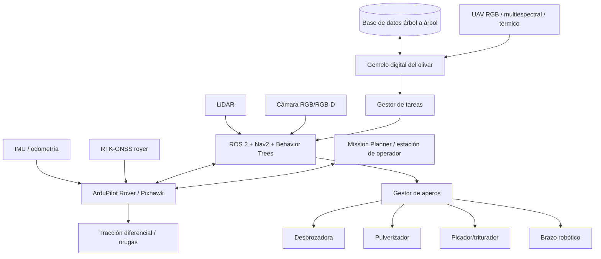
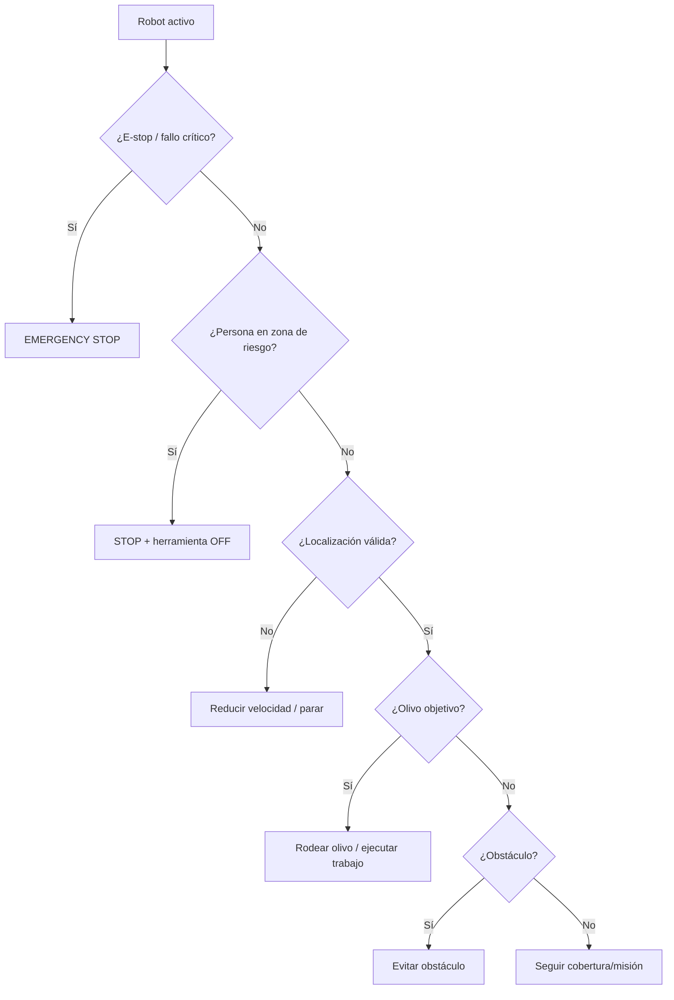
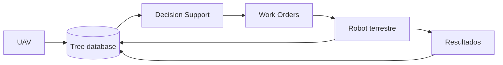

# Plataforma Robótica Autónoma y Modular para la Gestión de Olivar Ecológico
## Integración de RTK-GNSS, percepción multimodal, ArduPilot/ROS 2, aperos inteligentes y teledetección UAV

**Documento de concepto científico-técnico y hoja de ruta de investigación**  
**Versión:** 1.0 — octubre de 2026  
**Ámbito inicial:** olivar tradicional/ecológico, finca piloto de aproximadamente 11 ha, Jaén (España)  
**Licencia propuesta para este documento y el software del proyecto:** CC BY 4.0 para documentación científica y Apache-2.0/BSD-3-Clause para software propio, sujeto a compatibilidad con las dependencias.

---

## Resumen

Este documento propone el diseño y desarrollo de una plataforma robótica terrestre autónoma, modular y de código abierto para la automatización progresiva de tareas recurrentes en olivar ecológico. La propuesta parte de un vehículo terrestre de orugas con propulsión eléctrica/híbrida y combina posicionamiento RTK-GNSS, autopiloto ArduPilot Rover, percepción basada en LiDAR y visión artificial, computación embarcada mediante NVIDIA Jetson, ROS 2 y Navigation2 (Nav2), planificación de cobertura agrícola mediante Fields2Cover/OpenNav Coverage y supervisión mediante Mission Planner.

La plataforma se concibe como un **vehículo base multipropósito** al que puedan acoplarse distintos aperos: desbrozadora, sistema de pulverización localizada, triturador de restos de poda/varetas y, a más largo plazo, un manipulador robótico para detección y eliminación asistida o autónoma de varetas. El objetivo es reutilizar la infraestructura de localización, percepción, seguridad, navegación y planificación para varias tareas agrícolas en lugar de desarrollar una máquina independiente para cada una.

El proyecto incorpora además una capa aérea mediante UAV con cámaras RGB, multiespectral y eventualmente térmica. La información aérea se integraría con observaciones próximas realizadas por el robot terrestre para construir un **gemelo digital del olivar a nivel de árbol individual**, incluyendo posición, geometría de copa, vigor, índices espectrales, indicadores térmicos, histórico de labores y eventos detectados.

La estrategia de desarrollo es incremental. La primera fase utiliza un vehículo RC 4×4 a escala 1/10 para validar RTK, ArduPilot, ROS 2 y evasión de obstáculos con una inversión relativamente pequeña. Posteriormente se añaden visión, LiDAR y planificación de comportamientos; finalmente, el software se transfiere a una plataforma real de orugas. Esta metodología reduce riesgo técnico y distribuye el presupuesto durante varios años.

El proyecto ofrece un marco suficientemente amplio para generar varias publicaciones científicas y una o dos tesis doctorales en áreas como navegación agrícola, fusión sensorial, planificación de cobertura, percepción multimodal, olivicultura de precisión, robótica de aperos y cooperación UAV–UGV.

**Palabras clave:** robótica agrícola, olivar ecológico, ArduPilot, ROS 2, Nav2, RTK, GNSS, LiDAR, visión artificial, UAV, fotogrametría, multiespectral, agricultura de precisión, Fields2Cover, robot de orugas.

---

# 1. Motivación

El olivar tradicional requiere numerosas intervenciones repetitivas: control mecánico de hierba, tratamientos, gestión de restos de poda, retirada de varetas, inspección fitosanitaria y seguimiento del estado hídrico y vegetativo. Muchas de estas tareas implican:

- elevado coste de mano de obra;
- exposición del operario a calor, polvo, pendientes, maquinaria y productos fitosanitarios;
- desplazamientos repetitivos sobre el mismo terreno;
- dificultad para realizar tratamientos individualizados;
- utilización uniforme de recursos aunque exista alta variabilidad dentro de una misma parcela.

La hipótesis fundamental del proyecto es que una gran parte de estas tareas comparte una infraestructura común:

1. **localizarse con precisión;**
2. **percibir árboles, personas y obstáculos;**
3. **planificar una ruta;**
4. **moverse de forma segura;**
5. **identificar qué tarea corresponde ejecutar;**
6. **controlar un apero;**
7. **registrar lo realizado.**

Por ello, en lugar de construir una “desbrozadora autónoma”, se propone construir una **plataforma robótica agrícola modular**.

---

# 2. Objetivos

## 2.1. Objetivo general

Desarrollar y validar una plataforma robótica abierta, modular y progresivamente autónoma capaz de ejecutar tareas de mantenimiento e inspección en olivar tradicional/ecológico mediante la combinación de posicionamiento RTK-GNSS, navegación autónoma, percepción multimodal y gestión digital del cultivo.

## 2.2. Objetivos específicos

1. Desarrollar un prototipo RC 1/10 para validar la arquitectura de navegación.
2. Alcanzar navegación RTK repetible a escala centimétrica en zonas de cielo abierto.
3. Diseñar una arquitectura redundante que continúe operando de manera segura ante degradación temporal de GNSS.
4. Integrar LiDAR, cámara RGB/RGB-D e IMU/odometría.
5. Detectar y clasificar:
   - olivos;
   - personas;
   - piedras;
   - troncos;
   - ramas/restos vegetales;
   - zonas transitables.
6. Implementar comportamientos de alto nivel:
   - seguir una misión;
   - evitar obstáculos;
   - detenerse ante personas;
   - aproximarse a un olivo;
   - rodearlo 360°;
   - continuar hacia el siguiente árbol.
7. Generar rutas eficientes de cobertura agrícola.
8. Transferir el software desde el prototipo RC a un vehículo de orugas real.
9. Diseñar una interfaz mecánica, eléctrica y lógica común para aperos.
10. Desarrollar progresivamente módulos para:
    - desbrozado;
    - pulverización localizada;
    - trituración de restos;
    - manipulación/corte de varetas.
11. Incorporar cartografía UAV RGB/multiespectral/térmica.
12. Crear una base de datos y gemelo digital a nivel de árbol individual.
13. Evaluar científicamente precisión, robustez, seguridad, eficiencia energética, cobertura, calidad del trabajo y reducción potencial de insumos.

---

# 3. Contexto de aplicación

La finca piloto considerada inicialmente tiene aproximadamente **11 ha** y corresponde a un entorno de olivar en Jaén.

Se contemplan condiciones ambientales exigentes:

- temperatura mínima de diseño: **−15 °C**;
- temperatura ambiente máxima de referencia: **+60 °C**;
- alta radiación solar;
- polvo;
- vibraciones;
- terreno irregular;
- posibles pendientes;
- cobertura móvil limitada.

Para la plataforma final se recomienda seleccionar electrónica crítica con margen térmico de al menos **−40…+85 °C** cuando sea posible. Un componente especificado únicamente hasta +50/+55 °C puede ser válido para el prototipo, pero no debe considerarse automáticamente apto para una máquina expuesta durante horas al sol a temperaturas ambientales próximas a 60 °C.

---

# 4. Estado del arte

## 4.1. Robots agrícolas autónomos

La robótica agrícola ha evolucionado desde sistemas de guiado GNSS hacia plataformas que combinan GNSS, LiDAR, cámaras y planificación autónoma. En cultivos arbóreos, las principales dificultades son la obstrucción GNSS por las copas, la variabilidad geométrica del terreno, obstáculos no estructurados y la necesidad de interactuar con los árboles.

Un trabajo particularmente cercano al presente proyecto es el de Zhu et al. (2025), donde se desarrolla un robot pulverizador para frutales basado en **ArduPilot + ROS + fusión sensorial + EKF + evasión de obstáculos** [1]. La similitud arquitectónica convierte dicho trabajo en una referencia directa.

En 2026, Han et al. presentaron una arquitectura para un robot de orugas de huerto que combina **LiDAR e IMU con mapas previos** para mantener localización cuando GNSS es inestable, junto con control específico para chasis de orugas [2]. Este enfoque es especialmente relevante en olivar, donde la disponibilidad RTK puede deteriorarse bajo copa.

## 4.2. Planificación de cobertura agrícola

Fields2Cover es una biblioteca abierta para *Coverage Path Planning* agrícola. Implementa generación de cabeceras, pasadas, optimización de rutas y generación de trayectorias cinemáticamente viables [3]. La versión moderna admite parcelas no convexas y obstáculos.

OpenNav Coverage integra Fields2Cover con Navigation2 y permite trabajar con polígonos de campo, filas agrícolas y coordenadas GPS/cartesianas [4]. Esto reduce considerablemente el software específico que debe desarrollarse.

Fields2Benchmark amplía este ecosistema ofreciendo un benchmark abierto con múltiples algoritmos, funciones objetivo y cientos de parcelas, útil para evaluar científicamente nuevas estrategias de cobertura [5].

## 4.3. Navigation2 y Behavior Trees

Navigation2 es el marco de navegación de ROS 2 y utiliza *Behavior Trees* para orquestar comportamientos complejos y mecanismos de recuperación [6]. Para este proyecto resulta especialmente apropiado porque permite establecer prioridades explícitas:

- persona detectada → STOP;
- riesgo de colisión → STOP/AVOID;
- olivo objetivo → CIRCLE_TREE;
- obstáculo ordinario → AVOID;
- ausencia de eventos → FOLLOW_MISSION.

## 4.4. Plataformas abiertas similares

### RoMu4o / UCM-AgBot-ROS2

RoMu4o es una plataforma de investigación para operaciones en huertos que integra:

- robot de orugas;
- GNSS;
- IMU;
- encoders;
- LiDAR;
- cámara RGB-D;
- ROS 2;
- manipulador de 6 GDL;
- percepción y navegación.

Su repositorio es una referencia particularmente valiosa para la arquitectura hardware/software propuesta [7].

### AgOpenGPS

AgOpenGPS es una plataforma abierta de agricultura de precisión con funciones de guiado GNSS, Pure Pursuit, líneas AB, curvas, cabeceras y control de secciones [8]. No sustituye a ROS 2/Nav2 para percepción compleja, pero constituye una referencia importante para guiado agrícola, interfaces de máquina y control de aperos.

## 4.5. Teledetección UAV aplicada al olivar

Las revisiones recientes indican un uso creciente de UAV con sensores RGB, multiespectrales, térmicos e hiperespectrales para:

- detección y conteo de árboles;
- parámetros de copa;
- vigor;
- estrés hídrico;
- enfermedades;
- rendimiento;
- evapotranspiración;
- fenología [9–12].

Jurado et al., desde la Universidad de Jaén, mostraron la integración de imágenes multiespectrales y modelos 3D para caracterización individual de olivos [13].

Una contribución reciente de 2026 propone un inventario multiescala RGB + multiespectral en el que **cada olivo constituye la unidad mínima de análisis**, alineándose directamente con la idea del gemelo digital árbol a árbol [14].

---

# 5. Concepto general del sistema



---

# 6. Reparto de responsabilidades

| Nivel | Subsistema | Responsabilidad |
|---|---|---|
| 0 | Seguridad hardware | E-stop, contactores, corte independiente de herramienta |
| 1 | Pixhawk / ArduPilot | control de movimiento, RTK, IMU, failsafe, geofence |
| 2 | ROS 2 / Nav2 | planificación local, costmaps, comportamientos |
| 3 | Percepción | LiDAR, visión, segmentación, detección |
| 4 | Planificador agrícola | Fields2Cover/OpenNav Coverage |
| 5 | Gestor de trabajo | árbol/tarea/apero/registro |
| 6 | Mission Planner | configuración, supervisión, misión, telemetría |
| 7 | UAV / GIS | cartografía y prescripción |

Una regla de diseño fundamental es que el ordenador de IA **no controle directamente motores de alta potencia ni elementos de corte**. Las órdenes de alto nivel deben pasar al controlador de movimiento, y el sistema de seguridad física debe poder detener la máquina incluso si Jetson, ROS o Pixhawk fallan.

---

# 7. Localización

## 7.1. RTK local

La finca de 11 ha permite utilizar una estación base móvil colocada cerca del área de trabajo. Se recomienda un enlace radio local para transmitir RTCM y evitar depender de Internet.

Una configuración de referencia es:

- base ZED-F9P;
- rover ZED-F9P;
- enlace de radio de largo alcance;
- antenas multibanda;
- Pixhawk.

El kit ArduSimple simpleRTK2B Long Range incluye base, rover, radios y antenas y está especificado para enlaces de hasta 10 km en condiciones favorables. El simpleRTK2B basado en ZED-F9P está especificado para **−40…+85 °C** [15].

## 7.2. Base móvil y puntos georreferenciados

Aunque la estación sea transportable, se recomienda disponer de 2–4 puntos permanentes en la finca:

```text
BASE_A
BASE_B
BASE_C
```

Cada punto debe tener una posición determinada con precisión. La base se coloca físicamente sobre el punto elegido y utiliza su coordenada conocida. Esto mejora la repetibilidad temporal del mapa y permite volver meses después al mismo olivo.

## 7.3. Heading GNSS

En la plataforma final resulta recomendable estudiar una configuración de dos receptores GNSS con *moving baseline*. Permite estimar orientación incluso a velocidad cero y reduce dependencia del magnetómetro, especialmente valioso cerca de:

- generador;
- motores;
- convertidores;
- grandes corrientes;
- estructura metálica.

## 7.4. Odometría e IMU

La plataforma final debería fusionar:

```text
RTK-GNSS
+ IMU
+ encoder oruga izquierda
+ encoder oruga derecha
+ LiDAR/SLAM
+ visión
```

La localización no debe perderse inmediatamente si RTK cambia temporalmente de `FIXED` a `FLOAT`.

---

# 8. Percepción

## 8.1. LiDAR

El LiDAR proporciona geometría y distancia, pero no necesariamente semántica.

Ejemplo:

```text
objeto 17:
  distancia: 2.8 m
  azimut: +12°
  altura: 0.55 m
  anchura: 0.8 m
```

El prototipo puede utilizar un LiDAR 2D o 3D de coste moderado. Para investigación avanzada, un LiDAR 3D proporciona importantes ventajas para copa, ramas, pendientes y navegación bajo vegetación.

El Livox Mid-360S, por ejemplo, ofrece 360° horizontal, 200.000 puntos/s, IP67 y 40 m de alcance típico sobre reflectividad del 10 %, pero su temperatura especificada es **−20…+55 °C** [16]. Es adecuado como sensor experimental, pero requeriría gestión térmica o sustitución por un modelo industrial para garantizar operación a +60 °C ambiental.

## 8.2. Visión artificial

La cámara responde a la pregunta semántica:

> ¿Qué es el objeto?

Clases iniciales:

- `olive_tree`;
- `person`;
- `rock`;
- `fallen_branch`;
- `vehicle`;
- `animal`;
- `ground`;
- `weed`;
- `sucker`.

Para prototipado se propone una cámara OAK-D S2/OAK-D S2 PoE. La variante PoE ofrece carcasa IP65 y conexión industrial M12 [17]. Debe considerarse que el rango térmico ambiental especificado de esta familia llega aproximadamente a +50 °C, por lo que no sería el sensor definitivo sin protección térmica [18].

## 8.3. Fusión LiDAR + visión

La fusión permite asociar semántica y geometría:

```yaml
object_id: 417
class: olive_tree
confidence: 0.98
position_robot:
  x: 3.82
  y: -0.74
trunk_radius: 0.23
canopy_radius: 1.94
```

La percepción debe distinguir especialmente entre:

- **obstáculo a evitar**, y
- **objeto sobre el que realizar trabajo**.

Un olivo no debe ser tratado igual que una piedra.

---

# 9. Arquitectura software

## 9.1. Componentes principales

```text
Ubuntu
└── ROS 2
    ├── MAVROS / MAVLink interface
    ├── Nav2
    │   ├── planner_server
    │   ├── controller_server
    │   ├── bt_navigator
    │   ├── costmap_2d
    │   └── collision_monitor
    ├── OpenNav Coverage
    │   └── Fields2Cover
    ├── perception
    │   ├── camera_driver
    │   ├── lidar_driver
    │   ├── detector
    │   ├── segmentation
    │   └── object_fusion
    ├── localization
    │   └── sensor_fusion
    ├── olive_manager
    ├── tool_manager
    └── data_logger
```

## 9.2. Mission Planner

Mission Planner se utilizará para:

- configuración de ArduPilot;
- diagnóstico;
- geofence;
- visualización GNSS;
- telemetría;
- misiones simples;
- pruebas;
- intervención del operador.

No debe ser el sistema que clasifique objetos ni ejecute lógica agrícola compleja.

## 9.3. ArduPilot Rover

ArduPilot controlará:

- skid steering/tracción diferencial;
- velocidad;
- heading;
- waypoints;
- RTK;
- geofence;
- failsafes;
- modos manual/AUTO/GUIDED/RTL;
- comunicación MAVLink.

## 9.4. Nav2

Nav2 se utilizará para:

- mapas de costes;
- planificación global/local;
- seguimiento de trayectoria;
- recuperación;
- *collision monitoring*;
- Behavior Trees.

## 9.5. Fields2Cover/OpenNav Coverage

Planificará recorridos completos de la parcela:

```text
parcela
→ cabeceras
→ pasadas
→ orden óptimo
→ giros
→ trayectoria
```

Esta capa puede recibir posteriormente mapas de prescripción derivados del UAV.

---

# 10. Máquina de comportamientos

Se propone implementar la lógica mediante Behavior Trees.



Prioridades iniciales:

| Prioridad | Evento |
|---:|---|
| 100 | E-stop físico |
| 95 | Persona en zona crítica |
| 90 | fallo de control/localización |
| 85 | colisión inminente |
| 70 | obstáculo |
| 50 | trabajo sobre olivo |
| 20 | misión de cobertura |
| 10 | retorno/base |

---

# 11. Comportamiento alrededor de un olivo

## 11.1. Detección

La visión identifica el olivo y el LiDAR estima posición y geometría.

## 11.2. Aproximación

El robot calcula un punto de entrada compatible con el apero.

## 11.3. Circunvalación

Sea el centro estimado del tronco:

\[
C=(C_x,C_y)
\]

y la posición del robot:

\[
R=(R_x,R_y)
\]

el ángulo instantáneo alrededor del tronco puede estimarse mediante:

\[
\theta = \operatorname{atan2}(R_y-C_y,\; R_x-C_x)
\]

Acumulando el cambio angular se verifica la cobertura de aproximadamente 360°.

La trayectoria nominal:

\[
x(\theta)=C_x+r\cos(\theta)
\]

\[
y(\theta)=C_y+r\sin(\theta)
\]

donde `r` depende de la geometría del robot y el apero.

La trayectoria no debe ser rígida. El planificador local la modifica cuando aparecen piedras, ramas o irregularidades.

## 11.4. Salida

Tras completar la circunvalación:

```text
CIRCLE_TREE
→ LEAVE_TREE
→ REJOIN_COVERAGE_PATH
→ NEXT_TREE
```

---

# 12. Seguridad ante personas

Una persona nunca debe considerarse simplemente un obstáculo que se puede rodear.

Ejemplo conceptual:

| Distancia | Comportamiento |
|---|---|
| > 10 m | operación normal |
| 5–10 m | velocidad reducida |
| < 5 m | parada |
| zona de herramienta | herramienta OFF + parada |

Los valores exactos deben determinarse mediante análisis de riesgos, velocidad, tiempo de reacción, inercia y normativa aplicable.

La seguridad final deberá combinar:

- visión;
- LiDAR/radar;
- E-stop remoto;
- E-stop físico;
- relés/contactores independientes;
- supervisión de comunicaciones;
- watchdog;
- estado seguro ante fallo.

---

# 13. Plataforma modular de aperos

Se propone una interfaz común:

```text
                 ROBOT
        ┌─────────────────────┐
        │ navegación + energía│
        └──────────┬──────────┘
                   │
             QUICK CONNECT
        ┌──────────┼──────────┐
        │          │          │
     potencia     CAN      hidráulica/
     DC/AC        bus       mecánica
        │          │          │
        └──────────┼──────────┘
                   ▼
                  APERO
```

Identificación del apero:

```yaml
tool_id: mower_v1
type: MOWER
width: 1.20
safe_radius: 3.0
power_limit_kw: 4.0
```

El bus CAN es preferible en la plataforma industrial frente a USB para comunicaciones de campo.

---

# 14. Aplicación 1: desbrozado

Primera aplicación por su valor agronómico y porque fuerza a resolver el problema de navegación próxima al árbol.

Secuencia:

```text
FOLLOW_ROW
→ TREE_DETECTED
→ APPROACH
→ TOOL_ON
→ CIRCLE_360
→ TOOL_OFF/SAFE
→ REJOIN_PATH
```

Variables científicas:

- porcentaje de superficie cubierta;
- hierba residual;
- distancia media al tronco;
- tiempo por árbol;
- consumo energético;
- número de intervenciones humanas;
- daño cero al árbol;
- error lateral.

---

# 15. Aplicación 2: pulverización localizada

Apero previsto:

- depósito;
- bomba;
- regulador;
- sensor de presión/caudal;
- electroválvulas;
- boquillas segmentadas;
- controlador CAN.

El sistema de percepción puede estimar presencia y volumen aparente de copa para activar boquillas únicamente cuando exista vegetación.

Conceptualmente:

```text
copa ausente      -> 0 %
copa pequeña      -> dosis baja
copa media        -> dosis media
copa densa/grande -> dosis superior
```

La dosis debe diseñarse siempre conforme a la normativa, etiqueta del producto y criterios agronómicos. El interés científico reside en la aplicación localizada y cuantificable, no en maximizar pulverización.

Variables:

- litros/árbol;
- litros/ha;
- reducción frente a aplicación uniforme;
- cobertura;
- deriva;
- error de activación;
- repetibilidad;
- relación entre volumen de copa y dosis.

---

# 16. Aplicación 3: trituración/picado de restos

El robot puede detectar acumulaciones de ramas o restos vegetales mediante visión/LiDAR y adaptar la trayectoria.

Estrategia:

```text
DETECT_REMAINS
→ APPROACH
→ ALIGN
→ ACTIVATE_MULCHER
→ REDUCE_SPEED
→ VERIFY_PASS
→ CONTINUE
```

La primera versión puede utilizar recorridos planificados por el operario; versiones posteriores podrían generar objetivos automáticamente.

---

# 17. Aplicación 4: retirada robotizada de varetas

Esta fase tiene mayor riesgo científico y se plantea a largo plazo.

Problema:

1. segmentar tronco;
2. detectar vareta;
3. estimar punto de nacimiento;
4. calcular pose de corte;
5. evitar ramas principales;
6. aproximar manipulador;
7. ejecutar corte seguro.

Desarrollo incremental:

### Nivel A — teleoperado
El robot posiciona el brazo y el humano controla el corte.

### Nivel B — asistencia
La IA detecta candidatas y el operador confirma.

### Nivel C — autonomía supervisada
El sistema propone trayectoria de corte y requiere aprobación.

### Nivel D — autonomía
Detección y corte automáticos bajo condiciones previamente validadas.

RoMu4o demuestra que un robot de huerto de orugas con brazo de 6 GDL, RGB-D y percepción ROS 2 es una arquitectura viable como plataforma experimental [7].

---

# 18. UAV, fotogrametría y teledetección

## 18.1. UAV RGB

Primera fase aérea recomendada.

Productos:

- ortomosaico;
- DSM/DTM;
- nube de puntos;
- mapa de árboles;
- geometría de copa;
- caminos;
- zonas problemáticas;
- modelos 3D.

## 18.2. Multiespectral

Bandas típicas:

- Green;
- Red;
- Red Edge;
- NIR.

Índice NDVI:

\[
NDVI = \frac{NIR-Red}{NIR+Red}
\]

Otros índices deberán seleccionarse en función del problema agronómico y calibrarse con medidas de campo.

## 18.3. Térmica

La termografía puede utilizarse para analizar variabilidad del estado hídrico y calcular indicadores como CWSI. Estudios en olivo muestran sensibilidad de CWSI obtenido desde UAV frente al estado hídrico [11,19].

## 18.4. Árbol como unidad de gestión

Cada árbol debe tener un ID persistente:

```yaml
tree_id: OLV-0427
position:
  lat: ...
  lon: ...
canopy:
  diameter_m: 4.12
  height_m: 3.42
  volume_m3: 31.8
remote_sensing:
  ndvi: ...
  ndre: ...
  canopy_temperature: ...
management:
  last_mowing: ...
  last_spray: ...
  last_sucker_removal: ...
observations:
  health_flag: normal
```

---

# 19. Gemelo digital

El resultado a medio plazo será un sistema que combine:



Ejemplos de órdenes:

```text
JOB-001:
  desbrozar sector C

JOB-002:
  inspeccionar OLV-0122

JOB-003:
  tratamiento localizado OLV-0181 ... OLV-0190

JOB-004:
  triturar restos sector F
```

---

# 20. Software libre a reutilizar

| Proyecto | Función | Licencia/estado | Uso previsto |
|---|---|---|---|
| ArduPilot Rover | Autopiloto terrestre | GPLv3 | Control base |
| MAVROS | ROS–MAVLink | BSD/GPL según componentes | Puente ROS 2 |
| ROS 2 | Middleware | Apache-2.0 | Arquitectura |
| Navigation2 | Navegación | Apache-2.0 | Planner/controller/BT |
| BehaviorTree.CPP | Behavior Trees | MIT | Comportamientos |
| Fields2Cover | cobertura agrícola | BSD-3-Clause | Cobertura |
| OpenNav Coverage | integración Nav2/F2C | Apache-2.0 | Cobertura ROS 2 |
| UCM-AgBot-ROS2 | referencia de robot de huerto | verificar repositorio | Arquitectura |
| AgOpenGPS | guiado agrícola | open source | referencia |
| OpenCV | visión | Apache-2.0 | procesamiento |
| PCL | nubes de puntos | BSD | LiDAR |
| YOLO / modelos compatibles | detección | según versión/modelo | percepción |

**Nota:** antes de publicar una distribución integrada debe hacerse una revisión formal de compatibilidad de licencias.

---

# 21. Hardware propuesto — prototipo RC

## 21.1. Fase mínima: navegación RTK

| Elemento | Cant. | Estimación (€) | Observaciones |
|---|---:|---:|---|
| Crawler RC 1/10 4×4 | 1 | 400–500 | si no se dispone ya |
| Pixhawk 6C Mini | 1 | 150–220 | −40…+85 °C [20] |
| ArduSimple simpleRTK2B LR base+rover | 1 | 592 | precio consultado 2026 [15] |
| alimentación/reguladores | 1 | 60 | DC/DC separados |
| cableado/JST-GH/conectores | — | 50 |
| soporte GNSS / ground plane | — | 40 |
| E-stop / kill RC | 1 | 40 |
| soportes/impresión 3D | — | 50 |
| **Subtotal con vehículo** | | **1.382–1.552** |
| **Subtotal sin vehículo** | | **982–1.052** |

Esta primera fase puede iniciarse prácticamente dentro del objetivo original de ~1.000 € si ya se dispone del coche RC.

## 21.2. Fase percepción

| Elemento | Cant. | Estimación (€) |
|---|---:|---:|
| Jetson Orin Nano Super | 1 | 250–400 |
| NVMe 1 TB | 1 | 70 |
| OAK-D S2 / equivalente | 1 | 300–480 |
| LiDAR 2D para pruebas | 1 | 250–400 |
| o LiDAR 3D Livox Mid-360S | 1 | ~589 |
| switch Ethernet/PoE | 1 | 60–120 |
| DC/DC dedicado Jetson | 1 | 50–80 |
| caja/protección | 1 | 80–150 |
| soporte antivibración | — | 50 |
| **Subtotal adicional 2D** | | **1.110–1.750** |
| **Subtotal adicional 3D** | | **1.449–1.939** |

NVIDIA anuncia el Jetson Orin Nano Super con hasta 67 TOPS y un precio de referencia de 249 USD [21]. Luxonis anuncia OAK-D S2 a 329 USD y OAK-D S2 PoE a 479 USD [17].

---

# 22. Hardware de plataforma de orugas real

En esta fase es preferible **adaptar una máquina comercial de orugas con control remoto** antes que diseñar chasis, tracción y sistema híbrido desde cero.

Presupuesto orientativo de integración, **sin incluir el precio de adquisición de la máquina base**, dado que depende del modelo y proveedor:

| Subsistema | Estimación (€) |
|---|---:|
| Pixhawk industrial + redundancias | 300–800 |
| RTK base+rover definitivo | 600–1.200 |
| segundo GNSS para heading | 200–600 |
| Jetson de desarrollo/producción | 400–1.500 |
| LiDAR exterior | 600–5.000 |
| cámaras exteriores | 500–2.000 |
| encoders/sensores de velocidad | 300–800 |
| radar/proximidad de seguridad | 300–1.500 |
| contactores/E-stop/watchdog | 500–1.500 |
| DC/DC aislados y filtrado EMI | 500–1.500 |
| CAN + I/O industrial | 300–1.000 |
| armario IP65/IP67 | 400–1.000 |
| soportes mecanizados | 500–1.500 |
| cableado industrial | 500–1.200 |
| telemetría/red local | 200–800 |
| instrumentación adicional | 300–1.000 |
| **Integración total estimada** | **6.000–21.900** |

Este rango es deliberadamente amplio porque el salto entre prototipo y máquina segura para trabajo agrícola depende mucho del grado de industrialización.

---

# 23. Aperos — presupuesto orientativo

## 23.1. Desbrozadora

Si se utiliza la propia máquina desbrozadora comercial como plataforma:

| Elemento | Estimación (€) |
|---|---:|
| interfaz electrónica del apero | 200–600 |
| sensores rpm/corriente/estado | 150–400 |
| actuadores auxiliares | 300–1.000 |
| protecciones y seguridad | 300–1.000 |
| **Adaptación** | **950–3.000** |

## 23.2. Pulverizador experimental

| Elemento | Estimación (€) |
|---|---:|
| depósito | 150–400 |
| bomba | 150–350 |
| regulador | 80–200 |
| sensor caudal | 100–300 |
| sensor presión | 50–150 |
| electroválvulas | 150–400 |
| boquillas/portaboquillas | 100–300 |
| controlador CAN | 100–300 |
| tubería/filtros | 100–250 |
| estructura | 300–700 |
| **Total** | **1.280–3.350** |

## 23.3. Triturador

Si se adapta un triturador comercial compacto:

- presupuesto inicial de integración: **1.500–5.000 €**;
- prototipo específico: potencialmente superior.

## 23.4. Brazo robótico

Para investigación:

| Nivel | Estimación |
|---|---:|
| brazo educativo/ligero para laboratorio | 2.000–6.000 € |
| brazo colaborativo/industrial pequeño | 8.000–25.000+ € |
| herramienta de corte + sensórica | 1.000–4.000 € |

No se recomienda adquirirlo durante las primeras fases.

---

# 24. UAV y fotogrametría — presupuesto

## Fase A: RGB

Puede comenzarse con un UAV RGB ya disponible o de coste moderado.

Presupuesto indicativo:

- UAV RGB: **1.000–2.500 €**;
- baterías adicionales: **300–600 €**;
- puntos de control/targets: **100–300 €**;
- software: preferentemente OpenDroneMap/WebODM/QGIS cuando sea posible.

## Fase B: multiespectral

Un DJI Mavic 3 Multispectral combina cámara RGB de 20 MP y cuatro sensores multiespectrales (Green, Red, Red Edge y NIR). Un precio español consultado en 2026 es aproximadamente **4.508 € IVA incluido** [22].

Presupuesto:

| Elemento | Estimación (€) |
|---|---:|
| DJI Mavic 3 Multispectral | ~4.508 |
| baterías/estación | 500–1.000 |
| targets/control | 200–500 |
| **Total** | **5.200–6.000** |

Una alternativa científica de mayor nivel, MicaSense RedEdge-P, tiene un precio oficial de referencia de **7.995 USD** para el kit de cámara, sin envío ni impuestos [23].

## Fase C: térmica

La termografía puede añadirse posteriormente. No se considera obligatoria para demostrar la plataforma robótica inicial.

---

# 25. Presupuesto por fases

## Escenario recomendado de inversión incremental

| Fase | Objetivo | Presupuesto adicional estimado |
|---|---|---:|
| 0 | simulación SITL/ROS 2 | 0–300 € |
| 1 | RC + Pixhawk + RTK | 1.000–1.550 € |
| 2 | Jetson + cámara + LiDAR | 1.100–1.950 € |
| 3 | software de autonomía/percepción | principalmente personal |
| 4 | plataforma real: integración | 6.000–21.900 € + máquina base |
| 5 | módulo desbrozado | 950–3.000 € |
| 6 | pulverización localizada | 1.280–3.350 € |
| 7 | UAV RGB | 1.400–3.400 € |
| 8 | UAV multiespectral | 5.200–6.000 € |
| 9 | triturador | 1.500–5.000 € |
| 10 | brazo/varetas | 3.000–29.000+ € |

### Lectura práctica

No es necesario disponer de todo el presupuesto al inicio:

- **~1.000–1.500 €** permite validar navegación RTK;
- **~2.500–3.500 € acumulados** permite tener un robot RC con percepción completa;
- sólo cuando esa arquitectura funcione se justifica invertir en el vehículo de orugas real;
- UAV, pulverizador, triturador y brazo pueden convertirse en subproyectos independientes financiables.

**Los importes son orientativos, no ofertas comerciales.** Precios consultados en octubre de 2026 cuando existe una referencia pública; otros son estimaciones de ingeniería y deberán actualizarse antes de cada compra. No se incluyen costes de personal, mecanizado especializado, certificación, seguro, homologación ni adquisición de la máquina agrícola base salvo que se indique.

---

# 26. Gestión térmica

El requisito de hasta +60 °C ambiente obliga a distinguir entre prototipo y máquina final.

| Componente | Rango relevante |
|---|---|
| simpleRTK2B ZED-F9P | −40…+85 °C [15] |
| Pixhawk 6C Mini | −40…+85 °C [20] |
| Holybro H-RTK F9P | −40…+85 °C en versión UART documentada [24] |
| OAK-D S2 | alrededor de −20…+50 °C ambiente [18] |
| Livox Mid-360S | −20…+55 °C [16] |

Medidas recomendadas:

- armario exterior de color claro;
- separación del motor térmico/generador;
- aislamiento radiativo;
- disipadores;
- ventilación filtrada o circuito cerrado;
- monitorización interna de temperatura;
- *thermal throttling*;
- apagado seguro si se supera umbral;
- selección de sensor industrial para producción.

---

# 27. Comunicaciones

## 27.1. RTK

Prioridad:

```text
RTCM por radio local
```

Internet no debe ser imprescindible.

## 27.2. Starlink

Starlink puede tener valor para:

- vídeo;
- acceso remoto;
- sincronización de datos;
- descarga de misiones;
- telemetría de larga distancia;
- mantenimiento remoto.

No debería formar parte de la cadena crítica de localización o parada.

## 27.3. Red interna

Preferencia:

- Ethernet/PoE para sensores de alta tasa;
- CAN para aperos/control distribuido;
- UART/CAN para autopiloto;
- Wi-Fi únicamente como canal no crítico.

---

# 28. Alimentación

Arquitectura conceptual:

```text
BATERÍA PRINCIPAL / GENERADOR
          |
          +---- tracción
          |
          +---- apero
          |
          +---- DC/DC aislado electrónica
                    |
             +------+------+
             |             |
            24 V          12/5 V
             |             |
          sensores      Pixhawk/RTK
          Jetson        seguridad
```

Se requieren:

- filtros EMI;
- masas bien diseñadas;
- protección contra transitorios;
- fusibles por rama;
- protección de inversión;
- DC/DC independientes;
- separación física de cables de potencia y señal.

---

# 29. Plan experimental

## 29.1. Nivel 1 — simulación

Herramientas:

- ArduPilot SITL;
- Gazebo/Ignition;
- ROS 2;
- Nav2;
- OpenNav Coverage;
- mapas sintéticos de olivar.

Pruebas:

- waypoint;
- obstáculos;
- pérdida GNSS simulada;
- persona simulada;
- olivo objetivo;
- vuelta 360°;
- recuperación.

## 29.2. Nivel 2 — RC

Circuito controlado sin herramienta.

Métricas:

- RMSE de trayectoria;
- error transversal;
- disponibilidad RTK FIX;
- tiempo de recuperación;
- éxito de misión;
- distancia mínima a obstáculos;
- latencia sensorial.

## 29.3. Nivel 3 — olivar sin herramienta

Robot real sin elementos de corte.

Escenarios:

- calles;
- debajo de copa;
- pendientes;
- terreno húmedo/seco;
- polvo;
- mañana/mediodía/tarde.

## 29.4. Nivel 4 — herramienta inactiva

Apero físicamente instalado pero desactivado.

Objetivo:

- comprobar geometría;
- distancia a tronco;
- estabilidad;
- giros;
- consumo.

## 29.5. Nivel 5 — trabajo supervisado

Operación a baja velocidad y bajo control de seguridad.

## 29.6. Nivel 6 — autonomía extendida

Sólo tras criterios cuantitativos de éxito de fases anteriores.

---

# 30. Métricas científicas

## Navegación

- RMSE de posición;
- error lateral;
- error longitudinal;
- error de heading;
- tasa de RTK FIX;
- porcentaje de tiempo sin GNSS útil;
- drift durante degradación;
- tasa de finalización.

## Percepción

- precision;
- recall;
- F1;
- mAP;
- IoU;
- error de distancia;
- tasa de falsos negativos de persona;
- robustez por iluminación.

## Cobertura

- porcentaje de suelo trabajado;
- solapamiento;
- superficie omitida;
- longitud total;
- tiempo;
- energía/ha.

## Árbol

- error centro de tronco;
- error diámetro;
- distancia mínima;
- porcentaje de circunferencia procesada;
- tiempo/árbol.

## Agronomía

- altura de hierba antes/después;
- biomasa residual;
- volumen aplicado;
- deriva;
- reducción de insumos;
- consumo energético;
- coste/ha.

---

# 31. Plan temporal

Se propone un programa de **48 meses**, compatible con una o dos tesis doctorales y varios TFG/TFM.

## Año 1 — Fundamentos

### Meses 1–3
- arquitectura;
- repositorio;
- ROS 2/Nav2;
- ArduPilot SITL;
- Fields2Cover;
- definición de métricas.

### Meses 4–6
- coche RC;
- Pixhawk;
- RTK;
- Mission Planner;
- control básico.

### Meses 7–9
- autonomía waypoint;
- geofence;
- logging;
- ensayos de repetibilidad.

### Meses 10–12
- Jetson;
- LiDAR;
- cámara;
- dataset inicial.

**Resultado Año 1:** plataforma RC RTK + navegación básica + primer artículo técnico/benchmark.

## Año 2 — Percepción y comportamiento

### Meses 13–18
- detección de olivos/personas/obstáculos;
- fusión LiDAR-visión;
- costmaps;
- Behavior Trees.

### Meses 19–24
- comportamiento CIRCLE_TREE;
- pruebas en olivar;
- comparación RTK vs RTK+LiDAR+IMU;
- planificación de cobertura.

**Resultado Año 2:** robot RC capaz de recorrer calles, evitar obstáculos y rodear olivos.

## Año 3 — Plataforma agrícola

### Meses 25–30
- integración en oruga real;
- alimentación;
- CAN;
- seguridad;
- encoders.

### Meses 31–36
- desbrozado;
- ensayos agronómicos;
- UAV RGB;
- base de datos de árboles.

**Resultado Año 3:** demostrador de desbrozado autónomo supervisado.

## Año 4 — Multipropósito y agricultura de precisión

### Meses 37–40
- pulverización localizada;
- estimación de copa;
- mapas de prescripción.

### Meses 41–44
- UAV multiespectral/térmico;
- gemelo digital;
- fusión UAV–UGV.

### Meses 45–48
- triturador;
- estudio preliminar de brazo/varetas;
- evaluación económica;
- publicaciones finales.

---

# 32. Paquetes de trabajo

| WP | Nombre | Meses |
|---|---|---|
| WP1 | Arquitectura y requisitos | 1–6 |
| WP2 | Navegación RTK y control | 3–15 |
| WP3 | Percepción multimodal | 7–24 |
| WP4 | Planificación y Behavior Trees | 10–30 |
| WP5 | Plataforma agrícola real | 22–36 |
| WP6 | Aperos inteligentes | 28–48 |
| WP7 | UAV y teledetección | 24–48 |
| WP8 | Gemelo digital | 30–48 |
| WP9 | Evaluación experimental | 6–48 |
| WP10 | Transferencia/publicaciones/open source | 1–48 |

---

# 33. Estrategia de publicaciones científicas

El proyecto puede generar varias contribuciones separables.

## Artículo 1 — Arquitectura y benchmark de navegación

**Tema:** arquitectura abierta ArduPilot–ROS 2–Nav2–RTK para robot agrícola de bajo coste.

Comparar:

- GNSS standalone;
- RTK;
- RTK + IMU;
- RTK + IMU + odometría.

## Artículo 2 — Navegación bajo copa

**Tema:** fusión RTK/LiDAR/IMU/odometría en olivar tradicional.

Especial interés:

- transiciones FIX/FLOAT;
- degradación GNSS;
- localización relativa a filas y troncos.

## Artículo 3 — Percepción semántica multimodal

**Tema:** fusión RGB-D/LiDAR para clasificación y localización de objetos agrícolas.

Dataset abierto de:

- olivos;
- personas;
- piedras;
- ramas;
- hierba;
- suelo.

## Artículo 4 — Planificación de cobertura específica de olivar

**Tema:** extensión de Fields2Cover para cultivos arbóreos donde el árbol no es sólo obstáculo sino objetivo de trabajo.

Esta puede ser una contribución muy original:

> *semantic coverage planning with work-around-tree actions*.

## Artículo 5 — Desbrozado autónomo

Evaluación en campo:

- cobertura;
- tiempo;
- consumo;
- error;
- seguridad;
- calidad agronómica.

## Artículo 6 — Pulverización variable árbol a árbol

Integración:

- geometría de copa;
- percepción proximal;
- dosificación;
- reducción de producto.

## Artículo 7 — Fusión UAV–UGV

**Tema:** gemelo digital de olivar y generación automática de misiones.

## Artículo 8 — Varetas

Si se desarrolla el brazo:

- detección 3D;
- *pose estimation*;
- planificación de manipulación;
- corte semiautónomo.

---

# 34. Posibles tesis doctorales

## Tesis A — Robótica autónoma terrestre para olivar

**Título provisional:**

> *Autonomous Multimodal Navigation and Task Planning for Modular Agricultural Robots in Traditional Olive Orchards*

Líneas:

- RTK;
- LiDAR;
- percepción;
- Nav2;
- Behavior Trees;
- navegación bajo copa;
- cobertura;
- seguridad;
- control de aperos.

## Tesis B — Gemelo digital y cooperación UAV–UGV

**Título provisional:**

> *UAV–UGV Multisensor Data Fusion and Digital Twins for Tree-Level Precision Management in Olive Orchards*

Líneas:

- fotogrametría;
- multiespectral;
- térmica;
- inventario árbol a árbol;
- detección de anomalías;
- planificación de trabajos;
- prescripción localizada;
- aprendizaje temporal.

Las dos tesis comparten infraestructura pero tienen preguntas científicas diferenciadas.

---

# 35. TFG/TFM derivados

El proyecto es especialmente adecuado para trabajos de estudiantes:

1. Driver ROS 2 para apero CAN.
2. Detección de troncos mediante LiDAR.
3. Segmentación de olivos.
4. Detección de personas.
5. Simulador de olivar.
6. Integración SITL–Nav2.
7. Planificador de circunvalación.
8. Optimización energética.
9. Dataset agrícola.
10. Panel web de gemelo digital.
11. Integración UAV.
12. Estimación de volumen de copa.
13. Detección de varetas.
14. Digitalización de puntos RTK.
15. Control del pulverizador.
16. Monitorización térmica de electrónica.

---

# 36. Organización del repositorio GitHub

Propuesta:

```text
olive-robot/
├── README.md
├── docs/
│   ├── architecture.md
│   ├── hardware.md
│   ├── safety.md
│   └── experiments.md
├── firmware/
├── ros2_ws/
│   └── src/
│       ├── olive_bringup/
│       ├── olive_description/
│       ├── olive_navigation/
│       ├── olive_perception/
│       ├── olive_behavior/
│       ├── olive_localization/
│       ├── olive_tools/
│       └── olive_digital_twin/
├── simulation/
│   ├── worlds/
│   └── models/
├── datasets/
├── configs/
│   ├── ardupilot/
│   ├── nav2/
│   └── perception/
├── experiments/
├── notebooks/
├── hardware/
│   ├── cad/
│   ├── electronics/
│   └── bom/
└── papers/
```

---

# 37. Gestión de datos

Se recomienda registrar cada experimento mediante:

- rosbag2;
- logs ArduPilot;
- vídeo;
- LiDAR;
- posiciones RTK;
- datos UAV;
- configuración software;
- versión Git;
- meteorología;
- tipo de suelo;
- condiciones de iluminación.

Cada experimento debería tener metadatos reproducibles:

```yaml
experiment_id: EXP-2027-014
git_commit: ...
robot_config: rc_v2
field_zone: A
start_time: ...
rtk_base: BASE_A
weather:
  temp_c: 34
  wind_ms: 2.1
mission: ...
```

---

# 38. Reproducibilidad y ciencia abierta

Objetivos recomendados:

- código fuente público;
- parámetros de experimentos;
- modelos CAD publicables;
- datasets anonimizados;
- scripts de evaluación;
- DOI mediante Zenodo;
- versiones etiquetadas;
- documentación de BOM;
- archivos de simulación;
- publicación de resultados negativos útiles.

Esto incrementará notablemente el valor académico del proyecto.

---

# 39. Riesgos principales

| Riesgo | Probabilidad | Impacto | Mitigación |
|---|---|---|---|
| pérdida RTK bajo copa | alta | alta | LiDAR/IMU/odo |
| calor extremo | alta | alta | diseño térmico |
| polvo | alta | alta | IP65/IP67 |
| vibraciones | alta | media | montaje industrial |
| falsos negativos persona | baja pero crítica | crítica | sensores redundantes |
| EMI generador/motores | media | alta | aislamiento/filtros |
| complejidad software | alta | media | fases + simulación |
| integración de aperos | media | alta | CAN e interfaz estándar |
| brazo demasiado complejo | alta | media | dejar para fase final |
| dependencia de Internet | media | alta | RTK local/offline |
| coste industrialización | media | alta | validar primero en RC |

---

# 40. Criterios de éxito

## Hito H1
RC recorre automáticamente una trayectoria RTK repetible.

## Hito H2
RC evita obstáculos y se detiene ante persona.

## Hito H3
RC detecta un olivo y completa una vuelta 360°.

## Hito H4
Sistema completa cobertura de parcela experimental.

## Hito H5
Software transferido a oruga real.

## Hito H6
Desbrozado autónomo supervisado.

## Hito H7
Inventario UAV/UGV árbol a árbol.

## Hito H8
Segundo apero autónomo.

## Hito H9
Publicación del stack y dataset.

---

# 41. Hipótesis científicas

**H1.** La fusión RTK + LiDAR + IMU + odometría reducirá significativamente el error de navegación y la tasa de abortos respecto a RTK aislado en zonas bajo copa.

**H2.** La percepción multimodal LiDAR + visión reducirá falsos positivos/negativos de obstáculos frente a sensores individuales.

**H3.** Un planificador semántico que trate los olivos como objetivos de trabajo, y no meramente como obstáculos, mejorará cobertura bajo copa respecto a planificación agrícola convencional.

**H4.** La planificación de cobertura optimizada reducirá distancia recorrida, tiempo y energía frente a recorridos manuales simples.

**H5.** La integración UAV–UGV permitirá producir órdenes de trabajo a nivel de árbol individual con mayor resolución espacial que una gestión homogénea por parcela.

**H6.** La pulverización basada en geometría de copa y mapas de prescripción puede reducir insumo total manteniendo cobertura objetivo.

---

# 42. Conclusión

El proyecto propuesto no debe considerarse simplemente una automatización de una desbrozadora. Su mayor interés científico y tecnológico consiste en desarrollar una **plataforma autónoma reutilizable para múltiples operaciones en olivar**.

La arquitectura propuesta permite comenzar con riesgo y presupuesto bajos:

```text
SIMULACIÓN
   ↓
RC + RTK
   ↓
LiDAR + visión
   ↓
autonomía semántica
   ↓
oruga agrícola
   ↓
desbrozado
   ↓
pulverización
   ↓
trituración
   ↓
manipulación
```

Paralelamente:

```text
UAV RGB
   ↓
fotogrametría
   ↓
multiespectral/térmica
   ↓
inventario árbol a árbol
   ↓
gemelo digital
   ↓
misiones automáticas UGV
```

La existencia de software abierto maduro —ArduPilot, ROS 2, Nav2, Fields2Cover y OpenNav Coverage— evita reconstruir la infraestructura fundamental y permite concentrar la investigación en problemas realmente novedosos: navegación bajo copa, planificación semántica alrededor del árbol, fusión UAV–UGV, herramientas inteligentes y autonomía segura en olivar tradicional.

Por amplitud, modularidad y posibilidad de validación experimental real, el proyecto puede sostener **varias publicaciones científicas, múltiples TFG/TFM y una o dos tesis doctorales**, además de generar una plataforma tecnológica transferible a otros cultivos leñosos.

---

# 43. Referencias

1. Zhu, X., Zhao, X., Liu, J., Feng, W., & Fan, X. (2025). **Autonomous Navigation and Obstacle Avoidance for Orchard Spraying Robots: A Sensor-Fusion Approach with ArduPilot, ROS, and EKF.** *Agronomy*, 15(6), 1373. https://doi.org/10.3390/agronomy15061373

2. Han, S., Cui, L., Xue, X., Ye, F., Le, F., Sun, T., & Chen, C. (2026). **Map-constrained LiDAR-IMU localization and segmented tracking control for tracked orchard robot navigation.** *Computers and Electronics in Agriculture*. https://doi.org/10.1016/j.compag.2026.112275

3. Mier, G., Valente, J., & de Bruin, S. (2023). **Fields2Cover: An Open-Source Coverage Path Planning Library for Unmanned Agricultural Vehicles.** *IEEE Robotics and Automation Letters*, 8(4), 2166–2172. https://doi.org/10.1109/LRA.2023.3248439

4. Open Navigation LLC. **OpenNav Coverage — Nav2 Compatible Complete Coverage Task Server.** GitHub. https://github.com/open-navigation/opennav_coverage

5. **Fields2Benchmark: An open-source benchmark for coverage path planning methods in agriculture.** (2025). *Smart Agricultural Technology*, 12, 101156. https://doi.org/10.1016/j.atech.2025.101156

6. Macenski, S., Martín, F., White, R., & Ginés Clavero, J. (2020). **The Marathon 2: A Navigation System.** *IEEE/RSJ International Conference on Intelligent Robots and Systems (IROS)*. https://arxiv.org/abs/2003.00368

7. Mortazavi, M., Cappelleri, D. J., & Ehsani, R. (2025). **RoMu4o: A Robotic Manipulation Unit for Orchard Operations Automating Proximal Hyperspectral Leaf Sensing.** Repository: https://github.com/mehradmrt/UCM-AgBot-ROS2

8. AgOpenGPS Project. **AgOpenGPS — Ag Precision Mapping, Section Control and Guidance Software.** https://github.com/AgOpenGPS-Official/AgOpenGPS

9. **Advancements in Remote Sensing Imagery Applications for Precision Management in Olive Growing: A Systematic Review.** (2024). *Remote Sensing*, 16(8), 1324. https://doi.org/10.3390/rs16081324

10. Zhang, C., Valente, J., Kooistra, L., Guo, L., & Wang, W. (2021). **Orchard management with small unmanned aerial vehicles: a survey of sensing and analysis approaches.** *Precision Agriculture*, 22, 2007–2052. https://doi.org/10.1007/s11119-021-09813-y

11. **Twenty Years of Remote Sensing Applications Targeting Landscape Analysis and Environmental Issues in Olive Growing: A Review.** (2022). *Remote Sensing*, 14(21), 5430. https://doi.org/10.3390/rs14215430

12. **Precision Oliviculture: Research Topics, Challenges, and Opportunities—A Review.** (2022). *Remote Sensing*, 14(7), 1668. https://doi.org/10.3390/rs14071668

13. Jurado, J. M., Ortega, L., Cubillas, J. J., & Feito, F. R. (2020). **Multispectral Mapping on 3D Models and Multi-Temporal Monitoring for Individual Characterization of Olive Trees.** *Remote Sensing*, 12(7), 1106. https://doi.org/10.3390/rs12071106

14. **A multi-scale inventory for sustainable olive farming using remote sensing and data fusion.** (2026). *Smart Agricultural Technology*, 14, 102230. https://doi.org/10.1016/j.atech.2026.102230

15. ArduSimple. **simpleRTK2B Long Range RTK Starter Kit / ZED-F9P.** Consultado en octubre de 2026. https://www.ardusimple.com/product/simplertk2b-starter-kit-lr-ip65/

16. Livox. **Mid-360S Specifications.** Consultado en octubre de 2026. https://www.livoxtech.com/mid-360s/specs

17. Luxonis. **OAK-D S2 / OAK-D S2 PoE.** Consultado en octubre de 2026. https://shop.luxonis.com/

18. Luxonis. **Environmental/operating-temperature discussion for OAK-D S2 PoE.** 2026. https://discuss.luxonis.com/d/6733-temperature-ratings-for-oak-d-s2-poe-camera/2

19. Egea, G. et al. (2017). **Assessing a crop water stress index derived from aerial thermal imaging and infrared thermometry in super-high density olive orchards.** *Agricultural Water Management*, 187, 210–221. https://doi.org/10.1016/j.agwat.2017.03.030

20. Holybro. **Pixhawk 6C Mini Technical Specification.** Consultado en 2026. https://docs.holybro.com/autopilot/pixhawk-6c-mini/technical-specification

21. NVIDIA. **Jetson Orin Nano Super Developer Kit.** Consultado en octubre de 2026. https://www.nvidia.com/en-eu/autonomous-machines/embedded-systems/jetson-orin/nano-super-developer-kit/

22. DJI / distribuidor español. **DJI Mavic 3 Multispectral.** Precio consultado en octubre de 2026. Especificación: RGB 20 MP + cuatro bandas multiespectrales.

23. AgEagle/MicaSense. **RedEdge-P Multispectral Camera Kit.** Consultado en octubre de 2026. https://micasense.com/es/drone-sensors/rededge-p/

24. Holybro. **H-RTK ZED-F9P Series Specification.** Consultado en 2026. https://docs.holybro.com/gps-and-rtk-system/zed-f9p-h-rtk-series/specification

25. Fields2Cover Project. **Fields2Cover documentation and source.** https://github.com/Fields2Cover/Fields2Cover

26. ROS Navigation. **Navigation2 — ROS 2 Navigation Framework.** https://github.com/ros-navigation/navigation2

27. Macenski, S., Moore, T., Lu, D. V., Merzlyakov, A., & Ferguson, M. (2023). **From the desks of ROS maintainers: A survey of modern & capable mobile robotics algorithms in the Robot Operating System 2.** *Robotics and Autonomous Systems*.

28. **Trends in Remote Sensing Technologies in Olive Cultivation.** (2023). *Smart Agricultural Technology*, 3, 100103. https://doi.org/10.1016/j.atech.2022.100103

---

# 44. Enlaces principales del ecosistema

- ArduPilot Rover: https://ardupilot.org/rover/
- Mission Planner: https://ardupilot.org/planner/
- ROS 2: https://docs.ros.org/
- Navigation2: https://navigation.ros.org/
- Fields2Cover: https://github.com/Fields2Cover/Fields2Cover
- OpenNav Coverage: https://github.com/open-navigation/opennav_coverage
- UCM-AgBot-ROS2 / RoMu4o: https://github.com/mehradmrt/UCM-AgBot-ROS2
- AgOpenGPS: https://github.com/AgOpenGPS-Official/AgOpenGPS
- ArduSimple: https://www.ardusimple.com/
- Holybro Pixhawk: https://holybro.com/
- NVIDIA Jetson: https://developer.nvidia.com/embedded/jetson
- Luxonis DepthAI: https://docs.luxonis.com/
- Livox: https://www.livoxtech.com/

---

## Nota sobre evolución del documento

Este documento debe tratarse como especificación viva. Tras cada fase experimental deberían actualizarse:

- BOM;
- arquitectura;
- parámetros;
- resultados;
- costes;
- riesgos;
- publicaciones;
- prioridades.

Una práctica recomendable es etiquetar versiones asociadas a hitos:

```text
v0.1  simulation
v0.2  RC-RTK
v0.3  RC-perception
v0.4  orchard-RC
v1.0  tracked-platform
v1.1  autonomous-mowing
v1.2  precision-spraying
```
