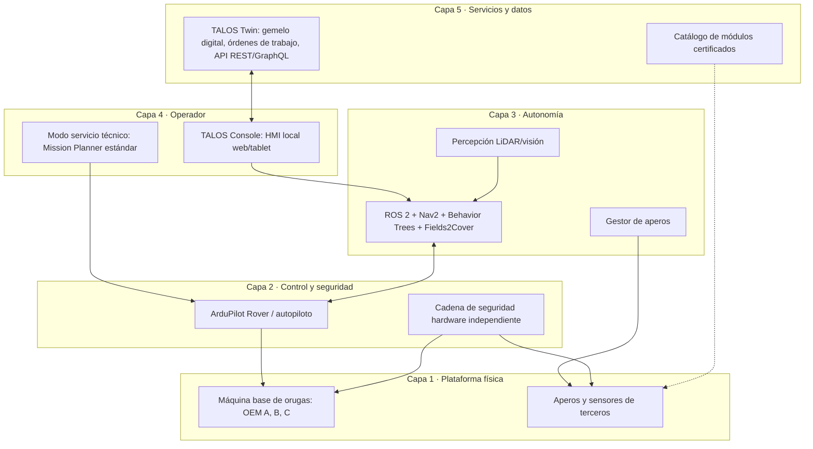
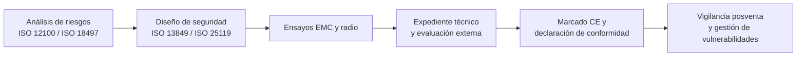
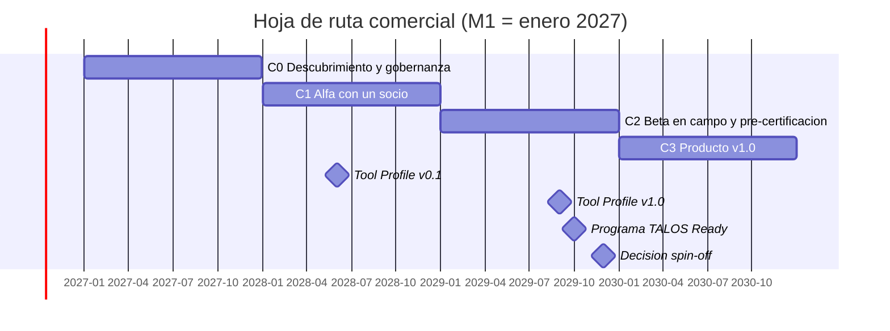

# TALOS — De plataforma de investigación a producto comercial abierto para robótica en olivar

**Estrategia de productización, alianzas con fabricantes, arquitectura de ecosistema abierto, modelo de negocio, hoja de ruta y presupuesto de la línea comercial**

**Documento:** 2 de 2 (complementa a *«Plataforma robótica autónoma, modular y de código abierto para la gestión de olivar ecológico»*, en adelante **Documento 1**)
**Versión:** 1.0 — octubre de 2026
**Estado:** documento estratégico de trabajo. **No es asesoramiento jurídico, fiscal ni de inversión.**
**Nombre de trabajo de la plataforma:** **TALOS** (ver §3; sujeto a búsqueda de anterioridades de marca)
**Autores:** [Nombre Apellido¹] — *(completar)* · **Correspondencia:** [correo]

> **Convención de fiabilidad.** **†** = estimación o hipótesis del autor, no verificada con ofertas ni datos de mercado. **[V]** = dato comprobado en una fuente pública consultada en octubre de 2026 (ver §17). **[?]** = dato que no he podido verificar y que debe confirmarse antes de usarlo. Todas las cifras económicas son rangos orientativos.

---

## Resumen

El Documento 1 define una plataforma abierta (ArduPilot + ROS 2 + Nav2 + RTK-GNSS + percepción + aperos + UAV) validada en cuatro años. Este documento analiza **cómo convertirla en un producto comercial** sin perder su carácter abierto. La tesis es que el valor comercial no está en cerrar el código, sino en **(1) un kit de integración robusto, certificable y fácil de instalar sobre máquinas de orugas teleoperadas existentes, (2) una consola de operador sencilla pensada para agricultores, (3) un estándar abierto de acoplamiento de aperos (mecánico, eléctrico, de comunicaciones y de software) y (4) un programa de socios y certificación** que permita a terceros fabricar módulos compatibles.

Se proponen: un modelo de **«núcleo abierto + servicios y certificación»**; una arquitectura en cinco capas con interfaces públicas; una consola de operador propia (no una versión recortada de Mission Planner, aunque la licencia lo permite; §5); un marco de negociación con fabricantes de máquina base (los modelos citados por el equipo, **Like 500** y **Camon HM27**, **no he podido localizarlos en fuentes públicas [?]**, por lo que se analiza un marco general y se comparan alternativas verificables como FAE RCU, Energreen RoboEVO/RoboMAX y Prinoth Raptor 100); una gobernanza con asociación o fundación titular de la marca; una ruta regulatoria (Reglamento de Máquinas 2023/1230, ciberseguridad, radio, seguridad funcional); y un plan en cuatro fases comerciales (C0–C3) acopladas a las puertas *go/no-go* del Documento 1.

La línea comercial **requiere una inversión adicional estimada de ≈ 33.000–71.000 € en el año 1 y ≈ 1,0–2,0 M€ acumulados a cuatro años** (con contingencia), muy escalonada y condicionada a hitos (§12). Se incluyen además una lista de **grupos de investigación**, **investigadores afines** y **empresas colaboradoras** candidatas (§14–16), a verificar uno a uno.

**Palabras clave:** producto comercial; robótica agrícola; arquitectura abierta; ecosistema de aperos; ISOBUS; DroneCAN; Mission Planner; GPLv3; Reglamento de Máquinas; olivar; TALOS.

---

## Índice

1. [Contexto y tesis](#1-contexto-y-tesis)
2. [Visión de producto y requisitos](#2-visión-de-producto-y-requisitos)
3. [Nombre de la plataforma](#3-nombre-de-la-plataforma)
4. [Arquitectura abierta del producto](#4-arquitectura-abierta-del-producto)
5. [Consola del operador: ¿recortar Mission Planner?](#5-consola-del-operador-recortar-mission-planner)
6. [Alianzas con fabricantes de máquina base](#6-alianzas-con-fabricantes-de-máquina-base)
7. [Ecosistema abierto: estándar de aperos, SDK y certificación](#7-ecosistema-abierto-estándar-de-aperos-sdk-y-certificación)
8. [Modelo de negocio y oferta](#8-modelo-de-negocio-y-oferta)
9. [Licencias, propiedad intelectual y gobernanza](#9-licencias-propiedad-intelectual-y-gobernanza)
10. [Regulación, certificación y responsabilidad](#10-regulación-certificación-y-responsabilidad)
11. [Hoja de ruta comercial](#11-hoja-de-ruta-comercial)
12. [Presupuesto de la línea comercial](#12-presupuesto-de-la-línea-comercial)
13. [Riesgos](#13-riesgos)
14. [Grupos de investigación candidatos](#14-grupos-de-investigación-candidatos)
15. [Investigadores relevantes](#15-investigadores-relevantes)
16. [Empresas y organizaciones colaboradoras](#16-empresas-y-organizaciones-colaboradoras)
17. [Referencias](#17-referencias)
18. [Anexos](#18-anexos)

---

# 1. Contexto y tesis

**Problema.** El olivar tradicional necesita mecanización segura y asequible en pendientes, bajo copa y en explotaciones pequeñas o medianas. Hoy existen (i) **portaherramientas teleoperados de orugas** (control remoto, sin autonomía) y (ii) **robots agrícolas autónomos** caros y pensados para cultivos en hilera estructurados. El hueco es una **capa de autonomía abierta y adaptable** que convierta máquinas teleoperadas robustas en máquinas supervisadas y, después, autónomas.

**Tesis.**

1. **El hardware pesado ya existe.** Fabricantes como FAE, Energreen o Prinoth comercializan portaherramientas de orugas de 44–120 CV, con pendiente de trabajo de hasta 55° y mando a distancia (hasta ≈ 150 m en Energreen) [V: R3, R4, R5]. No conviene competir con ellos en chasis, motor e hidráulica.
2. **El valor diferencial es el «cerebro»:** localización RTK + percepción + comportamientos *work-around-tree* + gestión del apero + datos por árbol (Documento 1, §4).
3. **Abierto no es incompatible con comercial.** La licencia de ArduPilot y de su software de estación de tierra, incluido Mission Planner, es GPLv3 y permite integrarlo en productos para la venta, con obligaciones de ofrecer el código fuente y mantener los créditos [V: R1, R2].
4. **Un estándar de acoplamiento atrae socios.** Si otros fabricantes pueden crear aperos y sensores compatibles sin pedir permiso, la plataforma gana valor con cada socio (efecto red).

**Modelo mental:** *Linux/Android del olivar robótico*: núcleo abierto, marca y certificación gobernadas, y varias formas de ganar dinero a su alrededor.

---

# 2. Visión de producto y requisitos

## 2.1. Propuesta de valor

| Usuario | Dolor | Promesa del producto |
|---|---|---|
| Agricultor/olivarero | Mano de obra, riesgo, pendientes, tiempo | «Instalas un kit en tu máquina de orugas y trabajas con una app sencilla; la máquina rodea el olivo y para si hay una persona» |
| Cooperativa / empresa de servicios | Coste por hectárea, flota diversa | Flota supervisada, órdenes de trabajo, trazabilidad por árbol |
| Fabricante de máquina | Diferenciarse sin invertir en autonomía | Kit/SDK listo para integrar, con certificación compartida |
| Fabricante de apero/sensor | Acceso a la base instalada | Interfaz abierta y sello de compatibilidad |
| Investigador | Plataforma reproducible | Datos, simulación y código abiertos |

## 2.2. Requisitos de producto (resumen)

| Eje | Requisito | Métrica orientativa |
|---|---|---|
| Robustez | Operación en polvo, calor y vibración; IP65–IP67 en electrónica; diseño térmico (Documento 1, §4.11) | MTBF y tasa de fallos en campaña; ensayo a +60 °C ambiente † |
| Facilidad de uso | Instalación del kit en < 1 jornada; puesta en marcha con asistente; operación con ≤ 3 pantallas | Tiempo de instalación, tareas completadas por un usuario no técnico sin ayuda |
| Seguridad | Parada física independiente del software; detección de personas con redundancia; estado seguro ante fallo | Cumplimiento de la ruta normativa (§10) |
| Apertura | Interfaces públicas y versionadas (hardware, bus, software, datos) | Nº de módulos de terceros certificados |
| Mantenibilidad | Diagnóstico remoto, actualizaciones firmadas, registros reproducibles | Tiempo medio de reparación |
| Coste | Kit asequible frente a un robot agrícola autónomo completo | Precio del kit y retorno de la inversión (§8) |

## 2.3. Segmentos y orden de entrada

1. **Olivar de pendiente y tradicional con portaherramientas de orugas** (desbrozado, trituración): mercado inicial y caso de uso del Documento 1.
2. **Otros cultivos leñosos** (viñedo, almendro, frutal de secano): la misma capa con otros aperos.
3. **Mantenimiento de taludes, cortafuegos y plantas fotovoltaicas:** las páginas de fabricantes muestran uso de portaherramientas de orugas en estas aplicaciones [V: R3, R4]; requiere otro análisis de riesgos.

---

# 3. Nombre de la plataforma

## 3.1. Criterios

Corto (≤ 3 sílabas), pronunciable en español e inglés, evocador, con relación con el Mediterráneo y la robótica, con dominio y marca posiblemente disponibles, y que sirva de «paraguas» para submarcas.

## 3.2. Candidatos

| Nombre | Origen y significado | Fortalezas | Riesgos |
|---|---|---|---|
| **TALOS** *(propuesto)* | Autómata de bronce de la mitología griega que custodiaba Creta, rodeando la isla: **el primer «robot» guardián del Mediterráneo**; rodea (como el *work-around-tree*) y protege | Épico, memorable, 5 letras, historia contable en una frase; encaja con la circunvalación de olivos y la seguridad | **Nombre muy usado** (hay productos y marcas con ese nombre en robótica y ciberseguridad **[?]**): exige búsqueda de anterioridades y, probablemente, una forma distintiva (p. ej. «TALOS OLEA») |
| **OLEA** | Género botánico del olivo (*Olea europaea*) | Corto, bonito, muy ligado al cultivo; excelente como **marca del estándar abierto** («OLEA Link», «OLEA Tool Bus») | Menos «épico»; posible confusión con otras marcas agroalimentarias |
| **ATHENAI / ATENEA** | Atenea, diosa que regaló el olivo a Atenas | Fuerte simbolismo olivarero | Muy genérico y saturado en tecnología |
| **ARBOS** | Del latín *arbor* (árbol) | Refleja «el árbol como unidad de trabajo» | Poco evocador, posible conflicto con marcas existentes |
| **GIGANTE / TITÁN** | Fuerza | Impacto | Genérico; sugiere tamaño y no inteligencia |

## 3.3. Recomendación

**Marca paraguas: TALOS.** Lema provisional: *«El guardián de los olivares»*. **Submarcas** coherentes y fáciles de recordar:

| Componente | Nombre propuesto |
|---|---|
| Kit de autonomía para máquinas de orugas | **TALOS Core** |
| Consola del operador (app/HMI) | **TALOS Console** |
| Estándar abierto de aperos y módulos (mecánico/eléctrico/datos) | **OLEA Link** *(o «TALOS Link»)* |
| Gemelo digital y órdenes de trabajo | **TALOS Twin** |
| Programa de socios y certificación | **TALOS Ready** |
| Simulador abierto | **TALOS Sim** |

*Interpretación (retroacrónimo, opcional):* **T**ree-level **A**utonomous **L**ayered **O**pen **S**ystem.

> **Antes de adoptar el nombre:** consultar las bases de la OEPM, la EUIPO y la OMPI (TMview/Global Brand Database), comprobar dominios y repositorios, y valorar las clases de Niza 7, 9, 12, 42 y 45 †. **No he realizado esa búsqueda.** Si TALOS resultara inviable, la alternativa más segura es una marca compuesta o **OLEA** como marca principal.

---

# 4. Arquitectura abierta del producto

## 4.1. Principio de diseño: «interfaces antes que implementaciones»

Cada frontera entre capas es una **interfaz pública, versionada y documentada** (como un puerto USB: quien la cumple, funciona). Así un tercero puede sustituir o añadir cualquier pieza.



## 4.2. Interfaces públicas propuestas (versión 0.1 → 1.0)

| Id | Interfaz | Propuesta técnica | Quién la usa |
|---|---|---|---|
| **I-M** | **Mecánica** del apero | Acoplamiento rápido de portaherramientas; los fabricantes citados admiten aperos de terceros con **conexión SAE para minicargadoras** (p. ej. FAE RCU75/RCU120) [V: R3]; definir además una placa de interfaz con tomas hidráulicas y eléctricas | Fabricantes de aperos |
| **I-E** | **Eléctrica** | Conector de potencia y señal normalizado (tensión nominal 12/24/48 V †), líneas de parada de emergencia y de habilitación (*enable*) cableadas, no solo por software | Aperos, máquina base |
| **I-B** | **Bus de datos** del apero | CAN con **perfil «TALOS Tool Profile»**: pasarela a **ISOBUS (ISO 11783)** para aperos agrícolas existentes y compatibilidad con **DroneCAN** para sensores/periféricos de ArduPilot [?: confirmar versión soportada] | Aperos, sensores |
| **I-S** | **Software** | Paquete ROS 2 estándar: acciones `ToolActivate`, `ToolStatus`, `ToolSafeState` y un **descriptor** de apero (YAML, ver Documento 1 §4.9) | Desarrolladores de aperos y percepción |
| **I-D** | **Datos** | Formato abierto de órdenes de trabajo y de registro por árbol (GeoJSON/GeoPackage + esquema); API REST | Gemelo digital, ERP agrícola, UAV |
| **I-C** | **Consola** | Plugins de la consola (paneles de apero, informes) con API de extensión | Terceros |

```yaml
# Ejemplo de descriptor de apero «TALOS Tool Profile» v0.1 (propuesta)
tool_id: mulcher_x120
vendor: ExampleCorp
type: MULCHER
interface_version: "0.1"
mechanical: {coupler: SAE_skid_steer, width_m: 1.20, mass_kg: 180}
electrical: {voltage_v: 24, max_current_a: 30, estop_loop: true, enable_line: true}
bus: {type: CAN, profile: TALOS_TOOL, isobus_gateway: false}
safety: {safe_state: TOOL_OFF, safe_radius_m: 3.0, spin_down_s: 6}
telemetry: [rpm, current_a, temperature_c, fault_code]
```

## 4.3. Tres niveles de integración con una máquina base

| Nivel | Descripción | Esfuerzo para el fabricante | Ventaja | Inconveniente |
|---|---|---|---|---|
| **N1 — Retrofit externo** | Kit que actúa sobre el mando remoto/radiocontrol y sensores propios; no toca la ECU de la máquina | Mínimo (permiso y soporte) | Se puede empezar ya; poca dependencia | Menor rendimiento y sensores externos; seguridad más difícil de certificar |
| **N2 — Integración por interfaz** | La máquina expone control de tracción, E-stop, estado y apero mediante CAN/electrónica documentada | Medio | Mejor control, seguridad integrada | Requiere acuerdo y cambios en la máquina |
| **N3 — «TALOS Ready» de fábrica** | La máquina sale de fábrica preparada (soportes, cableado, alimentación, firmware) | Alto | Mejor producto y certificación conjunta | Largo plazo y alta confianza |

**Estrategia:** empezar en **N1 con una máquina** (prototipo del Documento 1, Fase 4), pasar a **N2 con un socio piloto** y ofrecer **N3** a partir de la v1.0.

---
# 5. Consola del operador: ¿recortar Mission Planner?

## 5.1. Qué permite la licencia

ArduPilot y su software de estación de tierra, incluido **Mission Planner**, se distribuyen bajo **GPLv3**; el proyecto indica que cualquier empresa puede incorporarlos a productos para la venta sin autorización, siempre que informe de que el software es abierto, ofrezca el código fuente (o un enlace a él) y conserve los créditos de los contribuyentes [V: R1]. En los foros del proyecto se resume así: no hay obligación de publicar los cambios en abierto, pero sí de ponerlos a disposición de los clientes que reciben el binario [V: R2]. **Por tanto, una versión recortada de Mission Planner es legalmente posible.**

> Matiz: la GPLv3 se aplica al **trabajo derivado**. Si el producto incorpora código de Mission Planner, ese código y sus derivados deben ofrecerse bajo GPLv3. Esto no contamina por sí solo el resto del stack si se comunica por interfaces independientes (MAVLink/DDS/API), pero **debe validarlo un abogado** antes de cerrar la arquitectura (§9).

## 5.2. Alternativas

| Opción | Descripción | Pros | Contras |
|---|---|---|---|
| **A. Fork recortado de Mission Planner** | Eliminar pestañas y funciones no necesarias; marca propia | Rápido de arrancar; conexión con ArduPilot ya resuelta | Aplicación de escritorio Windows/.NET orientada a técnicos y a UAV **[?]**; difícil de adaptar a tablet y a usuarios no técnicos; mantener el *fork* frente a actualizaciones es costoso; herencia GPLv3 en todo el código reutilizado |
| **B. Consola nueva (web/PWA o app de tablet)** sobre MAVLink + ROS 2 | HMI propia, con asistente de puesta en marcha y panel de misión | Mejor experiencia de uso, multiplataforma, API de plugins (I-C), licencia libre de elegir | Más desarrollo inicial; hay que reimplementar parte de la telemetría y de la calibración |
| **C. Personalizar otro GCS abierto** (p. ej. QGroundControl) | Adaptar un GCS multiplataforma | Interfaz moderna y multiplataforma | Orientado sobre todo a PX4 y a UAV **[?]**; licencias duales a verificar; el soporte de Rover/ArduPilot puede ser incompleto |
| **D. Híbrida (recomendada)** | **TALOS Console** (opción B) para el agricultor + **Mission Planner estándar sin modificar** como «modo servicio» para el técnico | Cada usuario ve lo que necesita; sin mantener un fork; el técnico conserva la herramienta completa y conocida | Dos herramientas que documentar |

## 5.3. Recomendación y alcance de TALOS Console (MVP)

**Opción D.** La consola del operador **no debe parecer un autopiloto**: debe parecer una app agrícola.

| Pantalla | Contenido mínimo (MVP) |
|---|---|
| 1. Inicio | Estado de la máquina (semáforo), batería/combustible, calidad RTK, estado del E-stop |
| 2. Parcela y trabajo | Mapa con la parcela, calles y árboles; elegir tarea (desbrozado, trituración); previsualizar la ruta de cobertura |
| 3. Ejecución | Mapa en vivo, cámara frontal, aviso de personas/obstáculos, botones **Pausa / Reanudar / Volver a base / Parada** |
| 4. Registro | Qué se hizo, dónde y cuándo; exportar a CSV/GeoJSON |
| 5. Asistente de instalación y diagnóstico | Comprobaciones guiadas de sensores, base RTK, aperos |

Elementos de Mission Planner que **no** se exponen al operador (quedan en modo servicio): calibraciones avanzadas, ajuste de parámetros, ficheros de registro, configuración de EKF, misiones de UAV, simuladores.

**Requisitos no funcionales:** funcionar sin Internet; modo claro/oscuro para exterior; textos grandes y botones táctiles; idiomas ES/EN/FR/IT; ciberseguridad (§10.3).

---

# 6. Alianzas con fabricantes de máquina base

## 6.1. Estado de la información sobre los modelos citados

| Modelo citado | Resultado de la búsqueda | Qué hacer |
|---|---|---|
| **«Like 500»** | **Sin resultado fiable [?]**. Aparecen otros equipos de nombre parecido en anuncios de segunda mano (p. ej. «Mfgstar 500»), pero **no puedo afirmar que se trate del mismo equipo** | Confirmar el fabricante exacto, el país y el modelo (¿ortografía o nombre comercial distinto?) |
| **«Camon HM27»** | **Sin resultado fiable [?]** (las búsquedas devuelven teléfonos con nombre similar y no maquinaria agrícola) | Ídem |

Mientras tanto, este documento plantea el marco de negociación de forma **independiente del modelo** y compara fabricantes **verificables** que ya comercializan portaherramientas de orugas teleoperados.

## 6.2. Alternativas verificables como máquina base

| Fabricante | Modelos (datos de sus webs) | Datos relevantes para el proyecto |
|---|---|---|
| **FAE Group** (Italia) | RCU45 / **RCU75** (motor 74 CV, mulching hasta 15 cm de diámetro) / **RCU120** (120 CV, hasta 20 cm) [V: R3] | Trabaja en pendientes de hasta 55°; chasis de acero con componentes protegidos y sistema integrado de unidades de control y sensores; admite aperos de terceros con conexión **SAE** [V: R3] |
| **Energreen** (Italia) | **RoboEVO**, **RoboMAX** [V: R4] | Hasta 55° en cualquier dirección; mando de hasta unos 150 m; transmisión hidrostática; orugas de 300 mm; RoboMAX con motor de 75 CV Stage V y cambio rápido de apero [V: R4] |
| **Prinoth** | **Raptor 100** [V: R5] | 55 kW (75 CV), diésel Deutz; ancho de trabajo 1.250–1.450 mm; velocidad de desplazamiento hasta 6 km/h [V: R5] |
| **Dronster** (alquiler en España a través de Vallfirest) | Desbrozadora forestal teledirigida con acoplamientos hidráulicos rápidos delantero/trasero/superior y pantalla TFT de 5" [V: R6] | Interesante por modularidad y por disponerse en alquiler para pruebas |
| **Fabricantes de menor coste** | Portaherramientas pequeños de orugas con motor de gasolina de 7–25 CV y mando de 150–500 m [V: R7] | Útiles como **plataforma de bajo coste** para pruebas, no necesariamente para producto certificado |

*(Los datos son los publicados en las webs de los fabricantes o anuncios consultados; no son especificaciones contractuales.)*

## 6.3. Qué pedir a un fabricante (lista de requisitos de integración)

| Ámbito | Qué necesitamos saber/obtener |
|---|---|
| **Control de tracción** | ¿El mando remoto usa protocolo propietario o señales estándar (PWM/CAN)? ¿Se puede inyectar una orden de velocidad/giro desde un controlador externo con prioridad definida? |
| **Seguridad** | Esquema del circuito de parada de emergencia, contactores, estado seguro, estado de vuelco; posibilidad de añadir un lazo de seguridad adicional |
| **Apero** | Control del régimen del rotor, elevación del cabezal, presión hidráulica, sensores disponibles |
| **Energía** | Tensión y capacidad de la batería/alternador para alimentar Jetson, LiDAR y RTK; puntos de alimentación protegidos |
| **Mecánica** | Superficies de montaje de sensores y armario IP65, antivibración, protección contra ramas |
| **Térmica y EMC** | Temperaturas en el compartimento, ruido eléctrico del generador y motores |
| **Documentación** | Esquemas eléctricos e hidráulicos, manual de despiece, piezas de repuesto |
| **Comercial** | Distribución, garantía, servicio posventa, política de modificaciones |

## 6.4. Modelos de acuerdo

| Modelo | Descripción | Cuándo conviene |
|---|---|---|
| **Pruebas y prototipo** | Cesión/préstamo/alquiler de una máquina para I+D a cambio de visibilidad y acceso a resultados | Fase 4 del Documento 1 (M25–30) |
| **Carta de intenciones (LoI)** | Compromiso no vinculante de colaborar, con ámbito y plazos | Primeros contactos |
| **Acuerdo de desarrollo conjunto** | Reparto de costes, propiedad de resultados, calendario y certificación | Alfa con un socio |
| **Distribución cruzada** | El fabricante ofrece TALOS Core como opción; TALOS recomienda esas máquinas | Beta/lanzamiento |
| **OEM / «TALOS Ready» (N3)** | Máquina de fábrica con interfaces integradas; licencia de marca | Producto v1.0 |
| **Licencia de marca y certificación** | El fabricante paga una cuota por el sello y los ensayos | Madurez del programa |

**Cláusulas clave:** propiedad intelectual de las mejoras (quién es titular de qué); no exclusividad (para que el estándar siga abierto) o exclusividad limitada en tiempo/territorio; responsabilidad por producto y reparto de la certificación CE; protección de datos de clientes; garantía conjunta y posventa; terminación y *escrow* de documentación.

## 6.5. Secuencia de aproximación

1. Elegir **2–3 fabricantes** (uno de ellos el que el equipo ya tenga identificado) y preparar un *dossier* de una página + demo en simulación.
2. Proponer un **piloto N1** sin modificar la máquina: instalar el kit sobre una unidad cedida.
3. Con resultados (H5/H6 del Documento 1), proponer el **acuerdo N2**.
4. Publicar la especificación **TALOS Tool Profile v1.0** y abrir la certificación a más fabricantes.

---

# 7. Ecosistema abierto: estándar de aperos, SDK y certificación

## 7.1. Qué ofrece el proyecto a terceros

| Para… | Recurso |
|---|---|
| Fabricantes de aperos | Especificación I-M/I-E/I-B/I-S, plantillas CAD, placa de desarrollo, banco de pruebas, **simulador TALOS Sim** con su apero |
| Fabricantes de sensores | Drivers ROS 2 de referencia, perfiles de calibración, conjunto de datos de prueba |
| Desarrolladores de software | SDK Python/C++ de ROS 2, API de la consola (plugins), esquemas de datos |
| Integradores/cooperativas | Guía de instalación, formación, soporte por niveles |

## 7.2. Programa TALOS Ready (certificación de compatibilidad)

| Nivel | Qué certifica | Cómo |
|---|---|---|
| **Compatible (autodeclarado)** | El módulo cumple la especificación | Lista de verificación pública + resultados de las pruebas automáticas del banco |
| **Verificado** | Pruebas de interoperabilidad realizadas por el proyecto | Ensayo en banco y en campo con registro abierto |
| **Seguro (Safety-ready)** | Cumple los requisitos de seguridad de la interfaz (parada, estado seguro, tiempos de reacción) | Evaluación de un tercero independiente †; es **condición para aperos de corte** |

El **sello y el nombre** TALOS Ready son marca registrada; el **código y las especificaciones** siguen siendo abiertos. Cualquiera puede fabricar un módulo compatible; solo quien supera la verificación puede usar el sello.

## 7.3. Normalización y comunidades afines

Dar visibilidad al estándar en la **AEF (Agricultural Industry Electronics Foundation)**, que promueve ISOBUS [?], en comunidades de **ROS 2** (Open Robotics / ROS-Industrial Consortium) y en el **programa de socios de ArduPilot** (existe «Partners Program» en su web) [V: R1]. Un objetivo ambicioso a largo plazo es proponer el perfil de aperos como **especificación pública** de una organización de estándares †.

---

# 8. Modelo de negocio y oferta

## 8.1. Líneas de ingreso

| Línea | Qué se vende | Margen/recurrencia |
|---|---|---|
| **1. TALOS Core (kit de autonomía)** | Hardware integrado + instalación + puesta en marcha | Ingreso único; margen medio |
| **2. Suscripción de software y servicios** | Actualizaciones certificadas, TALOS Twin (gemelo digital y órdenes de trabajo), soporte, actualización de mapas | **Recurrente** |
| **3. Integración y personalización** | Adaptación a nuevas máquinas/aperos; formación | Servicios profesionales |
| **4. Programa de socios** | Cuotas de certificación y de pertenencia | Recurrente moderado |
| **5. Datos y proyectos de I+D** | Contratos de investigación, proyectos europeos, licencias académicas gratuitas | No dilutivo |
| **6. Robot como servicio (RaaS)** † | Alquiler/servicio por hectárea con operador de la cooperativa | Opcional, más intensivo en capital |

## 8.2. Hipótesis de precio y margen (†, a validar con clientes)

El hardware del kit de integración final del Documento 1 (Fase 4, sin máquina base) se estimó en **6.400–22.900 €**. Una hipótesis de trabajo es que el **precio de venta del kit instalado** ronde **1,4–2,0 veces** su coste de hardware †, es decir, en torno a **9.000–46.000 €** según nivel de sensores y grado de certificación, con suscripción anual adicional del 8–15 % del precio del kit †. **Estas cifras no están validadas.** Se contrastarán en la fase C0 con ≥ 30 entrevistas a olivareros, cooperativas y empresas de servicios, comparando el precio del kit con (i) el coste de jornales de desbrozado por hectárea y (ii) el de un robot agrícola autónomo completo.

## 8.3. Preguntas de validación comercial (C0)

1. ¿Cuántas hectáreas gestiona un cliente típico y cuántas pasadas de desbrozado hace al año?
2. ¿Qué parte de las máquinas teleoperadas ya poseen y de qué marcas?
3. ¿Pagarían por seguridad (parada ante personas) aunque no hubiera autonomía completa?
4. ¿Prefieren comprar, alquilar o contratar el servicio?
5. ¿Qué tolerancia hay a la apertura del código (¿es ventaja o desconfianza?)?

---

# 9. Licencias, propiedad intelectual y gobernanza

## 9.1. Estrategia de licencias

| Componente | Licencia propuesta | Motivo |
|---|---|---|
| Firmware/parches ArduPilot y Mission Planner (si se modifican) | **GPLv3** (obligatoria) | Es la licencia del proyecto original [V: R1] |
| Paquetes ROS 2 propios (navegación, comportamientos, percepción) | **Apache-2.0** | Compatible con ROS 2/Nav2; incluye concesión de patentes |
| TALOS Console | Apache-2.0 o GPLv3 (decisión pendiente, §5) | Ver opción B/D |
| Especificaciones del estándar de aperos | **CC BY 4.0** o licencia de la organización de estándares | Facilitar su adopción |
| Hardware abierto (CAD y electrónica de las placas de interfaz) | **CERN-OHL** (variante a decidir) | Estándar de hardware abierto |
| Marca y sello «TALOS»/«TALOS Ready»/«OLEA» | **Marca registrada** con política de uso | Protege la calidad sin cerrar el código |
| Modelos de IA y datasets | Elegir licencia compatible; **vigilar licencias como AGPL-3.0 de algunas implementaciones de detectores** (Documento 1, §9.4) | Evitar contaminación |

## 9.2. Propiedad intelectual

- **Patentes:** valorar con un agente de patentes qué es patentable (p. ej. métodos de circunvalación sobre mapa semántico, arquitecturas de seguridad). Una estrategia abierta puede combinarse con **patentes defensivas** o con la concesión de licencia gratuita para uso conforme al estándar †.
- **CLA o DCO:** para contribuciones externas, utilizar *Developer Certificate of Origin* (DCO) o un *Contributor License Agreement* si se prevé relicenciar †.
- **Derechos de la universidad/centro:** antes de comercializar, clarificar con la OTRI/OTT la titularidad de los desarrollos de tesis y de proyectos financiados; puede requerirse una **spin-off** o licencia.

## 9.3. Gobernanza

| Opción | Descripción | Observaciones |
|---|---|---|
| **Asociación/fundación sin ánimo de lucro** | Titular de la marca, de las especificaciones y de la certificación; con comité técnico abierto | Da neutralidad y confianza a los fabricantes |
| **Empresa (spin-off)** | Comercializa TALOS Core y servicios con licencia de marca de la asociación | Modelo «Linux Foundation + empresas» |
| **Consorcio de proyecto** | Marco temporal para proyectos europeos | Transitorio |

**Recomendación:** crear primero el **proyecto y la marca en una asociación** (para atraer socios) y, cuando exista demanda (C2), constituir una **spin-off** que comercialice el kit y los servicios.

---

# 10. Regulación, certificación y responsabilidad

> Lista de comprobación para el servicio jurídico/técnico, **no asesoramiento legal**. Verificar texto vigente y fechas de aplicación.

## 10.1. Seguridad de máquinas

- **Reglamento (UE) 2023/1230 sobre máquinas**: sustituye a la Directiva 2006/42/CE y es aplicable desde el **20 de enero de 2027** (Documento 1, ref. [46]). Un kit que convierta una máquina en una máquina con funciones autónomas puede implicar una **modificación sustancial**: el responsable debe evaluar si se convierte en fabricante de la máquina resultante †.
- Normas candidatas (verificar edición vigente): **ISO 18497** (maquinaria agrícola altamente automatizada), **ISO 13849-1** y **ISO 25119** (seguridad funcional), **ISO 11783** (ISOBUS) si se usa.
- **Evaluación de conformidad:** estudiar con un organismo notificado si la máquina entra en categorías con examen por tercera parte; si no, procedimiento con control interno y expediente técnico.

## 10.2. Radio, EMC y otros marcos

- **Directiva de equipos radioeléctricos (RED)** para enlaces de radio (RTK, mando, telemetría) y **compatibilidad electromagnética (EMC)** †.
- **Operación de UAV** (si se incluye la capa aérea): marco europeo de UAS (Documento 1, §11.3).
- **Fitosanitarios y pulverización:** normativa de uso sostenible y de inspección de equipos; el módulo de pulverización requiere análisis específico (Documento 1, §11.3).

## 10.3. Ciberseguridad y responsabilidad por producto

- El **Reglamento de Ciberresiliencia de la UE (UE 2024/2847)** impone requisitos de ciberseguridad a productos con elementos digitales y tiene obligaciones **escalonadas** (con aplicación general prevista a finales de 2027 y notificación de vulnerabilidades antes) **[?: confirmar fechas]**. Incluye disposiciones sobre software de código abierto y «administradores» de proyectos abiertos **[?]**; es relevante para la entidad titular del proyecto (§9.3).
- Requisitos prácticos: actualizaciones firmadas, gestión de vulnerabilidades, arranque seguro, aislamiento de red de la cadena de seguridad.
- **Responsabilidad por productos defectuosos:** la nueva Directiva (UE) 2024/2853 incluye el software como producto **[?: verificar alcance y transposición]**; suscribir **seguro de responsabilidad civil de producto** †.
- **Inteligencia artificial:** valorar si componentes de IA que sean componentes de seguridad de una máquina caen en el ámbito del Reglamento de IA **[?]**. Mitigación de diseño: la seguridad **no depende** solo de modelos de ML (Documento 1, §4.8 y §12).

## 10.4. Ruta de certificación propuesta



---
# 11. Hoja de ruta comercial

La línea comercial **no sustituye** al plan de investigación del Documento 1: va **acoplada a sus hitos y puertas** para no gastar antes de tiempo.

| Fase | Meses (Doc. 1) | Objetivo comercial | Entregables | Condición de paso |
|---|---|---|---|---|
| **C0 — Descubrimiento** | M1–12 | Validar necesidad, nombre, gobernanza y primeros aliados | 30+ entrevistas; búsqueda de marca; asociación constituida o en trámite; 2–3 LoI con fabricantes; esquema de la consola (MVP) | H1 cumplido (G1) |
| **C1 — Alfa con un socio** | M13–24 | Kit N1 sobre una máquina cedida; especificación v0.1 | Prototipo TALOS Core en máquina real (puede coincidir con la Fase 4 del Doc. 1 si se adelanta †); TALOS Console v0.1; Tool Profile v0.1 publicado | H3/H4 y primer artículo (G2) |
| **C2 — Beta en campo** | M25–36 | 3–5 explotaciones piloto; pre-certificación | Pilotos con operadores reales; análisis de riesgos externo; Tool Profile v1.0; programa TALOS Ready abierto; decisión sobre spin-off | H6 y evaluación de riesgos favorable (G3) |
| **C3 — Producto v1.0** | M37–48 | Primeras 10–20 unidades; ingresos recurrentes | Marcado CE (según ruta); suscripción TALOS Twin; ≥ 3 módulos de terceros certificados; ferias y distribución | H7/H8 y cumplimiento normativo |

**Hitos de mercado:** presentación en **Expoliva** (feria del aceite de oliva en Jaén) y en ferias agrícolas como **FIMA** (Zaragoza) o **Agritechnica** (Hannover) **[?: confirmar fechas de las próximas ediciones]**.



---

# 12. Presupuesto de la línea comercial

Importes **adicionales** al presupuesto de investigación del Documento 1 (que cubre hardware, operación y publicaciones del programa de 48 meses), en **miles de euros**, **rangos orientativos †** y escalonados. Todo se libera por fases (§11) y puede reducirse con subvenciones y con cesión de máquinas por parte de socios.

| Concepto (k€) | Año 1 | Año 2 | Año 3 | Año 4 | Total |
|---|---:|---:|---:|---:|---:|
| Equipo (producto, firmware, software/ROS, UX, seguridad, desarrollo de negocio) † | 20–30 | 90–130 | 190–280 | 250–350 | 550–790 |
| Unidades piloto y kits de integración (hardware) † | 0–5 | 15–40 | 50–120 | 80–200 | 145–365 |
| Ensayos y certificación (CE, EMC, radio, seguridad funcional) † | — | 5–15 | 30–80 | 40–120 | 75–215 |
| Legal, propiedad industrial/marcas, gobernanza, seguro de producto † | 5–15 | 10–25 | 15–40 | 15–40 | 45–120 |
| Marketing, ferias, web, documentación y comunidad † | 2–5 | 5–15 | 15–40 | 25–60 | 47–120 |
| Infraestructura (CI/CD, hosting, cloud del gemelo digital) † | 0–2 | 2–6 | 5–15 | 10–30 | 17–53 |
| Viajes y alianzas † | 2–5 | 5–10 | 8–15 | 10–20 | 25–50 |
| **Subtotal** | **29–62** | **132–241** | **313–590** | **430–820** | **904–1713** |
| Contingencia 15 % | 4–9 | 20–36 | 47–88 | 64–123 | 135–256 |
| **Total con contingencia** | **33–71** | **152–277** | **360–678** | **494–943** | **1039–1969** |

**Lectura rápida:** el **año 1** es muy modesto (≈ 33–71 k€ con contingencia: entrevistas, marca, gobernanza, LoI y especificación). El gasto fuerte llega solo si se superan las puertas G2 y G3. **Acumulado a 2 años: ≈ 185–348 k€; a 4 años: ≈ 1,0–2,0 M€.** La partida dominante es el **equipo** (≈ 50–55 % †).

**Cómo financiarlo (verificar convocatorias vigentes):** programas de innovación de empresas jóvenes y de I+D+i empresarial (CDTI), ayudas autonómicas, Grupos Operativos del PEI-AGRI, Horizon Europe (clúster de alimentación y agricultura), instrumentos del EIC y de EIT Food, capital semilla/*business angels* y cesión de máquinas por fabricantes. En especial, **la inversión privada solo debería entrar tras C1**, cuando haya un prototipo y un socio fabricante.

> **No incluido:** compra de máquinas base (ya reflejada en el Documento 1 como estimación †), costes de la tesis (financiados por convocatorias predoctorales) ni *stock* de producción en serie.

---

# 13. Riesgos

| Riesgo | Prob. | Impacto | Mitigación |
|---|---|---|---|
| El fabricante no cede interfaces o exige exclusividad | Media | Alta | Empezar con N1 (sin tocar la ECU); varios fabricantes; interfaces abiertas propias |
| Responsabilidad por accidente con un apero de corte | Baja pero crítica | Crítica | Cadena de seguridad hardware; certificación externa; seguro de producto; lanzar primero con supervisión |
| Incompatibilidad de licencias (GPL/AGPL) en el producto | Media | Media | Revisión formal; separar procesos; elegir detectores y modelos permisivos |
| Marca TALOS no disponible | Media | Media | Búsqueda de anterioridades; marca compuesta u OLEA |
| Mercado pequeño o precio no aceptable | Media | Alta | Validar en C0; modelo de suscripción y RaaS; ampliar a otros cultivos leñosos |
| Dispersión del equipo entre investigación y producto | Alta | Media | Gobernanza clara; roles separados; las tesis no dependen del producto |
| Cambios normativos (Reglamento de Máquinas, ciberseguridad) | Media | Media | Seguimiento normativo; diseño con margen; asesoría especializada |
| Competencia de grandes fabricantes con soluciones cerradas | Media | Media | Diferenciarse por apertura, coste y retrofit de máquinas existentes |
| Titularidad de la PI y conflicto con la universidad | Media | Alta | Acuerdo temprano con la OTRI; licencias; *spin-off* |
| Dependencia de un solo proveedor de sensores | Media | Media | Abstracción por interfaces y perfiles de sensor |

---

# 14. Grupos de investigación candidatos

> **Aviso de verificación.** Las organizaciones son reales según mi conocimiento, pero **no he comprobado cada línea de investigación ni su disponibilidad actual** en esta sesión; los campos «Interés para TALOS» son mi valoración. Antes de contactar, revisar su web y sus publicaciones recientes. Los grupos marcados con [V] aparecen en fuentes consultadas del Documento 1.

## 14.1. España

| Grupo / centro | Ubicación | Línea relevante | Interés para TALOS |
|---|---|---|---|
| **Universidad de Jaén — grupo de Robótica, Automática y Visión por Computador** [V: Doc. 1 [51]] | Jaén | UAS en agricultura de precisión de olivar (Grupo Operativo EIP-AGRI) | **Socio natural**: finca piloto, olivar, UAV |
| **Universidad de Jaén — Geomática/gráficos 3D** (olivar, modelos 3D) [V: Doc. 1 [13]] | Jaén | Caracterización 3D de olivos con UAV | Gemelo digital, WP7–WP8 |
| **CAR (Centro de Automática y Robótica), CSIC-UPM** | Madrid | Robótica de campo; flotas heterogéneas (proyecto RHEA) | Experiencia en robots agrícolas y aperos de precisión |
| **ETSII/ETSIAAB — UPM, grupos de robótica y agricultura de precisión** | Madrid | Robótica de campo y UAV | Colaboración académica y tesis |
| **IAS-CSIC (Instituto de Agricultura Sostenible)** | Córdoba | Teledetección con UAV, malas hierbas, olivar | Mapas de prescripción y validación agronómica |
| **Universidad de Córdoba — ingeniería rural / geomática y teledetección** | Córdoba | Fotogrametría y teledetección con UAV | UAV RGB/multiespectral |
| **Universidad de Sevilla — ingeniería agroforestal y robótica agrícola** | Sevilla | Maquinaria agrícola y robótica aérea | Maquinaria, UAV-UGV |
| **IFAPA — Centro Venta del Llano (Mengíbar, Jaén)** | Jaén | Investigación y experimentación en olivar | Ensayos agronómicos y fincas experimentales |
| **UPV (Valencia) — ingeniería agroforestal / visión y automatización** | Valencia | Maquinaria y automatización agrícola | Navegación y visión agrícola |
| **Universidad de Málaga / Universidad de Almería / Universidad de Zaragoza (robótica y visión)** | Andalucía/Aragón | Robótica móvil y visión | Percepción y SLAM |
| **Centros tecnológicos:** CITOLIVA (Jaén) y parque Geolit **[?]**; otros centros agroalimentarios | Jaén | Innovación del olivar y del aceite | Transferencia, pilotos con empresas |

## 14.2. Europa

| Grupo / centro | País | Línea | Interés |
|---|---|---|---|
| **PhenoRob / Universidad de Bonn (Stachniss, Popović)** | Alemania | SLAM, mapeo agrícola, KISS-ICP [V: Doc. 1 [42]] | Percepción y localización |
| **Wageningen University & Research — Agrosystems/Farm Technology** | Países Bajos | Fields2Cover y robótica agrícola [V: Doc. 1 [25]] | Planificación de cobertura; autores de Fields2Cover |
| **Lincoln Centre for Autonomous Systems / Lincoln Institute for Agri-Food Technology** | Reino Unido | Robótica agrícola y para cultivos | Estándares y pilotos |
| **NMBU — Universidad Noruega de Ciencias de la Vida** | Noruega | Thorvald II [V: Doc. 1 [36]] | Modularidad de robots |
| **INESC TEC / UTAD (Portugal)** | Portugal | Robótica en viñedo y olivar **[?]** | Colaboración ibérica |
| **ISAR — Universidad de Perugia** [V: Doc. 1 [50]] | Italia | AGROBOT (vid, olivo) | Olivar mediterráneo |
| **Universidades italianas (p. ej. Bolonia, Pisa, Florencia, Salento)** | Italia | Robótica agrícola y mecanización de pendiente | Máquinas de orugas de pendiente |
| **BFH-HAFL — Open Field Automation** [V: Doc. 1 [48]] | Suiza | Plataforma agrícola abierta en ROS 2 | Estándar abierto afín |

## 14.3. Resto del mundo

| Grupo | País | Línea |
|---|---|---|
| **Australian Centre for Field Robotics (ACFR), Univ. de Sídney** | Australia | Robótica de campo en agricultura |
| **UC Davis (Biological & Agricultural Engineering) / UC Merced** | EE. UU. | Robótica de huertos y localización [V: Doc. 1 [43]] |
| **Carnegie Mellon (Robotics Institute) / Cornell** | EE. UU. | Robótica y visión en frutales |
| **MARS Lab, Universidad de Hong Kong** | China | FAST-LIO2 [V: Doc. 1 [40]] |

---

# 15. Investigadores relevantes

> **Aviso.** Lista **orientativa** de personas asociadas a líneas cercanas al proyecto, elaborada a partir de las referencias del Documento 1 y de mi conocimiento general. **Verificar afiliación actual, publicaciones y disponibilidad** antes de cualquier contacto; no implica que hayan manifestado interés.

## 15.1. Robótica agrícola, navegación y percepción

| Investigador/a | Afiliación (a verificar) | Por qué es relevante |
|---|---|---|
| **Pablo González-de-Santos** | CAR-CSIC (Madrid) | Coordinación de proyectos de robots agrícolas europeos (RHEA) |
| **Roemi Fernández** | CAR-CSIC | Robótica de campo y manipulación |
| **Antonio Barrientos** | CAR/UPM (Madrid) | Robótica de campo, UAV y sistemas multi-robot |
| **Manuel Pérez-Ruiz** | Universidad de Sevilla | Maquinaria agrícola autónoma y cooperación UAV-UGV |
| **Francisco Rovira-Más** | UPV (Valencia) | Visión estéreo y guiado de maquinaria agrícola |
| **Cyrill Stachniss** | Univ. de Bonn | SLAM y agricultura robótica (PhenoRob); KISS-ICP |
| **Marija Popović** | Univ. de Bonn | Planificación de percepción y robótica de campo |
| **Gert Kootstra / Eldert van Henten** | Wageningen | Visión y robótica en horticultura y frutales |
| **Gonzalo Mier / João Valente / Sytze de Bruin** | Wageningen | **Fields2Cover** (planificación de cobertura) |
| **Stavros Vougioukas** | UC Davis | Detección de árboles y navegación en huertos [V: Doc. 1 [43]] |
| **Stefano Carpin** | UC Merced | Robótica de campo y planificación |
| **Salah Sukkarieh** | Univ. de Sídney (ACFR) | Robótica de campo agrícola |
| **Tom Duckett / Marc Hanheide / Simon Pearson** | Univ. de Lincoln | Robótica agroalimentaria |
| **Pål J. From / Lars Grimstad** | NMBU / Saga Robotics | Thorvald II [V: Doc. 1 [36]] |
| **Filipe Neves dos Santos / Raul Morais** | INESC TEC / UTAD | Robótica en vid y olivo **[?]** |
| **Fu Zhang** | HKU (MARS Lab) | FAST-LIO2 [V: Doc. 1 [40]] |

## 15.2. Teledetección y gestión del olivar

| Investigador/a | Afiliación (a verificar) | Línea |
|---|---|---|
| **Pablo J. Zarco-Tejada** | Univ. de Melbourne (antes IAS-CSIC) | Imagen térmica e hiperespectral, estrés hídrico en olivar |
| **Francisca López-Granados / José M. Peña** | IAS-CSIC (Córdoba) / ICA-CSIC | UAV y malas hierbas, agricultura de precisión |
| **Francisco J. Mesas-Carrascosa / Alfonso García-Ferrer** | Univ. de Córdoba | Fotogrametría y UAV |
| **Equipo UJA de olivar y geomática** [V: Doc. 1 [13, 14, 51]] | Univ. de Jaén | Modelos 3D y multiespectral por árbol |
| **Penizzotto, Slawiñski y Mut** [V: Doc. 1 [33]] | CONICET/INTA (Argentina) | Guiado láser en olivares |

## 15.3. Software abierto y comunidad

| Persona/organización | Aportación |
|---|---|
| **Steve Macenski** (Open Navigation) | Responsable de Navigation2 y de OpenNav Coverage [V: Doc. 1 [4, 26]]; posible socio de soporte comercial y estándar |
| **Equipo ArduPilot** (p. ej. Andrew Tridgell, Randy Mackay como responsable de Rover) y **Michael Oborne** (Mission Planner) | Autopiloto Rover y estación de tierra; existe «Partners Program» y soporte comercial [V: R1] |
| **Open Robotics / ROS-Industrial** | Comunidad ROS 2 y buenas prácticas industriales |

---

# 16. Empresas y organizaciones colaboradoras

> **Aviso.** Lista **candidata** con el papel potencial de cada una. No hay contactos ni acuerdos. Los datos de producto son los verificados en la sesión [V] o los conocidos de forma general; confirmar la oferta vigente antes de contactar.

## 16.1. Máquina base y aperos

| Empresa | País | Qué ofrece / interés | Verificado |
|---|---|---|---|
| **FAE Group** | Italia | Portaherramientas de orugas RCU45/75/120 y aperos; admite conexión SAE de terceros | [V: R3] |
| **Energreen** | Italia | RoboEVO, RoboMAX (hasta 55° de pendiente) | [V: R4] |
| **Prinoth (vegetation management)** | Italia/Austria | Raptor 100 y mulchers | [V: R5] |
| **Dronster / Vallfirest** | España | Desbrozadora forestal teledirigida; alquiler | [V: R6] |
| **Fabricantes del «Like 500» y «Camon HM27»** | ¿? | Indicados por el equipo | **[?]** sin localizar |
| **Kubota, Claas, John Deere, CNH, AGCO/Fendt, Antonio Carraro** | Varios | Tractores y maquinaria agrícola; posible interés en autonomía abierta | Conocimiento general |
| **Pellenc, Gregoire-Besson** | Francia | Maquinaria para cultivos leñosos y olivar | Conocimiento general [?] |
| **Fabricantes de pulverizadores** (p. ej. Hardi, Nobili y fabricantes españoles) | Varios | Módulo de pulverización localizada | Conocimiento general [?] |

## 16.2. Electrónica, sensores y cómputo

| Empresa | Rol |
|---|---|
| **ArduSimple** (Andorra) | Receptores RTK (ya usados en el Documento 1) |
| **u-blox, Septentrio, Emlid** | GNSS multibanda y RTK |
| **Holybro, CubePilot, Hex** | Autopilotos compatibles con ArduPilot |
| **NVIDIA** | Jetson (cómputo de IA embebida) |
| **Luxonis** | Cámaras OAK-D |
| **Livox/DJI, Ouster, Hesai, SICK** | LiDAR 3D/2D y sensores de seguridad |
| **SBG Systems, Movella (Xsens)** | IMU/INS de calidad |
| **Danfoss, Bosch Rexroth, HYDAC** | Hidráulica y electrónica industrial |
| **Pilz, Sick, ifm** | Seguridad funcional (relés, escáneres, PLC de seguridad) |

## 16.3. Robótica agrícola y competidores/colaboradores

| Empresa | País | Relación posible |
|---|---|---|
| **Robotnik Automation** | España (Barcelona) | Plataformas móviles basadas en ROS; posible socio de integración y fabricación |
| **Agrobot** | España (Huelva) | Experiencia en robots agrícolas (fresa) |
| **Naïo Technologies, FarmDroid, Agrointelli, AgXeed, Saga Robotics, Small Robot Company, Burro, farm-ng, Carbon Robotics, Verdant Robotics** | Francia, Dinamarca, Países Bajos, Noruega, Reino Unido, EE. UU. | Referencias de mercado; posibles socios o competidores en nichos distintos (hilera/hortícola) |
| **Open Navigation LLC** | EE. UU. | Soporte de Nav2 y Fields2Cover/OpenNav Coverage |

## 16.4. UAV y teledetección

| Empresa | Rol |
|---|---|
| **DJI (Mavic 3 Multispectral)** | UAV multiespectral usado en el Documento 1 |
| **MicaSense (AgEagle), Parrot, senseFly** | Sensores y plataformas de teledetección |
| **WebODM/OpenDroneMap** (comunidad) | Fotogrametría abierta |

## 16.5. Usuarios finales, cooperativas y entidades del sector

| Entidad | Rol |
|---|---|
| **Cooperativas y grupos de Jaén y Andalucía** (p. ej. Jaencoop, Dcoop) **[?]** | Fincas piloto, validación económica, canal de venta |
| **Empresas oleícolas** (p. ej. Deoleo) **[?]** | Interés en olivar sostenible y trazabilidad |
| **Empresas de servicios agrícolas y contratistas** | Usuarios intensivos de máquinas de desbroce |
| **IFAPA, CITOLIVA, Geolit** **[?]** | Experimentación, difusión, incubación |

## 16.6. Organizaciones de estándares y financiación

| Organización | Papel |
|---|---|
| **AEF — Agricultural Industry Electronics Foundation** | ISOBUS y compatibilidad de aperos **[?]** |
| **ArduPilot Partners Program / Dronecode** | Visibilidad y soporte comercial [V: R1] |
| **CDTI, Junta de Andalucía, EIC, EIT Food, Horizon Europe** | Financiación de I+D+i y de empresas jóvenes **[?]** |
| **OTRI/OTT de la universidad** | Titularidad de la PI y licencias |

---

# 17. Referencias

**Referencias nuevas de este documento (R1–R7), consultadas en octubre de 2026:**

R1. ArduPilot Dev Team. **License (GPLv3)** y *Note to businesses or individuals including this software in products*. https://ardupilot.org/dev/docs/license-gplv3.html — *indica que ArduPilot y su software de estación de tierra, incluido Mission Planner, son GPLv3 y pueden integrarse en productos para la venta con ciertas obligaciones; en el menú del sitio figuran «Commercial Support» y «Partners Program».*

R2. ArduPilot Discourse. **Can anyone use ArduPilot firmware and hardware for commercial drone manufacturing and selling?** https://discuss.ardupilot.org/t/can-anyone-use-ardupilot-firmware-and-hardware-for-commercial-drone-manufacturing-and-selling/62361 — y **Need clarification on GPL license to distribute software commercially.** https://discuss.ardupilot.org/t/need-clarification-on-gpl-license-to-distrbute-software-commercially/91567 — *opiniones de usuarios; no son asesoramiento jurídico.*

R3. FAE Group. **Compact remote controlled tracked carriers (RCU45/75/120)**. https://www.fae-group.com/en/products/land-clearing/tracked-carriers/compact-remote-controlled-tracked-carriers — y fichas de vídeo RCU-75 y RCU120: https://www.fae-group.com/en/video/compact-remote-controlled-tracked-carriers/the-compact-yet-powerful-remote-controlled-tracked-carrier

R4. Energreen. **RoboEVO** (https://energreencanada.com/remote-controlled-tool-carriers/energreen-roboevo-remote-controlled-tracked-mulcher.php) y **RoboMAX** (https://en.energreen.it/green-maintenance-machines-energreen/robo-remote-controlled-tool-carriers/forestry-mulcher/).

R5. Prinoth Vegetation Management. **Raptor 100**. https://www.prinoth-vegetationmanagement.com/en/products/raptor-100

R6. Homs Rentals / Vallfirest. **Alquiler de desbrozadora forestal a control remoto (Dronster)**. https://homsrentals.com/alquiler-online/desbrozadora-forestal/

R7. Anuncios y fichas comerciales de portaherramientas de orugas de bajo coste (Milanuncios, Wallapop, fabricantes) consultados como referencia de mercado, **no como fuente técnica**. Ejemplo: https://www.milanuncios.com/anuncios/desbrozadora-robot.htm

**Referencias del Documento 1** (numeración [1]–[51] del mismo): en especial [4] OpenNav Coverage, [13][14] UJA olivar, [25][26] Fields2Cover y Nav2, [33] guiado láser en olivar, [36] Thorvald II, [40]–[42] odometría LiDAR, [46] Reglamento de Máquinas 2023/1230, [48]–[51] plataformas abiertas y proyectos en olivar.

**Normativa citada sin texto consultado en esta sesión (verificar):** Reglamento (UE) 2024/2847 (Ciberresiliencia); Directiva (UE) 2024/2853 (responsabilidad por productos defectuosos); Reglamento de IA; Directiva de equipos radioeléctricos; ISO 12100, 13849-1, 18497, 25119, 11783.

---

# 18. Anexos

## Anexo A. Lista de comprobación para el primer contacto con un fabricante

- [ ] Dossier de 1 página (problema, solución, demo en simulación, qué pedimos).
- [ ] Propuesta de piloto N1 (sin modificar la máquina) con alcance, duración y responsabilidades.
- [ ] Borrador de LoI con confidencialidad, no exclusividad y publicación de resultados.
- [ ] Lista de requisitos de integración (§6.3) enviada de antemano.
- [ ] Seguro y plan de seguridad para las pruebas.
- [ ] Contacto técnico y comercial del fabricante identificados.

## Anexo B. Esquema de carta de intenciones (LoI)

1. Partes y objeto (kit de autonomía abierto sobre la máquina [MODELO]).
2. Alcance del piloto y calendario (3–6 meses).
3. Aportaciones de cada parte (máquina, soporte técnico, kit, personal).
4. Propiedad intelectual: cada parte conserva la suya; las mejoras del kit son abiertas según la licencia del proyecto; las mejoras de la máquina son del fabricante.
5. Seguridad: ensayos solo con supervisión y E-stop; responsabilidades.
6. Publicación: resultados abiertos previo aviso de 30 días al fabricante.
7. No exclusividad y no vinculación para negocios futuros.
8. Duración, terminación y ley aplicable.

## Anexo C. Lista de comprobación antes de registrar la marca

- [ ] Búsqueda de anterioridades en OEPM, EUIPO y OMPI para TALOS, OLEA y variantes.
- [ ] Comprobación de dominios (.com/.es/.eu), organizaciones de GitHub y redes sociales.
- [ ] Clases de Niza a valorar: 7, 9, 12, 42 y 45 †.
- [ ] Política de uso de marca (sello TALOS Ready) y de logotipo.
- [ ] Revisión por agente de la propiedad industrial.

## Anexo D. Preguntas para validar con clientes (C0)

Ver §8.3; añadir: ¿qué incidentes de seguridad han tenido con máquinas teleoperadas?, ¿qué pendientes y marcos de plantación tienen?, ¿qué formación tienen sus operarios?, ¿qué ayudas utilizan para adquirir maquinaria?

## Anexo E. Próximos pasos inmediatos (90 días)

1. **Confirmar** fabricante y modelo de «Like 500» y «Camon HM27» (o sustituirlos por alternativas del §6.2).
2. Búsqueda de marca TALOS/OLEA y decisión de nombre.
3. Primeras 10 entrevistas a olivareros y cooperativas de Jaén.
4. Contactar con la **OTRI** de la universidad para la titularidad de la PI.
5. Escribir el esquema de **TALOS Tool Profile v0.1** y un repositorio público de especificaciones.
6. Enviar los *dossiers* a 2–3 fabricantes y proponer un piloto N1.
7. Revisión jurídica de la arquitectura de licencias (§9) y de la ruta regulatoria (§10).
